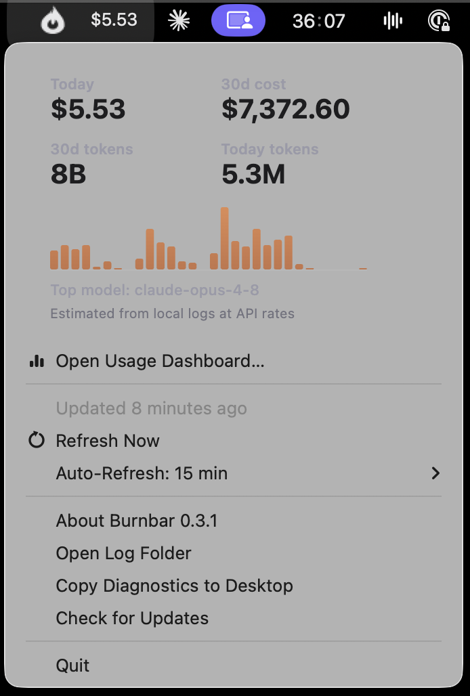

# 🔥 Burnbar

**Know what your AI coding agents are costing you, before the bill surprises you.** Burnbar lives in the macOS menu bar and shows today's spend at a glance, with all-time totals one click away — across Claude Code, Codex, and any other agent CLI [ccusage](https://github.com/ryoppippi/ccusage) reads, so you stop tab-switching between provider consoles to piece together what you actually spent.

<!-- LATEST_DMG_LINK -->
[**⬇️ Download for Mac (Apple Silicon) — v0.3.1**](https://github.com/tangentlin/burnbar/releases/download/v0.3.1/Burnbar-0.3.1-arm64.dmg) · [All releases](https://github.com/tangentlin/burnbar/releases/latest)



> Forked from [penicillin0/claude-usage-tracker-for-mac](https://github.com/penicillin0/claude-usage-tracker-for-mac) (MIT) and reworked to ride the current [ccusage](https://github.com/ryoppippi/ccusage) CLI. 🎉 Huge thanks to ccusage for the underlying usage analysis.

## Why Burnbar

- 🧩 **One place for every agent** — Claude Code, Codex (OpenAI models), and anything else ccusage detects, side by side instead of scattered across separate provider dashboards
- 🔥 **Live in the menu bar** — today's cost is always visible, no clicking required
- 📊 **Today + all-time** token counts and cost
- 🗄️ **Durable archive** — captures your usage history into a local store the agent CLIs can't purge, so your record survives even after they prune their logs
- 📈 **Usage dashboard** — an in-app Chart.js graph of cost over time, by model, and by agent (30d / 90d / all-time)
- 🌐 **Backend-agnostic** — it reads your local agent logs via ccusage, so it works the same whether Claude Code runs on the Anthropic API, **Google Vertex AI**, or **AWS Bedrock**
- 🔒 **Private** — only reads local files, stores numbers only, and never leaves your machine
- ⚡ **Tiny** — a thin Electron tray app over the ccusage CLI

## Install

Download the `.dmg` above, mount it, drag **Burnbar** into Applications, and launch it — that's it, no accounts or API keys to configure. It's a signed and notarized build, so Gatekeeper lets it run out of the box. Burnbar checks for new signed releases every 4 hours and offers to update from the tray.

## Requirements

macOS **Monterey (12) or later** — Burnbar runs on Electron 42, whose Chromium base dropped support for Big Sur (11). Ventura (13)+ is the practically tested baseline.

## How it works

Burnbar shells out to the bundled `ccusage` CLI (`ccusage daily --json --mode calculate -z <tz>`), which parses your local agent logs and prices them per model. It renders today's and all-time totals in the tray, and — from the same call — merges the numbers into a durable archive under the app's data dir using a "keep richest, never shrink" rule, so a later log purge can't erase history. The dashboard reads that archive. No accounts, no API keys, no network calls; numbers only, nothing leaves your machine.

## Develop

```bash
pnpm install
pnpm dev      # build + launch
```

Other scripts:

```bash
pnpm build       # tsc + esbuild renderer bundle -> dist/
pnpm start       # launch the built app
pnpm test        # Vitest unit tests (merge/normalize/derive/atomic IO)
pnpm check       # oxlint + oxfmt format check
pnpm check:fix   # oxlint --fix + oxfmt write
```

## Build a distributable

```bash
pnpm dist:mac
```

With no credentials set, this produces an **unsigned** `.dmg`/`.zip` — fine for local use, but Gatekeeper will block it on other Macs.

### Signing & notarization

Signing and notarization are driven by environment variables (see [docs/signing-runbook.md](docs/signing-runbook.md) for the full walkthrough including certificate creation, verification steps, and troubleshooting).

```bash
export CSC_LINK="/path/to/DeveloperID-Application.p12"
export CSC_KEY_PASSWORD="cert-password"
export APPLE_ID="you@example.com"
export APPLE_APP_SPECIFIC_PASSWORD="abcd-efgh-ijkl-mnop"
export APPLE_TEAM_ID="YOURTEAMID"
pnpm dist:mac
```

When signing vars are present the app is signed; when the notary vars are present it is also notarized and stapled, so it passes Gatekeeper on a second Mac. Omit either set and that step is skipped without failing the build. Use `pnpm dist:mac:debug` (sets `DEBUG_ENTITLEMENTS=1`) when you need lldb/Instruments to attach locally — that build cannot be notarized.

## Architecture

```text
src/
├── main.ts            # Electron entry point + wiring
├── capture-service.ts # one ccusage call → tray + archive
├── capture.ts         # spawns the ccusage CLI, normalizes reports
├── store.ts           # durable archive: keep-richest merge + atomic IO
├── derive.ts          # archive → dashboard series (pure)
├── tray.ts            # menu bar item + menu rendering (display-only)
├── window.ts + ipc.ts + preload.mts + dashboard/  # Chart.js dashboard
└── types.ts           # shared types
```

Deep-dive docs for agents and contributors live in [docs/](docs/) — start at [docs/AGENTS.md](docs/AGENTS.md).

## Disclaimer

Unofficial, third-party tool — **not affiliated with or endorsed by Anthropic**. Displayed usage is computed from local ccusage data and may not match official billing; always confirm spend through your provider (Anthropic / Google Cloud / AWS). Provided "as is", without warranty.

## License

MIT — see [LICENSE](LICENSE). Original work © Nakamura Ayahito; fork modifications © tangentlin.
