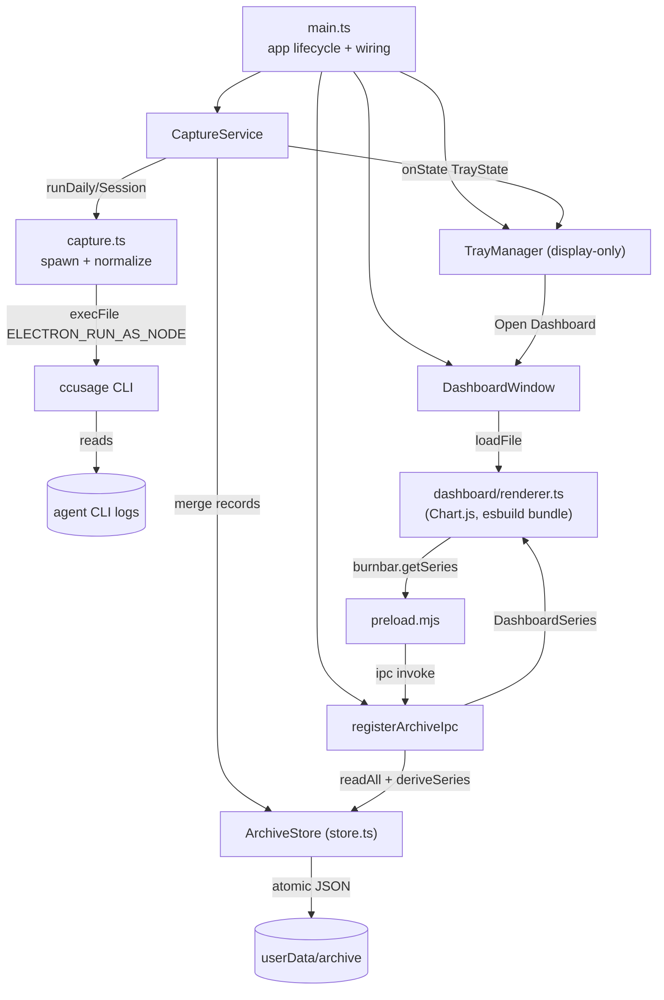

# Burnbar — Architecture

> How the pieces fit and how data flows from ccusage to the menu bar and the dashboard. See [DOMAIN.md](./DOMAIN.md) for vocabulary.

## Entry Points

| Entry | Purpose | File |
|-------|---------|------|
| `main` (package field → `dist/main.js`) | Electron main process; wires capture + tray + dashboard | [main.ts](../src/main.ts) |
| `CaptureService` | Single owner of the ccusage call feeding tray **and** archive | [capture-service.ts](../src/capture-service.ts) |
| `ArchiveStore` | Read/merge/persist the durable archive (pure merge + atomic IO) | [store.ts](../src/store.ts) |
| `TrayManager` | Display-only menu-bar rendering + "Open Usage Dashboard…" | [tray.ts](../src/tray.ts) |
| `DashboardWindow` + `registerArchiveIpc` | Chart.js window; read-only `archive:get-series` channel | [window.ts](../src/window.ts), [ipc.ts](../src/ipc.ts) |
| `pnpm build:renderer` | esbuild-bundle the dashboard renderer (+ Chart.js) | [scripts/build-renderer.mjs](../scripts/build-renderer.mjs) |
| `electron-builder` config | Packaging / signing / notarization | [electron-builder.config.cjs](../electron-builder.config.cjs) |

## Composition Overview



Single Electron **main** process. The tray-only design grew one on-demand **renderer** (the dashboard). [main.ts](../src/main.ts) wires the parts; [capture-service.ts](../src/capture-service.ts) owns the one external call and is the only writer of the archive; [tray.ts](../src/tray.ts) is a pure display consumer; the dashboard reads the archive only through the `burnbar.getSeries` preload channel. Pure logic lives in [store.ts](../src/store.ts) (merge) and [derive.ts](../src/derive.ts) (series) and is unit-tested in isolation.

## Data Flow

### Capture (tray + archive, one call)

```mermaid
sequenceDiagram
    participant S as CaptureService
    participant C as capture.ts → ccusage
    participant T as TrayManager
    participant A as ArchiveStore
    Note over S: every refresh interval (default 15m; + launch, + quit, + Refresh Now)
    S->>C: runDailyReport(tz)
    C-->>S: CcusageDailyReport
    S->>T: onState(TrayState {usage, lastUpdatedAt, sparkline, interval})
    S->>A: mergeDaily(record) per date — writes only on change (dirty check)
    Note over S,A: sessions on launch / day-rollover / quit → mergeSessions
```

1. **Ingest** — `CaptureService` calls `capture.ts`, which spawns the bundled ccusage CLI via the current runtime with `ELECTRON_RUN_AS_NODE=1` and `-z <tz>`. — [capture.ts:33-58](../src/capture.ts#L33-L58)
2. **Render** — the daily report becomes `UsageData` and is pushed to the tray (display only). — [capture.ts#toUsageData](../src/capture.ts#L124)
3. **Persist** — the same report is normalized to records and merged under keep-richest; writes are atomic and dirty-checked. — [capture-service.ts](../src/capture-service.ts), [store.ts](../src/store.ts)

### Read (dashboard)

The renderer asks `window.burnbar.getSeries({range, dimension})`; the preload forwards it over IPC; the main process reads the whole archive and `deriveSeries` returns a `DashboardSeries`. The renderer never touches the store or Node. — [preload.mts](../src/preload.mts), [ipc.ts](../src/ipc.ts), [derive.ts](../src/derive.ts)

## State Model

- **The archive is the only persistent state** — per-day JSON, monthly-sharded sessions, and a manifest under `userData/archive`. Each merge is atomic and idempotent. — [store.ts](../src/store.ts), [ADR-006](./adr/006-durable-usage-archive.md)
- `CaptureService` holds the refresh timer, the latest `UsageData`, an in-memory `dailyCache` (mirrors disk to skip unchanged days), and the day-rollover marker. — [capture-service.ts:40-47](../src/capture-service.ts#L40-L47)
- The tray retains only its `Tray` handle and the latest usage; the dashboard window is created lazily and dropped on close. — [tray.ts](../src/tray.ts), [window.ts](../src/window.ts)

## Cross-Cutting Concerns

### Error Handling

Capture is **best-effort**: a daily failure surfaces as `UsageData.error` (and the tray's error row); a session failure stays silent; both leave the archive untouched and never crash the tray. — [capture-service.ts](../src/capture-service.ts)

### Durability

Writes are atomic (temp-then-rename) and gated by a schema-compatibility check; a newer-schema archive disables writes rather than risk corruption. — [store.ts#atomicWriteJson](../src/store.ts#L203), [store.ts#isSchemaCompatible](../src/store.ts#L287)

### Performance

One ccusage `daily` spawn per refresh interval (default 15 min, user-configurable; 0 = manual) serves both tray and archive; the `dailyCache` skips disk work on unchanged days; sessions (heavier) run only at launch / rollover / quit. ccusage stdout is buffered up to 256 MiB. — [capture-service.ts](../src/capture-service.ts), [capture.ts:33-41](../src/capture.ts#L33-L41)

### Window Security

`contextIsolation: true`, `nodeIntegration: false`, a strict CSP, `sandbox: false` (for the ESM preload), and a single read-only IPC channel; the renderer loads only local bundled code. — [window.ts](../src/window.ts), [ADR-008](./adr/008-dashboard-window-bundle.md)

### Platform Behavior

macOS is the target: Dock hidden, `LSUIElement` set, title only on darwin; non-darwin paths are defensive, not supported. — [main.ts](../src/main.ts), [tray.ts](../src/tray.ts)

## Key Design Decisions

- **Shell out to the ccusage CLI** instead of importing it (ccusage 20.x dropped library exports). — [ADR-001](./adr/001-ccusage-cli-shell-out.md)
- **Run ccusage through the app's own runtime** via `ELECTRON_RUN_AS_NODE`. — [ADR-002](./adr/002-electron-run-as-node.md)
- **One CLI call, derive today** from the daily report. — [ADR-003](./adr/003-single-call-derive-today.md)
- **Template tray icon** for automatic light/dark tinting. — [ADR-004](./adr/004-template-tray-icon.md)
- **Env-var-driven signing/notarization**. — [ADR-005](./adr/005-env-driven-signing-notarization.md)
- **A durable, numbers-only archive** under `userData` that survives source purges. — [ADR-006](./adr/006-durable-usage-archive.md)
- **"Keep richest, never shrink" merge** so a purge can never erase history; backfill is the same operation. — [ADR-007](./adr/007-keep-richest-merge.md)
- **Dashboard via an ESM preload + a separate esbuild renderer bundle**, with a read-only IPC surface. — [ADR-008](./adr/008-dashboard-window-bundle.md)
