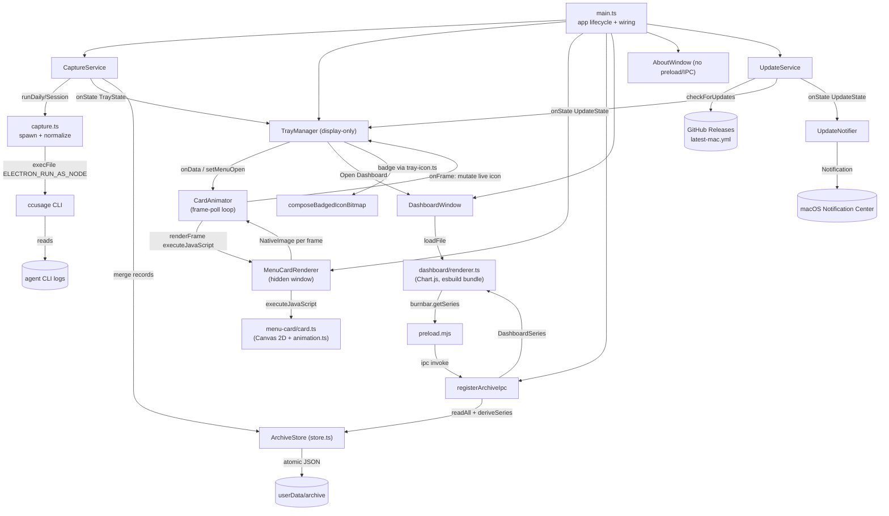

# Burnbar — Architecture

> How the pieces fit and how data flows from ccusage to the menu bar and the dashboard. See [DOMAIN.md](./DOMAIN.md) for vocabulary.

## Entry Points

| Entry | Purpose | File |
|-------|---------|------|
| `main` (package field → `dist/main.js`) | Electron main process; wires capture + tray + dashboard | [main.ts](../src/main.ts) |
| `CaptureService` | Single owner of the ccusage call feeding tray **and** archive | [capture-service.ts](../src/capture-service.ts) |
| `ArchiveStore` | Read/merge/persist the durable archive (pure merge + atomic IO) | [store.ts](../src/store.ts) |
| `TrayManager` | Display-only menu-bar rendering + "Open Usage Dashboard…" | [tray.ts](../src/tray.ts) |
| `MenuCardRenderer` | Hidden window rasterizing one menu-stats-card animation frame to a `NativeImage` | [menu-card-window.ts](../src/menu-card-window.ts) |
| `CardAnimator` | Frame-poll loop driving `MenuCardRenderer`: bounded on data change, ambient while the menu is open | [card-animator.ts](../src/card-animator.ts) |
| `DashboardWindow` + `registerArchiveIpc` | Chart.js window; read-only `archive:get-series` channel | [window.ts](../src/window.ts), [ipc.ts](../src/ipc.ts) |
| `AboutWindow` | Static credits/links window — no preload/IPC | [about-window.ts](../src/about-window.ts) |
| `UpdateService` | electron-updater lifecycle (check/download/install) feeding the tray's update row | [update-service.ts](../src/update-service.ts) |
| `UpdateNotifier` | OS notifications on the actionable update transitions + post-restart confirmation | [update-notifier.ts](../src/update-notifier.ts) |
| `pnpm build:renderer` | esbuild-bundle both browser renderers — the dashboard (+ Chart.js) and the menu card | [scripts/build-renderer.mjs](../scripts/build-renderer.mjs) |
| `pnpm storybook` | Preview browser-representable states (the update badge, notification copy, menu-card animations) in isolation, no app launch | [.storybook/](../.storybook/), [stories/](../stories/), [storybook.md](./storybook.md) |
| `electron-builder` config | Packaging / signing / notarization / GitHub-Releases publish (electron-updater feed) | [electron-builder.config.cjs](../electron-builder.config.cjs) |

## Composition Overview



Single Electron **main** process. The tray-only design grew three browser **renderers**: the on-demand dashboard window, a hidden, never-shown window the tray drives to rasterize its stats card, and the on-demand About window. [main.ts](../src/main.ts) wires the parts; [capture-service.ts](../src/capture-service.ts) owns the one external call and is the only writer of the archive; [tray.ts](../src/tray.ts) is a pure display consumer that owns a [`CardAnimator`](../src/card-animator.ts) (feeding it `onData`/`setMenuOpen`, asking [menu-card-window.ts](../src/menu-card-window.ts) to paint each animation frame, and mutating a live `MenuItem.icon` per frame — [ADR-013](./adr/013-menu-card-animation-framework.md)) and renders [update-service.ts](../src/update-service.ts)'s state into a single tray-only update row; the dashboard reads the archive only through the `burnbar.getSeries` preload channel. The About window is the odd one out: static credits/links content with no preload and no IPC — see [about-window.ts](../src/about-window.ts). Pure logic lives in [store.ts](../src/store.ts) (merge), [derive.ts](../src/derive.ts) (series), and [menu-card/animation.ts](../src/menu-card/animation.ts) (tween/particle math) and is unit-tested in isolation.

## Data Flow

### Capture (tray + archive, one call)

```mermaid
sequenceDiagram
    participant S as CaptureService
    participant C as capture.ts → ccusage
    participant T as TrayManager
    participant A as ArchiveStore
    Note over S: every refresh interval (default 15m; + launch, + quit, + Refresh Now)
    S->>C: runDailyReport(tz)
    C-->>S: CcusageDailyReport
    S->>A: deriveSeries(readAllDaily) → MenuCard (30d cost/tokens, top model, bars)
    S->>T: onState(TrayState {usage, lastUpdatedAt, card, interval})
    T->>T: CardAnimator polls MenuCardRenderer.renderFrame() (only when the signature changed) → NativeImage per frame, mutated live onto the menu icon
    S->>A: mergeDaily(record) per date — writes only on change (dirty check)
    Note over S,A: sessions on launch / day-rollover / quit → mergeSessions
```

1. **Ingest** — `CaptureService` calls `capture.ts`, which spawns the bundled ccusage CLI via the current runtime with `ELECTRON_RUN_AS_NODE=1` and `-z <tz>`. — [capture.ts:33-58](../src/capture.ts#L33-L58)
2. **Render** — the daily report becomes `UsageData`, and the archive yields a derived `MenuCard` (30-day figures); both go to the tray, which (when the data actually changed) kicks off `CardAnimator`, which polls the hidden `MenuCardRenderer` window frame by frame — an odometer roll and/or bar-growth reveal — and mutates the live menu icon (display only). — [capture.ts#toUsageData](../src/capture.ts#L124), [capture-service.ts#computeCard](../src/capture-service.ts#L201), [card-animator.ts](../src/card-animator.ts), [menu-card-window.ts](../src/menu-card-window.ts)
3. **Persist** — the same report is normalized to records and merged under keep-richest; writes are atomic and dirty-checked. — [capture-service.ts](../src/capture-service.ts), [store.ts](../src/store.ts)

### Read (dashboard)

The renderer asks `window.burnbar.getSeries({range, dimension})`; the preload forwards it over IPC; the main process reads the whole archive and `deriveSeries` returns a `DashboardSeries`. The renderer never touches the store or Node. — [preload.mts](../src/preload.mts), [ipc.ts](../src/ipc.ts), [derive.ts](../src/derive.ts)

## State Model

- **The archive is the only persistent state** — per-day JSON, monthly-sharded sessions, and a manifest under `userData/archive`. Each merge is atomic and idempotent. — [store.ts](../src/store.ts), [ADR-006](./adr/006-durable-usage-archive.md)
- `CaptureService` holds the refresh timer, the latest `UsageData`, an in-memory `dailyCache` (mirrors disk to skip unchanged days), and the day-rollover marker. — [capture-service.ts:40-47](../src/capture-service.ts#L40-L47)
- The tray retains its `Tray` handle, the latest state, the cached card bitmap (keyed by a signature of the card data, so the 60 s label tick reuses it), a live reference to the card `MenuItem`, and one owned `CardAnimator` (its own state: the latest data, the bounded-run deadline, whether the menu is open); the dashboard and About windows are each created lazily and dropped on close; the menu-card window is created once and reused. — [tray.ts](../src/tray.ts), [card-animator.ts](../src/card-animator.ts), [menu-card-window.ts](../src/menu-card-window.ts), [window.ts](../src/window.ts), [about-window.ts](../src/about-window.ts)
- `UpdateService` holds its own fixed-interval timer (independent of the usage-refresh interval) and the latest `UpdateState`; `main.ts` fans that state out to the tray (a single state-driven menu row **plus** a colored icon badge on the actionable states, composited by the pure [tray-icon.ts](../src/tray-icon.ts)) and to [UpdateNotifier](../src/update-notifier.ts) (OS notifications on the actionable transitions + a post-restart confirmation keyed off `settings.lastRunVersion`). — [update-service.ts](../src/update-service.ts), [ADR-011](./adr/011-auto-update-mechanism.md)

## Cross-Cutting Concerns

### Error Handling

Capture is **best-effort**: a daily failure surfaces as `UsageData.error` (and the tray's error row); a session failure stays silent; both leave the archive untouched and never crash the tray. — [capture-service.ts](../src/capture-service.ts)

Auto-update follows the same posture: a failed check/download logs and falls back to an idle-equivalent tray row — never a crash, dialog, or blocked tray. — [update-service.ts](../src/update-service.ts)

### Durability

Writes are atomic (temp-then-rename) and gated by a schema-compatibility check; a newer-schema archive disables writes rather than risk corruption. — [store.ts#atomicWriteJson](../src/store.ts#L203), [store.ts#isSchemaCompatible](../src/store.ts#L287)

### Performance

One ccusage `daily` spawn per refresh interval (default 15 min, user-configurable; 0 = manual) serves both tray and archive; the `dailyCache` skips disk work on unchanged days; sessions (heavier) run only at launch / rollover / quit. ccusage stdout is buffered up to 256 MiB. — [capture-service.ts](../src/capture-service.ts), [capture.ts:33-41](../src/capture.ts#L33-L41)

### Window Security

Dashboard: `contextIsolation: true`, `nodeIntegration: false`, a strict CSP, `sandbox: false` (for the ESM preload), and a single read-only IPC channel; the renderer loads only local bundled code. — [window.ts](../src/window.ts), [ADR-008](./adr/008-dashboard-window-bundle.md)

About: the same `contextIsolation`/`nodeIntegration` posture but `sandbox: true` and **no preload at all** — it's a static page with no data to fetch, so `setWindowOpenHandler` + `will-navigate` are the only extra surface, both routing links to `shell.openExternal` after an http(s)-only scheme check. — [about-window.ts](../src/about-window.ts)

### Platform Behavior

macOS is the target: Dock hidden, `LSUIElement` set, title only on darwin; non-darwin paths are defensive, not supported. — [main.ts](../src/main.ts), [tray.ts](../src/tray.ts)

## Key Design Decisions

- **Shell out to the ccusage CLI** instead of importing it (ccusage 20.x dropped library exports). — [ADR-001](./adr/001-ccusage-cli-shell-out.md)
- **Run ccusage through the app's own runtime** via `ELECTRON_RUN_AS_NODE`. — [ADR-002](./adr/002-electron-run-as-node.md)
- **One CLI call, derive today** from the daily report. — [ADR-003](./adr/003-single-call-derive-today.md)
- **Template tray icon** for automatic light/dark tinting. — [ADR-004](./adr/004-template-tray-icon.md)
- **Env-var-driven signing/notarization**. — [ADR-005](./adr/005-env-driven-signing-notarization.md)
- **A durable, numbers-only archive** under `userData` that survives source purges. — [ADR-006](./adr/006-durable-usage-archive.md)
- **"Keep richest, never shrink" merge** so a purge can never erase history; backfill is the same operation. — [ADR-007](./adr/007-keep-richest-merge.md)
- **Dashboard via an ESM preload + a separate esbuild renderer bundle**, with a read-only IPC surface. — [ADR-008](./adr/008-dashboard-window-bundle.md)
- **Menu stats card rendered by an off-screen window's Canvas 2D** (deterministic data-URL output, not `capturePage`), replacing the template sparkline. — [ADR-009](./adr/009-menu-stats-card.md)
- **Production entitlements drop debugger/get-task-allow** so notarized builds pass; a separate debug plist covers local lldb/Instruments attach. — [ADR-010](./adr/010-production-entitlements.md)
- **Tray-only auto-update via electron-updater + the GitHub provider**, reading the feed off the same signed/notarized Release artifacts; `autoDownload` forced off, install only from an explicit tray click. — [ADR-011](./adr/011-auto-update-mechanism.md)
