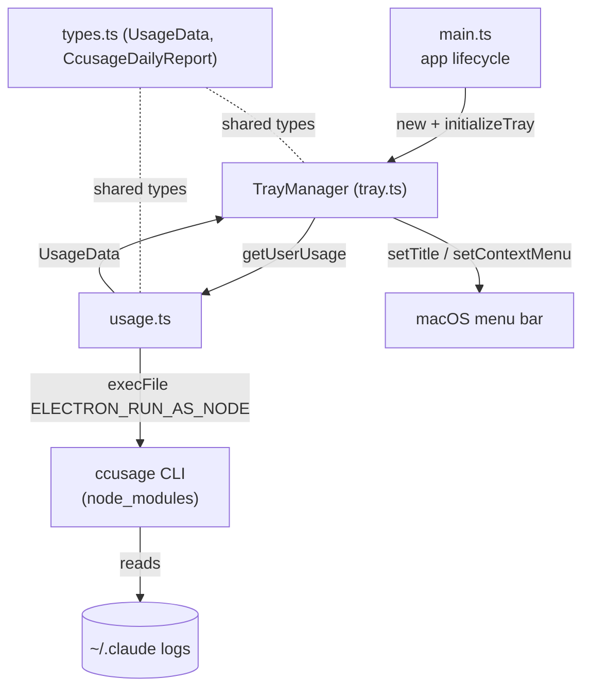
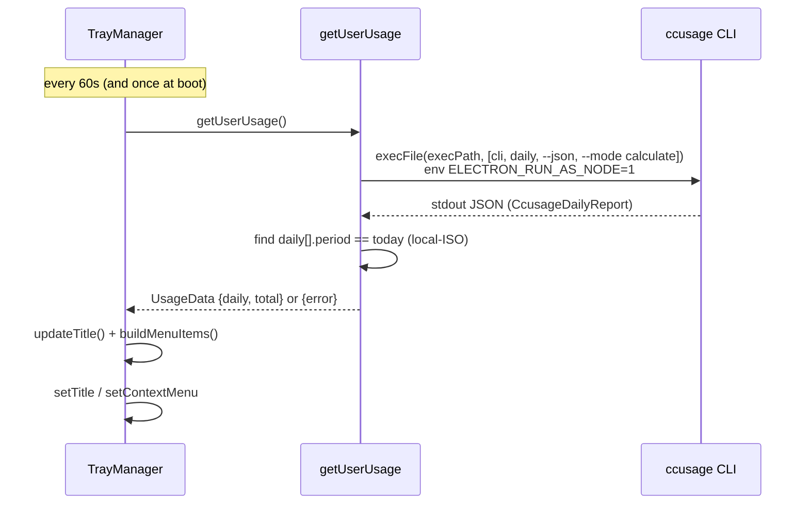

# Burnbar — Architecture

> How the pieces fit and how data flows from ccusage to the menu bar. See [DOMAIN.md](./DOMAIN.md) for vocabulary.

## Entry Points

| Entry | Purpose | File |
|-------|---------|------|
| `main` (package field → `dist/main.js`) | Electron main process; boots the tray | [main.ts](../src/main.ts) |
| `getUserUsage()` | The one data-ingestion call | [usage.ts](../src/usage.ts) |
| `TrayManager` | All rendering + lifecycle of the tray | [tray.ts](../src/tray.ts) |
| `pnpm icon` | Regenerate PNG icons from SVG sources | [scripts/generate-icons.mjs](../scripts/generate-icons.mjs) |
| `electron-builder` config | Packaging / signing / notarization | [electron-builder.config.cjs](../electron-builder.config.cjs) |

## Composition Overview

Single Electron **main** process, **tray-only** (no windows, no renderer). [main.ts](../src/main.ts) owns lifecycle; [tray.ts](../src/tray.ts) owns all UI; [usage.ts](../src/usage.ts) owns the one external dependency. Types in [types.ts](../src/types.ts) are the contract between data and UI.

## Data Flow

1. **Ingest** — `getUserUsage()` spawns the bundled ccusage CLI via the current runtime's own binary. — [usage.ts:17-27](../src/usage.ts#L17-L27)
2. **Transform** — parse JSON, derive today from `daily[]`, map to `UsageStats`. — [usage.ts:33-45](../src/usage.ts#L33-L45)
3. **Render** — title shows today's cost; context menu shows today + all-time breakdown. — [tray.ts:60-65](../src/tray.ts#L60-L65)

## State Model

- **No persistent state.** Each refresh re-fetches and rebuilds the menu from scratch. — [tray.ts:54-65](../src/tray.ts#L54-L65)
- The only retained handles are `tray` and `refreshTimer` on `TrayManager`. — [tray.ts:10-11](../src/tray.ts#L10-L11)
- `refreshTimer` is cleared on `before-quit` via `dispose()`. — [main.ts:15-17](../src/main.ts#L15-L17), [tray.ts:47-52](../src/tray.ts#L47-L52)

## Cross-Cutting Concerns

### Error Handling
All ingestion failure is contained in `getUserUsage()`'s try/catch, surfaced as `UsageData.error`; the UI degrades to an "Error loading usage data" item and a blank title. — [usage.ts:46-53](../src/usage.ts#L46-L53), [tray.ts:73-77](../src/tray.ts#L73-L77)

### Performance
One CLI spawn per 60s; today is derived rather than fetched separately. ccusage stdout is buffered up to 64 MiB. — [usage.ts:23](../src/usage.ts#L23), [usage.ts:31-32](../src/usage.ts#L31-L32)

### Platform Behavior
macOS is the target: Dock hidden ([main.ts:8-10](../src/main.ts#L8-L10)), `LSUIElement` set ([electron-builder.config.cjs:37](../electron-builder.config.cjs#L37)), title only on darwin. Non-darwin paths exist defensively (click-to-popup, `window-all-closed` quit) but are not a supported target. — [tray.ts:33-37](../src/tray.ts#L33-L37), [main.ts:19-23](../src/main.ts#L19-L23)

## Key Design Decisions

- **Shell out to the ccusage CLI** instead of importing it as a library (ccusage 20.x dropped library exports). — [adr/001-ccusage-cli-shell-out.md](./adr/001-ccusage-cli-shell-out.md)
- **Run ccusage through the app's own runtime** via `ELECTRON_RUN_AS_NODE`, so no external `node`/`ccusage` is required. — [adr/002-electron-run-as-node.md](./adr/002-electron-run-as-node.md)
- **One CLI call, derive today** from the daily report. — [adr/003-single-call-derive-today.md](./adr/003-single-call-derive-today.md)
- **Template tray icon** for automatic light/dark tinting. — [adr/004-template-tray-icon.md](./adr/004-template-tray-icon.md)
- **Env-var-driven signing/notarization** so credential-less builds still succeed. — [adr/005-env-driven-signing-notarization.md](./adr/005-env-driven-signing-notarization.md)
