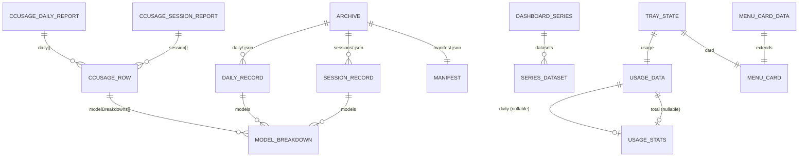

# Burnbar — Domain

> Vocabulary, entities, and rules that ground every other doc. Code is the source of truth.

## Glossary

| Term | Definition | Code Reference |
|------|-----------|----------------|
| **Burnbar** | The macOS menu-bar app itself. App id `com.tangentlin.burnbar`, product name `Burnbar`. | [electron-builder.config.cjs:24-25](../electron-builder.config.cjs#L24-L25) |
| **ccusage** | Third-party CLI that reads agent CLIs' local logs and prices token usage per model. Burnbar's only data source. | [capture.ts:17-29](../src/capture.ts#L17-L29) |
| **Token burn** | Total tokens consumed over a period; surfaced as `totalTokens` (= input + output + cacheCreation + cacheRead). | [types.ts#TokenCounts](../src/types.ts#L77-L84) |
| **Cost** | USD figure ccusage computes for a period. Renamed `totalCost`→`cost` only at the tray boundary; archive records keep `totalCost`/`cost`. | [types.ts#UsageStats](../src/types.ts#L8-L11) |
| **Today / daily** | Usage for the current **local** calendar date in the pinned tz, matched against `report.daily[].period`. | [capture.ts#toUsageData](../src/capture.ts#L124) |
| **All-time / total** | Grand total across every day ccusage returns. | [capture.ts:125-128](../src/capture.ts#L125-L128) |
| **Agent (source)** | A usage-producing CLI ccusage detects (claude, codex, openclaw, …). `daily` combines all under `agent:"all"`; `session` is per-agent. | [types.ts#CcusageRow](../src/types.ts#L36-L52) |
| **Capture** | One normalize-and-merge of a ccusage report into the archive. | [capture-service.ts](../src/capture-service.ts) |
| **Archive** | The durable, numbers-only store under `userData` that survives source-log purges. | [features/usage-archive.md](./features/usage-archive.md), [ADR-006](./adr/006-durable-usage-archive.md) |
| **DailyRecord** | One local date's combined usage + per-model breakdown; authoritative for cost-over-time and by-model views. | [types.ts#DailyRecord](../src/types.ts#L100-L112) |
| **SessionRecord** | One agent session keyed by `sessionId`; source for the by-agent view. | [types.ts#SessionRecord](../src/types.ts#L114-L123) |
| **Manifest** | Archive metadata: `schemaVersion`, pinned `timezone`, observed `ccusageVersion`, first/last capture. | [types.ts#ArchiveManifest](../src/types.ts#L125-L132) |
| **Keep richest / never shrink** | The merge rule: per token field keep `max()`; a source purge can never reduce stored counts. | [store.ts#mergeDailyRecord](../src/store.ts#L107), [ADR-007](./adr/007-keep-richest-merge.md) |
| **Dirty check** | Write a record only when its numbers change, so a refresh tick is a no-op on quiet days. | [store.ts#mergeDaily](../src/store.ts#L297) |
| **Series** | A chart-ready `DashboardSeries` derived from the archive for a `(range, dimension)`; each dataset carries parallel `data` (cost) and `tokens`. | [types.ts#DashboardSeries](../src/types.ts#L149-L156) |
| **Heatmap** | A calendar-ready `HeatmapSeries` derived from the archive for a `range`: one `HeatmapCell` per day (`cost`, `tokens`, cost-descending `models` + `agents` splits). Color intensity is keyed to daily cost; the per-cell splits feed the hover detail. | [types.ts#HeatmapSeries](../src/types.ts), [derive.ts#deriveHeatmap](../src/derive.ts) |
| **Refresh interval** | Minutes between auto-captures; persisted in `settings.json`. **0 = manual** (no auto-refresh). Default 15. | [types.ts#AppSettings](../src/types.ts), [settings.ts](../src/settings.ts) |
| **Tray state** | Everything the menu renders — usage, last-updated stamp, the derived 30-day `MenuCard`, active interval — pushed by the CaptureService. | [types.ts#TrayState](../src/types.ts#L196-L201) |
| **MenuCard** | The derived 30-day figures behind the menu stats card: `cost30d`, `tokens30d`, `topModel`, and `spark` (30-day daily costs, the card's bar chart). Computed from the archive each capture. | [types.ts#MenuCard](../src/types.ts#L175-L180), [capture-service.ts#computeCard](../src/capture-service.ts#L201) |
| **MenuCardData** | A `MenuCard` plus today's `todayCost`/`todayTokens` and the menu appearance (`dark`) — the full input the browser-context card renderer draws. | [types.ts#MenuCardData](../src/types.ts#L186-L190) |
| **Update state** | The electron-updater lifecycle snapshot the tray renders into its single update row: `status` (`idle`/`checking`/`available`/`downloading`/`downloaded`/`error`), `version`, `percent`, `error`. Pushed by the UpdateService on every transition. | [types.ts#UpdateState](../src/types.ts), [update-service.ts](../src/update-service.ts), [ADR-011](./adr/011-auto-update-mechanism.md) |
| **Stats card** | The rich bitmap the menu shows in place of plain text rows: a 2×2 today/30-day stat grid, a warm bar chart, "Top model", and a footnote, on a transparent background. Rasterized off-screen by `MenuCardRenderer`; display-only (the "Open Usage Dashboard…" row beneath it is the drill-down). | [menu-card-window.ts](../src/menu-card-window.ts), [src/menu-card/card.ts](../src/menu-card/card.ts), [ADR-009](./adr/009-menu-stats-card.md) |
| **Template image** | A monochrome image macOS auto-tints for light/dark menus — the tray icon and the two menu-row glyphs (Refresh ↻, Dashboard bar-chart). The stats card is a full-color bitmap, *not* a template. | [tray.ts:57-60](../src/tray.ts#L57-L60), [menu-card-window.ts#renderIcon](../src/menu-card-window.ts) |
| **ELECTRON_RUN_AS_NODE** | Env var that makes the Electron binary behave as plain Node — used to run ccusage through Burnbar's own runtime. | [capture.ts:33-41](../src/capture.ts#L33-L41) |
| **Calculate mode** | ccusage `--mode calculate` — prices from local logs. Makes Burnbar backend-agnostic. | [capture.ts:52-58](../src/capture.ts#L52-L58) |
| **Pinned timezone** | The system IANA tz, passed to ccusage via `-z` and recorded in the manifest, so day buckets are stable. | [time.ts](../src/time.ts), [capture-service.ts](../src/capture-service.ts) |
| **LSUIElement** | macOS Info.plist flag marking the app as agent-only (no Dock icon). | [electron-builder.config.cjs:37](../electron-builder.config.cjs#L37) |

## Entities & Relationships

Two mappers bridge the halves, both in [capture.ts](../src/capture.ts): `toUsageData` produces the tray `UsageData`; `normalizeDailyReport` / `normalizeSessionReport` produce archive records. The archive→chart mapper is [`deriveSeries`](../src/derive.ts#L108); the CaptureService reuses it in [`computeCard`](../src/capture-service.ts#L201) to derive the tray's `MenuCard`. Field shapes live in [types.ts](../src/types.ts) — not re-transcribed here.

## Invariants

- **Never shrink.** A later capture with fewer tokens never reduces stored counts; cost follows the snapshot with the larger token total (ties → later capture). — [store.ts](../src/store.ts#L107), [ADR-007](./adr/007-keep-richest-merge.md)
- **Totals = Σ models.** Record totals are always the rollup of merged model lines. — [store.ts#rollupTotals](../src/store.ts#L69)
- **`totalTokens` = sum of the four component counts.** Recomputed on normalize so it holds even if ccusage omits it. — [capture.ts:85-103](../src/capture.ts#L85-L103)
- **Atomic writes.** Every archive write is temp-then-rename; a crash mid-write never leaves a partial file. — [store.ts#atomicWriteJson](../src/store.ts#L203)
- **Numbers only, on-device only.** The archive holds counts/costs/timestamps — never conversation content or raw logs — and lives only under `userData`; nothing is transmitted. — [ADR-006](./adr/006-durable-usage-archive.md)
- **`firstCapturedAt` preserved; `lastCapturedAt` advances** on every change. — [store.ts:107-159](../src/store.ts#L107-L159)
- `UsageStats` always carries both `totalTokens` and `cost`; `UsageData.daily`/`total` are a full `UsageStats` or `null`, never `undefined`. — [types.ts:8-19](../src/types.ts#L8-L19)
- The menu-bar title is set only on macOS. — [tray.ts#updateTitle](../src/tray.ts)

## Business Rules

- **One ccusage `daily` call feeds both the tray and the archive** on each refresh (default every 15 min; configurable, 0 = manual); the tray subscribes for display, the store persists on change. — [capture-service.ts](../src/capture-service.ts), [ADR-006](./adr/006-durable-usage-archive.md)
- **First launch backfills** everything the source logs still hold (full, unfiltered capture merged under keep-richest). — [features/usage-archive.md](./features/usage-archive.md)
- **Sessions** are captured at lower frequency — launch, local-day rollover, and quit — and sharded by UTC last-activity month, keyed by `sessionId`. — [store.ts#mergeSessions](../src/store.ts#L314)
- **By-agent** daily figures come from sessions bucketed to their **local last-activity day** — a documented approximation that can drift slightly near day boundaries. — [derive.ts:81-106](../src/derive.ts#L81-L106)
- ccusage runs in `--mode calculate`, so figures are identical regardless of backend (Anthropic / Vertex AI / Bedrock). — [capture.ts:17-29](../src/capture.ts#L17-L29)

## Edge Cases & Failure Modes

- **ccusage CLI throws / non-JSON** → caught; the daily path surfaces `UsageData.error` (menu shows "Error loading usage data", title cleared) and leaves the archive untouched; the session path stays silent. Capture is best-effort and never crashes the tray. — [capture-service.ts](../src/capture-service.ts)
- **Source purge** → keep-richest preserves prior counts; the archive only grows. — [ADR-007](./adr/007-keep-richest-merge.md)
- **Newer archive schema** (a future Burnbar wrote it) → writes are disabled for the session; the tray still works. — [store.ts#isSchemaCompatible](../src/store.ts#L287)
- **Session crosses a month boundary** → it moves shards cleanly (no duplicate across two files). — [store.ts#mergeSessions](../src/store.ts#L314)
- **Unparseable `lastActivity`** → that session is skipped in the by-agent view, never crashing derivation. — [derive.ts:48-55](../src/derive.ts#L48-L55)
- **No usage today** → `daily` is `null`; menu shows "No usage today"; title cleared. — [tray.ts](../src/tray.ts)
- **Large history** → ccusage stdout buffered up to 256 MiB. — [capture.ts:33-41](../src/capture.ts#L33-L41)
