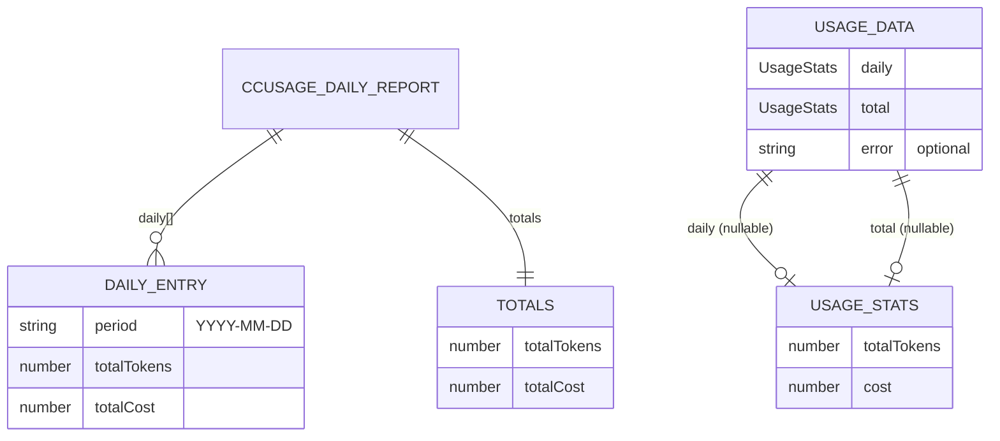

# Burnbar — Domain

> Vocabulary, entities, and rules that ground every other doc. Code is the source of truth.

## Glossary

| Term | Definition | Code Reference |
|------|-----------|----------------|
| **Burnbar** | The macOS menu-bar app itself. App id `com.tangentlin.burnbar`, product name `Burnbar`. | [electron-builder.config.cjs:24-25](../electron-builder.config.cjs#L24-L25) |
| **ccusage** | Third-party CLI that reads Claude Code's local `~/.claude` logs and prices token usage per model. Burnbar's only data source. | [usage.ts:8-15](../src/usage.ts#L8-L15) |
| **Token burn** | Total tokens consumed by Claude Code over a period; surfaced as `totalTokens`. | [types.ts#UsageStats](../src/types.ts#L1-L4) |
| **Cost** | USD figure ccusage computes for a period, surfaced as `cost`. | [types.ts#UsageStats](../src/types.ts#L1-L4) |
| **Today / daily** | Usage for the current local calendar date (`YYYY-MM-DD`), matched against `report.daily[].period`. | [usage.ts:34-35](../src/usage.ts#L34-L35) |
| **All-time / total** | Grand total across every day ccusage returns. | [usage.ts:41-44](../src/usage.ts#L41-L44) |
| **Daily report** | The slice of `ccusage daily --json` output Burnbar parses — `daily[]` plus `totals`. | [types.ts#CcusageDailyReport](../src/types.ts#L17-L27) |
| **Period** | ISO date string (`YYYY-MM-DD`) keying each entry in `report.daily`. | [types.ts:19](../src/types.ts#L19) |
| **Template image** | A monochrome tray icon macOS auto-tints for light/dark menu bars. | [tray.ts:19-21](../src/tray.ts#L19-L21) |
| **ELECTRON_RUN_AS_NODE** | Env var that makes the Electron binary behave as plain Node — used to run ccusage through Burnbar's own runtime. | [usage.ts:22](../src/usage.ts#L22) |
| **LSUIElement** | macOS Info.plist flag marking the app as agent-only (no Dock icon, no app menu). | [electron-builder.config.cjs:37](../electron-builder.config.cjs#L37) |
| **Calculate mode** | ccusage `--mode calculate` — prices usage from local logs (vs. fetching pricing). Makes Burnbar backend-agnostic. | [usage.ts:20](../src/usage.ts#L20) |

## Entities & Relationships

`getUserUsage()` is the only mapper between the two halves: it reads a `CcusageDailyReport` and produces a `UsageData`. — [usage.ts:29-54](../src/usage.ts#L29-L54)

## Invariants

- A `UsageStats` always carries both `totalTokens` and `cost` (no partial figures). — [types.ts#UsageStats](../src/types.ts#L1-L4)
- `UsageData.daily` / `UsageData.total` are **either a full `UsageStats` or `null`** — never `undefined`, so the renderer can branch on truthiness. — [usage.ts:38-45](../src/usage.ts#L38-L45)
- `UsageData.error` is present **only** on the failure path; success never sets it. — [usage.ts:46-53](../src/usage.ts#L46-L53)
- The menu-bar title is set only on macOS; other platforms never get a title. — [tray.ts:67-79](../src/tray.ts#L67-L79)
- Naming `period` uses **local** date (`new Date().toISOString().slice(0,10)` is UTC, see Edge Cases). — [usage.ts:34](../src/usage.ts#L34)

## Business Rules

- One ccusage invocation yields both today and all-time; today is **derived** from the same report, never a second scan. — [usage.ts:31-35](../src/usage.ts#L31-L35)
- Today's figure is `null` when no `daily[]` entry matches today's date (e.g. no usage yet today). — [usage.ts:38-40](../src/usage.ts#L38-L40)
- The tray refreshes every 60s so the visible cost stays current without user action. — [tray.ts:7](../src/tray.ts#L7), [tray.ts:42-44](../src/tray.ts#L42-L44)
- ccusage runs in `--mode calculate`, pricing from local logs, so Burnbar reports the same regardless of backend (Anthropic / Vertex AI / Bedrock). — [usage.ts:11-13](../src/usage.ts#L11-L13)

## Edge Cases & Failure Modes

- **ccusage CLI throws / non-JSON output** → caught; `UsageData` returns `{daily: null, total: null, error}`; menu shows "Error loading usage data", title cleared. — [usage.ts:46-53](../src/usage.ts#L46-L53), [tray.ts:84-88](../src/tray.ts#L84-L88)
- **No usage today** → `daily` is `null`; menu shows "No usage today"; title cleared. — [tray.ts:73-78](../src/tray.ts#L73-L78), [tray.ts:121-126](../src/tray.ts#L121-L126)
- **Tray creation fails** → logged and `initializeTray()` returns early; no tray, no refresh loop. — [tray.ts:26-29](../src/tray.ts#L26-L29)
- **UTC vs local date skew** [inferred] → `period` is computed from `toISOString()` (UTC), so near midnight the "today" key can disagree with the user's local day. Low impact, but real. — [usage.ts:34](../src/usage.ts#L34)
- **Large history** → ccusage stdout buffered up to 64 MiB; beyond that the spawn errors and falls to the error state. — [usage.ts:23](../src/usage.ts#L23)
