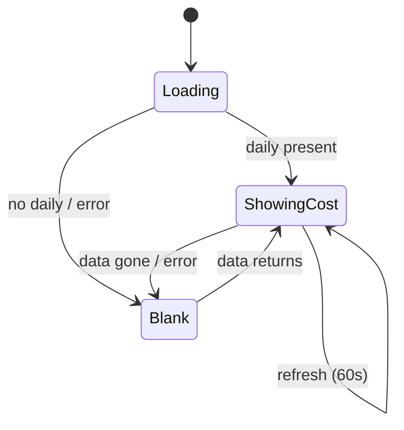

# Feature: Live Menu-Bar Cost

## User Story

As a Claude Code user, I want today's spend visible in my menu bar at all times so I can watch my burn without opening anything.

## Scope

**Includes:** today's cost rendered as `$X.XX` beside the tray icon (macOS), auto-updated every 60s, cleared when there's no data or an error.
**Excludes:** token count in the title (that's in the [usage menu](./usage-menu.md)); any non-macOS title.

## UX Flow

### Success State
Title shows ` $X.XX` (leading space, 2 decimals) for today. — [tray.ts:78](../../src/tray.ts#L78)

### Empty State
No usage today → title cleared to `""`. — [tray.ts:73-76](../../src/tray.ts#L73-L76)

### Error State
ccusage failed → title cleared to `""`. — [tray.ts:73-76](../../src/tray.ts#L73-L76)

## Acceptance Criteria

- [ ] On macOS, the menu bar shows today's cost within one refresh of launch. — [tray.ts:39](../../src/tray.ts#L39)
- [ ] The figure updates at least every 60s without interaction. — [tray.ts:7](../../src/tray.ts#L7), [tray.ts:42-44](../../src/tray.ts#L42-L44)
- [ ] When there is no usage today or an error, the title is blank (icon only). — [tray.ts:73-76](../../src/tray.ts#L73-L76)
- [ ] No title is set on non-macOS platforms. — [tray.ts:68](../../src/tray.ts#L68)

## Data Model (Conceptual)

Consumes `UsageData.daily.cost`; produces a formatted title string. — [DOMAIN.md](../DOMAIN.md)

## State Transitions

## Code Touchpoints

| Concern | File |
|---------|------|
| Title rendering | [tray.ts#updateTitle](../../src/tray.ts#L67-L79) |
| Refresh loop | [tray.ts:42-44](../../src/tray.ts#L42-L44) |
| Data | [usage.ts#getUserUsage](../../src/usage.ts#L29) |

## Known Pitfalls

- The title string has an intentional **leading space** before `$`. — [tray.ts:78](../../src/tray.ts#L78)
- Title is darwin-only; don't rely on it cross-platform.
