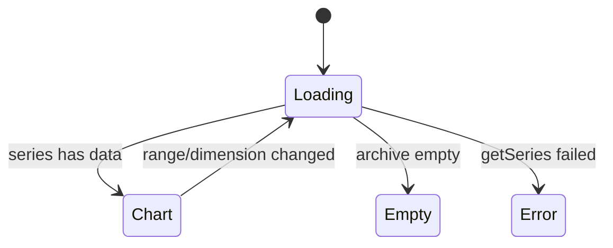

# Feature: Usage Dashboard

## User Story

As a user with an accumulated [usage archive](./usage-archive.md), I want an in-app graph of my spend over time — broken down by model and by agent — so I can see history even after the source tools have purged their logs.

## Scope

**Includes:** a Chart.js window opened from the tray ("Open Usage Dashboard…"); a single cost metric with a **Total / By model / By agent** breakdown toggle and **30d / 90d / All** range presets; reads the archive (not live ccusage).
**Excludes:** budgets, alerts, projections; editing/exporting data; any change to the existing tray click behavior.

## UX Flow

### Open
Tray menu → "Open Usage Dashboard…" opens (or focuses) the window; the existing click-to-show-menu behavior is unchanged. — [tray.ts](../../src/tray.ts), [window.ts](../../src/window.ts)

### Views
A stacked bar chart over a continuous daily axis. Total = combined cost per day; By model / By agent = one stacked series each. The header shows the range label and its summed cost. Opens by default at **30-day / Total spend** (matching the tray's quick glance). — [src/dashboard/renderer.ts](../../src/dashboard/renderer.ts), [derive.ts](../../src/derive.ts)

### Hover detail & legend
The tooltip names the day (friendly date) and, per stacked segment, its **cost and token count**, with a **Total** footer when more than one entity stacks. The legend appears only when a view shows more than one entity (Total is a single series, so it carries none). — [src/dashboard/renderer.ts](../../src/dashboard/renderer.ts)

### Empty / Error
No archived usage yet → an empty-state message. An IPC/read failure → an inline error, never a crash. — [src/dashboard/renderer.ts](../../src/dashboard/renderer.ts)

## Acceptance Criteria

- [ ] A tray item opens the dashboard; the tray's prior behavior is unchanged. — [tray.ts](../../src/tray.ts)
- [ ] Cost-over-time, by-model, and by-agent views render from the archive. — [derive.ts#deriveSeries](../../src/derive.ts)
- [ ] 30d / 90d / All presets re-scope the chart and the headline total; the window opens at 30d / Total. — [src/dashboard/renderer.ts](../../src/dashboard/renderer.ts)
- [ ] The tooltip shows per-segment cost + tokens and a total footer; the legend shows only when >1 entity stacks. — [src/dashboard/renderer.ts](../../src/dashboard/renderer.ts)
- [ ] The renderer reads data **only** through `burnbar.getSeries` (contextIsolation on, nodeIntegration off, no network). — [preload.mts](../../src/preload.mts), [ipc.ts](../../src/ipc.ts), [window.ts](../../src/window.ts)
- [ ] The dashboard shows history even after the source logs are purged (reads the archive, not live ccusage). — [ipc.ts](../../src/ipc.ts)

## Data Model (Conceptual)

`SeriesRequest` (range + dimension) → `DashboardSeries` (labels + stacked datasets + total). The main process reads the store and derives; the renderer only draws. — [types.ts](../../src/types.ts), [DOMAIN.md](../DOMAIN.md)

## State Transitions

## Code Touchpoints

| Concern | File |
|---------|------|
| Window lifecycle + security | [window.ts](../../src/window.ts) |
| Preload bridge | [preload.mts](../../src/preload.mts) |
| IPC handler (read + derive) | [ipc.ts](../../src/ipc.ts) |
| Series derivation (pure) | [derive.ts](../../src/derive.ts) |
| Chart rendering | [src/dashboard/renderer.ts](../../src/dashboard/renderer.ts) |
| Menu entry | [tray.ts](../../src/tray.ts) |

## Known Pitfalls

- The renderer is a separate esbuild bundle (Chart.js is bundled); the preload must be `dist/preload.mjs`. See [ADR-008](../adr/008-dashboard-window-bundle.md).
- By-agent daily totals can drift slightly from the authoritative daily totals near day boundaries (session day-bucketing approximation). — [derive.ts](../../src/derive.ts)
