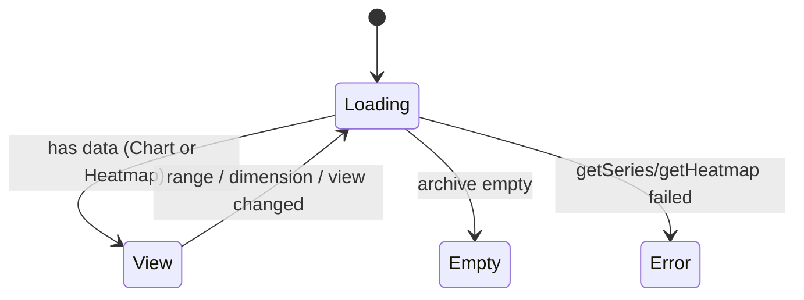

# Feature: Usage Dashboard

## User Story

As a user with an accumulated [usage archive](./usage-archive.md), I want an in-app graph of my spend over time — broken down by model and by agent — so I can see history even after the source tools have purged their logs.

## Scope

**Includes:** a Chart.js window opened from the tray ("Open Usage Dashboard…"); a **Chart / Heatmap** view toggle; the chart's single cost metric with a **Total / By model / By agent** breakdown toggle; a GitHub-style calendar **heatmap** keyed to daily cost with a per-cell model + agent breakdown on hover; **30d / 90d / All** range presets shared by both views; reads the archive (not live ccusage).
**Excludes:** budgets, alerts, projections; editing data; any change to the existing tray click behavior.

## UX Flow

### Open
Tray menu → "Open Usage Dashboard…" opens (or focuses) the window; the existing click-to-show-menu behavior is unchanged. — [tray.ts](../../src/tray.ts), [window.ts](../../src/window.ts)

### Views
A **Chart / Heatmap** toggle picks the visualization; both share the range presets and the header's range label + summed cost. Opens by default at **Chart / 30-day / Total spend** (matching the tray's quick glance). — [src/dashboard/renderer.ts](../../src/dashboard/renderer.ts), [derive.ts](../../src/derive.ts)

- **Chart** — a stacked bar chart over a continuous daily axis. Total = combined cost per day; By model / By agent = one stacked series each.
- **Heatmap** — a GitHub-style calendar (weekday rows × week columns, month labels) over the same continuous daily axis. Each cell is one day; its color intensity is keyed to that day's **total cost**, bucketed by **quantile** into a single-hue blue ramp so one outlier day doesn't wash the rest out. Empty days read as a distinct muted cell. The breakdown toggle is hidden here — the heatmap is always keyed to total cost. — [derive.ts#deriveHeatmap](../../src/derive.ts)

### Hover detail & legend
- **Chart** — the tooltip names the day (friendly date) and, per stacked segment, its **cost and token count**, with a **Total** footer when more than one entity stacks. The legend appears only when a view shows more than one entity (Total is a single series, so it carries none).
- **Heatmap** — hovering a cell shows a tooltip with the day's **total cost + tokens** and the full **by-model** and **by-agent** breakdown (each cost-descending). A **Less → More** swatch legend anchors the color scale. Each cell also carries an `aria-label` with its value, so detail is never color-only. — [src/dashboard/renderer.ts](../../src/dashboard/renderer.ts)

### Empty / Error
No archived usage yet → an empty-state message. An IPC/read failure → an inline error, never a crash. — [src/dashboard/renderer.ts](../../src/dashboard/renderer.ts)

## Acceptance Criteria

- [ ] A tray item opens the dashboard; the tray's prior behavior is unchanged. — [tray.ts](../../src/tray.ts)
- [ ] Cost-over-time, by-model, and by-agent views render from the archive. — [derive.ts#deriveSeries](../../src/derive.ts)
- [ ] The Chart / Heatmap toggle switches views; the heatmap renders a calendar keyed to daily cost and hides the breakdown toggle. — [src/dashboard/renderer.ts](../../src/dashboard/renderer.ts), [derive.ts#deriveHeatmap](../../src/derive.ts)
- [ ] 30d / 90d / All presets re-scope both views and the headline total; the window opens at Chart / 30d / Total. — [src/dashboard/renderer.ts](../../src/dashboard/renderer.ts)
- [ ] The chart tooltip shows per-segment cost + tokens and a total footer; the legend shows only when >1 entity stacks. — [src/dashboard/renderer.ts](../../src/dashboard/renderer.ts)
- [ ] Each heatmap cell hovers to a day total + by-model + by-agent breakdown; empty days are visually distinct. — [src/dashboard/renderer.ts](../../src/dashboard/renderer.ts)
- [ ] The renderer reads data **only** through `burnbar.getSeries` / `burnbar.getHeatmap` (contextIsolation on, nodeIntegration off, no network). — [preload.mts](../../src/preload.mts), [ipc.ts](../../src/ipc.ts), [window.ts](../../src/window.ts)
- [ ] The dashboard shows history even after the source logs are purged (reads the archive, not live ccusage). — [ipc.ts](../../src/ipc.ts)

## Data Model (Conceptual)

- **Chart** — `SeriesRequest` (range + dimension) → `DashboardSeries` (labels + stacked datasets + total).
- **Heatmap** — `HeatmapRequest` (range) → `HeatmapSeries` (one `HeatmapCell` per day: `cost`, `tokens`, and cost-descending `models` + `agents` splits).

The main process reads the store and derives; the renderer only draws. — [types.ts](../../src/types.ts), [DOMAIN.md](../DOMAIN.md)

## State Transitions

## Code Touchpoints

| Concern | File |
|---------|------|
| Window lifecycle + security | [window.ts](../../src/window.ts) |
| Preload bridge (`getSeries`, `getHeatmap`) | [preload.mts](../../src/preload.mts) |
| IPC handlers (read + derive) | [ipc.ts](../../src/ipc.ts) |
| Series + heatmap derivation (pure) | [derive.ts](../../src/derive.ts) |
| Chart + heatmap rendering | [src/dashboard/renderer.ts](../../src/dashboard/renderer.ts) |
| Heatmap grid / cell / tooltip styles | [src/dashboard/dashboard.css](../../src/dashboard/dashboard.css) |
| Menu entry | [tray.ts](../../src/tray.ts) |

## Known Pitfalls

- The renderer is a separate esbuild bundle (Chart.js is bundled); the preload must be `dist/preload.mjs`. See [ADR-008](../adr/008-dashboard-window-bundle.md).
- By-agent daily totals can drift slightly from the authoritative daily totals near day boundaries (session day-bucketing approximation); the heatmap's per-cell **by-agent** split shares this. — [derive.ts](../../src/derive.ts)
- **`[hidden]` cascade traps** when switching views: `.segmented` and Chart.js's inline `display:block` on the canvas both outrank the UA `[hidden]` rule, so hiding the breakdown toggle and the chart canvas needs explicit CSS (`.segmented[hidden]` / `canvas[hidden] { display:none !important }`). — [src/dashboard/dashboard.css](../../src/dashboard/dashboard.css)
