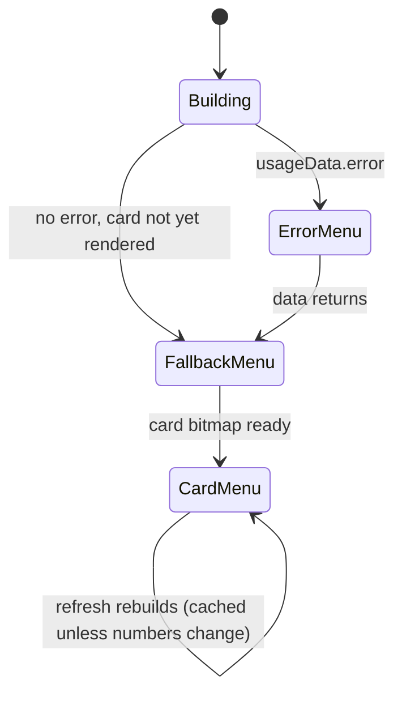

# Feature: Usage Breakdown Menu

## User Story

As a Claude Code user, I want a click to reveal a rich at-a-glance card — today's and 30-day spend and token counts, a spend-over-time bar chart, and my top model — with when it last updated, controls to refresh or change the cadence, links to the full dashboard and the project page, and a way to quit.

## Scope

**Includes:** a context menu fronted by a display-only bitmap **stats card** (today's $ / 30-day cost; 30-day tokens / today's tokens; a warm bar chart of 30-day daily costs; a "Top model: …" line; an "Estimated from local logs at API rates" footnote) on a transparent background; "Open Usage Dashboard…" directly beneath the card; a relative-time "Updated …" row; "Refresh Now"; an "Auto-Refresh" submenu (Manual / 5 / 10 / 15 / 30 / 60 min); "About Burnbar"; "Quit"; a plain-text fallback and error fallback. The Dashboard and Refresh rows carry template-image icons. The card **animates** (see [Animations](#animations) below): an odometer-style digit roll when a value changes, a bar-chart grow-from-baseline reveal, and drifting ember particles while the menu is open.
**Excludes:** all-time totals (moved to the dashboard — no longer in the menu); free-form interval entry (presets only; a non-preset value set in `settings.json` is honored and shown as "Custom"); an actionable card (the card is `enabled: false` — the drill-down is the "Open Usage Dashboard…" row beneath it); a setting to disable the animations (they're bounded/subtle by design — see [ADR-013](../adr/013-menu-card-animation-framework.md)).

The card bitmap is derived as a `MenuCard` by the CaptureService and rasterized off-screen by `MenuCardRenderer`, one animation frame at a time; the card geometry/palette/animation logic lives in [src/menu-card/card.ts](../../src/menu-card/card.ts), and the rendering/caching, last-updated formatting, and Auto-Refresh submenu are detailed in [modules/tray.md](../modules/tray.md) and [modules/menu-card-window.md](../modules/menu-card-window.md). The frame-poll loop lives in [modules/card-animator.md](../modules/card-animator.md); the cadence/persistence of the *data* lives in [features/usage-refresh.md](./usage-refresh.md).

## Animations

Three animations, one shared engine (see [ADR-013](../adr/013-menu-card-animation-framework.md) for the design):

- **Odometer digit roll** (issue #52) — when `todayCost`/`cost30d`/`tokens30d`/`todayTokens` change from a previously-rendered value, the changed digit columns roll from old to new (staggered left→right), like a mechanical odometer. Never plays on first paint (nothing to roll from) or on a light/dark theme switch alone.
- **Bar-chart grow-from-baseline reveal** (issue #54) — the 30-day bar chart grows from the baseline to its target heights (staggered left→right) on first paint *and* whenever the 30-day series changes; a theme-only re-render does not replay it.
- **Ember particles** (issue #53) — a handful of small warm-glowing dots drift upward and fade over the bar-chart region while the tray context menu is open, started/stopped from the `Menu`'s own `menu-will-show`/`menu-will-close` events.

All three are bounded or ambient-but-cheap by construction; frames are pushed by mutating the already-built card `MenuItem.icon` directly rather than rebuilding the menu. Preview all three live, without launching the app, via `pnpm storybook` → **Menu Card** stories — see [storybook.md](../storybook.md).

## UX Flow

### Success State
A non-selectable card banner drawing today + 30-day cost and tokens, the 30-day daily-cost bar chart, and the top model, with "Open Usage Dashboard…" (bar-chart icon) directly beneath it. — [tray.ts:165](../../src/tray.ts#L165), [src/menu-card/card.ts#drawCard](../../src/menu-card/card.ts)

### Fallback State
Before the first card render lands (or if a render fails), plain text: "Today's Usage" with `  Cost: $X.XX` / `  Tokens: N,NNN` (locale-grouped), or "  No usage today". — [tray.ts:168](../../src/tray.ts#L168), [addFallbackUsageItems](../../src/tray.ts#L217)

### Error State
ccusage failed → single disabled row "Error loading usage data" (card + fallback skipped); the rest of the menu still present. — [tray.ts:163](../../src/tray.ts#L163)

## Acceptance Criteria

- [ ] Menu shows the stats card (today + 30-day cost/tokens, bar chart, top model) when a card image is available. — [tray.ts:165](../../src/tray.ts#L165)
- [ ] The card is **non-selectable** (`enabled: false`); "Open Usage Dashboard…" sits directly beneath it and opens the dashboard. — [tray.ts:165](../../src/tray.ts#L165), [tray.ts:171-175](../../src/tray.ts#L171-L175)
- [ ] The Dashboard and Refresh Now rows show template-image icons (tinted to the menu foreground). — [tray.ts:172-183](../../src/tray.ts#L172-L183), [loadIcons](../../src/tray.ts#L87)
- [ ] Until the card renders (or on render failure), the plain-text "Today's Usage" fallback appears, tokens thousands-separated via `toLocaleString()`. — [tray.ts:168](../../src/tray.ts#L168), [tray.ts:222](../../src/tray.ts#L222)
- [ ] On error, the error row appears (card/fallback skipped); the rest of the menu remains. — [tray.ts:163](../../src/tray.ts#L163)
- [ ] Quit always present and calls `app.quit()`. — [tray.ts:190](../../src/tray.ts#L190)
- [ ] An "About Burnbar <version>" item (version from `app.getVersion()`) sits above Quit and opens the About/credits window — see [features/about.md](./about.md). — [tray.ts:298](../../src/tray.ts#L298), [main.ts](../../src/main.ts)
- [ ] Menu rebuilt on every pushed update (no stale rows); the card animation is only kicked off when its data signature changes. — [tray.ts#render](../../src/tray.ts#L98), [tray.ts#refreshCard](../../src/tray.ts#L122)
- [ ] Changed stat values roll (odometer-style) from the previous figure; unchanged values / first paint never roll. — [ADR-013](../adr/013-menu-card-animation-framework.md)
- [ ] The bar chart grows from the baseline on first paint and whenever the 30-day series changes; a light/dark theme switch alone never replays it. — [ADR-013](../adr/013-menu-card-animation-framework.md)
- [ ] Ember particles run only while the tray menu is open and stop cleanly on close, with no orphaned timers. — [card-animator.md](../modules/card-animator.md)

## Data Model (Conceptual)

Consumes the `TrayState` push: `UsageData` (`daily`, `total`, `error`) for the title/fallback, and the derived `MenuCard` (30-day figures) combined with today's numbers into the `MenuCardData` the card renderer draws. — [DOMAIN.md](../DOMAIN.md)

## State Transitions

## Code Touchpoints

| Concern | File |
|---------|------|
| Menu assembly | [tray.ts#buildMenuItems](../../src/tray.ts#L157) |
| Card render + cache | [tray.ts#refreshCard](../../src/tray.ts#L122), [menu-card-window.ts](../../src/menu-card-window.ts) |
| Card animation frame-poll loop | [card-animator.ts](../../src/card-animator.ts) |
| Card + icon drawing, animation tuning | [src/menu-card/card.ts](../../src/menu-card/card.ts), [animation.ts](../../src/menu-card/animation.ts), [animation-config.ts](../../src/menu-card/animation-config.ts) |
| Live menu-item icon updates | [tray.ts#handleCardFrame](../../src/tray.ts) |
| Row icons (render once, cache) | [tray.ts#loadIcons](../../src/tray.ts#L87), [menu-card-window.ts#renderIcon](../../src/menu-card-window.ts) |
| Plain-text fallback | [tray.ts#addFallbackUsageItems](../../src/tray.ts#L217) |
| About action | [main.ts](../../src/main.ts) (`onAbout: () => about.open()`) — see [features/about.md](./about.md) |
| Data | [capture.ts#toUsageData](../../src/capture.ts#L124) + [capture-service.ts#computeCard](../../src/capture-service.ts#L201) pushed via [CaptureService](../../src/capture-service.ts) |

## Known Pitfalls

- The card is a full-color bitmap shown as a menu-item `icon`, **not** a template image — macOS does not tint it. Its background is **transparent**, so the bold value text adapts to the menu appearance (`MenuCardData.dark` from `nativeTheme`); the tray re-renders the card on theme switches. The row icons *are* template images and tint correctly. — [adr/009](../adr/009-menu-stats-card.md), [tray.ts#handleThemeChange](../../src/tray.ts#L54)
- The card renders deterministically off the compositor (Canvas 2D → data URL), so window visibility never affects output. — [menu-card-window.ts](../../src/menu-card-window.ts)
- The card bitmap is cached by a JSON signature of its data; a newer state supersedes an in-flight render. Forgetting this on a new card field means stale images. — [tray.ts#refreshCard](../../src/tray.ts#L122)
- The card **and** the fallback rows are `enabled: false` (display-only); the drill-down is the separate "Open Usage Dashboard…" row beneath the card.
- Fallback row labels carry a leading two-space indent (`  Cost:`) for visual nesting. — [tray.ts:220](../../src/tray.ts#L220)
- The card animation engine deliberately excludes `dark` from its "did the stats change" check — only re-add it there if you actually want a theme switch to replay the odometer/bar animation (it currently must not, per acceptance criteria). — [menu-card.md](../modules/menu-card.md)
- Whether Electron reflects a live `MenuItem.icon` swap smoothly on an *already-open* native macOS menu (what makes the ember loop and any mid-open animation actually visible while browsing) is confirmed by convention, not by an automated check here — verify on a real Mac before relying on it. — [ADR-013](../adr/013-menu-card-animation-framework.md)
