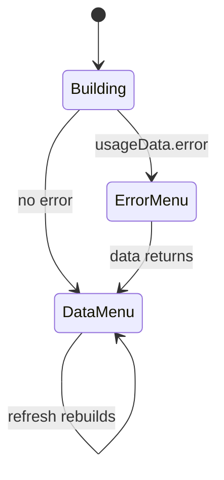

# Feature: Usage Breakdown Menu

## User Story

As a Claude Code user, I want a click to reveal today's and all-time cost and token counts, plus a way to quit.

## Scope

**Includes:** context menu with "Today's Usage" (cost + tokens), "All-Time Usage" (cost + tokens), separators, and "Quit"; empty and error fallbacks.
**Excludes:** any interactive/actionable rows — every usage row is `enabled: false` (display-only).

## UX Flow

### Success State
Two sections, each with `  Cost: $X.XX` and `  Tokens: N,NNN` (locale-grouped). — [tray.ts:112-120](../../src/tray.ts#L112-L120), [tray.ts:135-143](../../src/tray.ts#L135-L143)

### Empty State
No today entry → "  No usage today". No totals → "  No usage data". — [tray.ts:121-126](../../src/tray.ts#L121-L126), [tray.ts:144-149](../../src/tray.ts#L144-L149)

### Error State
ccusage failed → single disabled row "Error loading usage data" (sections skipped); Quit still present. — [tray.ts:84-101](../../src/tray.ts#L84-L101)

## Acceptance Criteria

- [ ] Menu shows today + all-time cost and tokens when data exists. — [tray.ts:106-150](../../src/tray.ts#L106-L150)
- [ ] Tokens are thousands-separated via `toLocaleString()`. — [tray.ts:118](../../src/tray.ts#L118), [tray.ts:141](../../src/tray.ts#L141)
- [ ] On error, only the error row + Quit appear. — [tray.ts:84-101](../../src/tray.ts#L84-L101)
- [ ] Quit always present and calls `app.quit()`. — [tray.ts:96-101](../../src/tray.ts#L96-L101)
- [ ] Menu rebuilt every refresh (no stale rows). — [tray.ts:62-64](../../src/tray.ts#L62-L64)

## Data Model (Conceptual)

Consumes `UsageData` in full (`daily`, `total`, `error`). — [DOMAIN.md](../DOMAIN.md)

## State Transitions

## Code Touchpoints

| Concern | File |
|---------|------|
| Menu assembly | [tray.ts#buildMenuItems](../../src/tray.ts#L81-L104) |
| Today rows | [tray.ts#addDailyUsageItems](../../src/tray.ts#L106-L127) |
| All-time rows | [tray.ts#addTotalUsageItems](../../src/tray.ts#L129-L150) |
| Data | [usage.ts#getUserUsage](../../src/usage.ts#L29) |

## Known Pitfalls

- Rows are intentionally **disabled** (display-only); adding an actionable item means a real `click` handler.
- Row labels carry a leading two-space indent (`  Cost:`) for visual nesting. — [tray.ts:114](../../src/tray.ts#L114)
