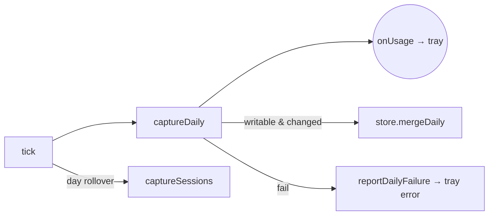

# Module: capture-service

## Purpose

Single owner of the recurring ccusage `daily` call that drives both the tray and the durable archive: it ticks every 60s, writes only when numbers change, and captures the heavier `session` report on launch, day-rollover, and quit.

## Public Surface

| Export | Type | File |
|--------|------|------|
| `CaptureService` | class | [capture-service.ts:33](../../src/capture-service.ts#L33) |
| `CaptureServiceOptions` | injectable deps (store + runner/clock/tz/interval seams) | [capture-service.ts:17](../../src/capture-service.ts#L17) |

Instance API: `start()`, `flush()`, `dispose()`, `onUsage()`, `getUsage()`, `getTimezone()`. The `tick`/`captureDaily`/`captureSessions`/`touchManifest`/`reportDailyFailure` methods are private.

## Responsibilities

- Own the 60s refresh timer; `start()` does the initial daily+session capture, then schedules ticks. — [capture-service.ts:72-87](../../src/capture-service.ts#L72-L87)
- Push each fresh daily result to the tray via the `onUsage` listener (the tray is a pure consumer). — [capture-service.ts:103-104](../../src/capture-service.ts#L103-L104)
- Skip disk work on unchanged days using an in-memory dirty cache keyed by date. — [capture-service.ts:112-123](../../src/capture-service.ts#L112-L123)
- Capture `session` data on launch, on local-day rollover, and on the final flush. — [capture-service.ts:83](../../src/capture-service.ts#L83), [capture-service.ts:94-96](../../src/capture-service.ts#L94-L96), [capture-service.ts:178](../../src/capture-service.ts#L178)
- Touch the manifest (timezone, ccusage version, capture stamp) only when a merge actually wrote. — [capture-service.ts:124-126](../../src/capture-service.ts#L124-L126), [capture-service.ts:151-157](../../src/capture-service.ts#L151-L157)
- Gate all writes on `archiveWritable` (schema-compat check at `start()`). — [capture-service.ts:76-81](../../src/capture-service.ts#L76-L81)

## Non-Goals

- No ccusage spawning/parsing or normalization — that is [capture](./capture.md).
- No disk layout, merge math, or atomic IO — that is [store](./store.md).
- No formatting or rendering — that is [tray](./tray.md).
- No dashboard read path — the dashboard reads the archive directly (see [window](./window.md)).

## How It Works

`start()` first calls `store.isSchemaCompatible()` and latches `archiveWritable`; if a newer Burnbar wrote the archive, writes are disabled for the session but the tray still works (it reads live ccusage). Each `tick()` recomputes today's local date, detects day-rollover, runs `captureDaily()`, and adds `captureSessions()` only on rollover. `captureDaily()` always refreshes `latestUsage` and notifies the listener first, then (if writable) normalizes the report and, per date, consults `dailyCache` before merging — caching the **merged** record the store returns so the dirty check mirrors disk.

## Key Types

| Type | Purpose | File |
|------|---------|------|
| `UsageData` | Tray-facing daily/total snapshot held in `latestUsage` | [types.ts#UsageData](../../src/types.ts) |
| `DailyRecord` | Authoritative merged record cached per date | [types.ts#DailyRecord](../../src/types.ts) |
| `CcusageRunner` | Injected ccusage invoker (default spawns the bundled CLI) | [capture.ts:31](../../src/capture.ts#L31) |
| `ArchiveStore` | Merge/dirty-check/atomic-IO collaborator | [store.ts:243](../../src/store.ts#L243) |

## Invariants & Failure Modes

- **dailyCache mirrors disk**: the cache stores the store's merged record, not the raw incoming one — a purged snapshot merges to the richer stored value, so the dirty check never diverges. — [capture-service.ts:117-121](../../src/capture-service.ts#L117-L121), see [adr/007-keep-richest-merge.md](../adr/007-keep-richest-merge.md)
- **Daily failure surfaces; sessions stay silent**: a daily-capture throw becomes a tray error row with a cleared title; a session throw only logs and never disturbs the tray. — [capture-service.ts:159-169](../../src/capture-service.ts#L159-L169), [capture-service.ts:144-148](../../src/capture-service.ts#L144-L148)
- **Best-effort capture**: a ccusage failure leaves the archive intact (no partial writes; the store's IO is atomic). — [capture-service.ts:30-31](../../src/capture-service.ts#L30-L31)
- **Schema-compat gate**: when the on-disk schema is newer than this build, `archiveWritable` is false and both daily and session writes are skipped for the session. — [capture-service.ts:76-81](../../src/capture-service.ts#L76-L81), [capture-service.ts:105-107](../../src/capture-service.ts#L105-L107), [capture-service.ts:132-135](../../src/capture-service.ts#L132-L135)
- **flush() runs at most once**: the `flushed` latch makes the `before-quit` flush idempotent so a deferred quit can't double-capture. — [capture-service.ts:172-179](../../src/capture-service.ts#L172-L179)
- **Manifest stamp tracks real writes**: `touchManifest` runs only when a merge reported a change, so quiet 60s ticks don't churn the manifest. — [capture-service.ts:124-126](../../src/capture-service.ts#L124-L126)

## Extension Points

- **Test seams**: inject `runner`, `now`, `timezone`, and `intervalMs` via `CaptureServiceOptions` to drive capture deterministically without spawning ccusage or waiting on wall-clock. — [capture-service.ts:17-24](../../src/capture-service.ts#L17-L24)
- **New capture cadence**: add report kinds or change rollover behavior in `tick()`; keep the dirty-cache discipline when adding writes. — [capture-service.ts:89-97](../../src/capture-service.ts#L89-L97)
- **Lifecycle wiring**: `start`/`flush`/`dispose` are called from `main.ts`; `before-quit` defers once to flush best-effort. — [main.ts](../../src/main.ts)

## Related Files

- [capture.ts](../../src/capture.ts) — ccusage runner + normalization ([capture](./capture.md)).
- [store.ts](../../src/store.ts) — merge, dirty check, atomic archive IO ([store](./store.md)).
- [time.ts](../../src/time.ts) — `localDateString` / `systemTimezone` ([time](./time.md)).
- [main.ts](../../src/main.ts) — owns the service and quit flush ([main](./main.md)).
- [adr/006-durable-usage-archive.md](../adr/006-durable-usage-archive.md) — why a single owner feeds tray + archive.
- [features/usage-archive.md](../features/usage-archive.md) — the durable-archive feature this serves.
