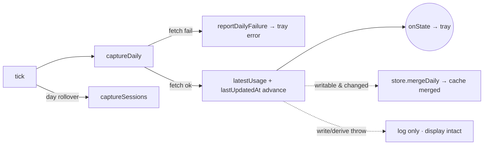

# Module: capture-service

## Purpose

Single owner of the recurring ccusage call that drives both the tray and the durable archive. It refreshes the display on a user-configurable interval (or never, in manual mode) and on demand, captures the heavier `session` report on launch / day-rollover / quit, and pushes a `TrayState` to its lone listener after each capture.

## Public Surface

| Export | Type | File |
|--------|------|------|
| `CaptureService` | class | [capture-service.ts:37](../../src/capture-service.ts#L37) |
| `CaptureServiceOptions` | injectable deps (store + runner/clock/tz/interval seams) | [capture-service.ts:19](../../src/capture-service.ts#L19) |

Instance API — lifecycle: `start()`, `flush()`, `dispose()`; reads: `getState()`, `getUsage()`, `getTimezone()`, `getRefreshIntervalMinutes()`; wiring: `onState(listener)`; commands: `setRefreshIntervalMinutes()`, `refreshNow()`. Module-private: the `scheduleTimer`/`tick`/`captureDaily`/`captureSessions`/`computeCard`/`touchManifest`/`reportDailyFailure`/`buildState`/`pushState` methods plus the `normalizeMinutes` floor and the `topModelLabel` helper. — [capture-service.ts:113-284](../../src/capture-service.ts#L113-L284)

## Responsibilities

- Own the refresh timer: `start()` does the initial daily+session capture, then schedules ticks via `scheduleTimer` (only when `refreshIntervalMinutes > 0`). — [capture-service.ts:86-97](../../src/capture-service.ts#L86-L97), [capture-service.ts:112-122](../../src/capture-service.ts#L112-L122)
- Reschedule live and re-push state when the cadence changes (`0` = manual, clears the timer). — [setRefreshIntervalMinutes](../../src/capture-service.ts#L100)
- Refresh on demand for the tray's "Refresh Now" (daily + sessions). — [refreshNow](../../src/capture-service.ts#L107)
- Push every capture's result to its listener as a `TrayState` (tray is a pure consumer). — [pushState/buildState](../../src/capture-service.ts#L227)
- Track `lastUpdatedAt` as the last *successful* fetch; a failed fetch leaves it untouched. — [capture-service.ts:147](../../src/capture-service.ts#L147), [capture-service.ts:217-218](../../src/capture-service.ts#L217-L218)
- Derive the menu stats card (`MenuCard`: `cost30d`, `tokens30d`, `topModel`, and the `spark` daily-cost bars) via `deriveSeries` over `store.readAllDaily()`. — [computeCard](../../src/capture-service.ts#L201)
- Capture `session` data on launch, on local-day rollover, and on quit-flush. — [capture-service.ts:95](../../src/capture-service.ts#L95), [capture-service.ts:129-131](../../src/capture-service.ts#L129-L131), [capture-service.ts:247](../../src/capture-service.ts#L247)
- Touch the manifest only when a merge actually wrote. — [touchManifest](../../src/capture-service.ts#L207), [capture-service.ts:165-167](../../src/capture-service.ts#L165-L167)
- Gate all writes on `archiveWritable` (schema-compat check at `start()`). — [capture-service.ts:88-93](../../src/capture-service.ts#L88-L93)

## Non-Goals

- No ccusage spawning/parsing or normalization — that is [capture](./capture.md).
- No disk layout, merge math, or atomic IO — that is [store](./store.md).
- No formatting or rendering — that is [tray](./tray.md).
- No persistence of the configured interval — that round-trips through [settings](./settings.md) before reaching `CaptureServiceOptions`.

## How It Works

`start()` latches `archiveWritable` from `store.isSchemaCompatible()`; if a newer Burnbar wrote the archive, writes are disabled for the session but the tray still works (it reads live ccusage). The core change (per [adr/006](../adr/006-durable-usage-archive.md)) is that **`captureDaily` splits two concerns**: the ccusage *fetch* is mandatory and owns the display, while the *archive write + card derivation* is best-effort.

- **Fetch leg** — `runDailyReport` failure routes to `reportDailyFailure` (tray error row, cleared title) and returns early, so `lastUpdatedAt` and the card keep their last-good values. On success, `latestUsage` and `lastUpdatedAt` advance *before* any disk work.
- **Persist leg** — wrapped in its own try/catch: if writable, it normalizes the report, and per date consults `dailyCache` before merging, caching the **merged** record the store returns so the dirty check mirrors disk; then it recomputes the `MenuCard` via `computeCard`. Any throw here is logged only — the freshly-fetched numbers already pushed are never erased.

`tick()` recomputes today's local date, detects rollover, runs `captureDaily()`, and adds `captureSessions()` only on rollover. `flush()` is the idempotent quit path.

## Key Types

| Type | Purpose | File |
|------|---------|------|
| `TrayState` | Pushed snapshot: usage + lastUpdatedAt + card + interval | [types.ts#TrayState](../../src/types.ts#L196-L201) |
| `MenuCard` | Derived 30-day card figures (`computeCard` output) | [types.ts#MenuCard](../../src/types.ts#L175-L180) |
| `UsageData` | Tray-facing daily/total numbers held in `latestUsage` | [types.ts#UsageData](../../src/types.ts#L13-L17) |
| `DailyRecord` | Authoritative merged record cached per date | [types.ts#DailyRecord](../../src/types.ts#L100-L108) |
| `CcusageRunner` | Injected ccusage invoker (default spawns the bundled CLI) | [capture.ts:31](../../src/capture.ts#L31) |
| `ArchiveStore` | Merge / dirty-check / atomic-IO collaborator | [store.ts:243](../../src/store.ts#L243) |

## Invariants & Failure Modes

- **Fetch failure never advances "last updated" (load-bearing)**: a `runDailyReport` throw surfaces as a tray error and returns before `lastUpdatedAt`/`latestUsage`/`card` move, so the menu shows the last-good stamp, not a fresh one. — [capture-service.ts:138-142](../../src/capture-service.ts#L138-L142), [reportDailyFailure](../../src/capture-service.ts#L224)
- **Write/derive failure is invisible to the display (load-bearing)**: the archive write and card derivation live in a separate try/catch *after* the display is updated and pushed; a throw is logged and the numbers stand. — [capture-service.ts:150-173](../../src/capture-service.ts#L150-L173)
- **dailyCache mirrors disk (keep-richest)**: the cache stores the store's *merged* record, not the raw incoming one — a leaner snapshot merges up to the richer stored value, so the dirty check never diverges. — [capture-service.ts:160-162](../../src/capture-service.ts#L160-L162), [adr/007](../adr/007-keep-richest-merge.md)
- **Daily failure surfaces; sessions stay silent**: a session throw only logs and never disturbs the tray (sessions feed only the by-agent view). — [captureSessions](../../src/capture-service.ts#L189-L192)
- **Schema-compat gate**: when the on-disk schema is newer than this build, `archiveWritable` is false and both daily and session writes are skipped for the session. — [capture-service.ts:88-93](../../src/capture-service.ts#L88-L93), [capture-service.ts:152](../../src/capture-service.ts#L152), [capture-service.ts:178-180](../../src/capture-service.ts#L178-L180)
- **Day-rollover triggers a session capture**: `tick()` re-derives the local date and runs sessions only when it changed, so a session crossing midnight is re-snapshotted into the new shard. — [tick](../../src/capture-service.ts#L124)
- **flush() runs at most once**: the `flushed` latch makes the quit flush idempotent so a deferred `before-quit` can't double-capture. — [flush](../../src/capture-service.ts#L241)
- **Manifest stamp tracks real writes**: `touchManifest` runs only when a merge reported a change, so quiet ticks don't churn the manifest. — [capture-service.ts:165-167](../../src/capture-service.ts#L165-L167), [capture-service.ts:186-188](../../src/capture-service.ts#L186-L188)
- **Interval is floored & non-negative**: `normalizeMinutes` drops non-finite/negative values to `0` (manual) and floors the rest. — [normalizeMinutes](../../src/capture-service.ts#L258)

## Extension Points

- **Test seams**: inject `runner`, `now`, `timezone`, and `refreshIntervalMinutes` via `CaptureServiceOptions` to drive capture deterministically without spawning ccusage or waiting on wall-clock. — [capture-service.ts:19-26](../../src/capture-service.ts#L19-L26)
- **New capture cadence**: add report kinds or change rollover behavior in `tick()`; keep the dirty-cache discipline when adding writes. — [tick](../../src/capture-service.ts#L124)
- **Card window**: `CARD_DAYS` (and the `30d` range) set the stats card's bar-chart span; `topModelLabel` picks the highest-cost model — match the dashboard if you change one. — [capture-service.ts:17](../../src/capture-service.ts#L17), [computeCard](../../src/capture-service.ts#L201), [topModelLabel](../../src/capture-service.ts#L275)
- **Lifecycle wiring**: `start`/`flush`/`dispose` and `setRefreshIntervalMinutes` are driven from [main](./main.md) via [ipc](./ipc.md) and [settings](./settings.md).

## Related Files

- [capture.ts](../../src/capture.ts) — ccusage runner + normalization ([capture](./capture.md)).
- [store.ts](../../src/store.ts) — merge, dirty check, atomic archive IO ([store](./store.md)).
- [derive.ts](../../src/derive.ts) — `deriveSeries` powering the menu card's 30-day figures ([derive](./derive.md)).
- [time.ts](../../src/time.ts) — `localDateString` / `systemTimezone` ([time](./time.md)).
- [main.ts](../../src/main.ts) — owns the service and quit flush ([main](./main.md)).
- [adr/006-durable-usage-archive.md](../adr/006-durable-usage-archive.md) — why one owner feeds tray + archive, and the fetch/write split.
- [adr/007-keep-richest-merge.md](../adr/007-keep-richest-merge.md) — the merge rule the dirty cache relies on.
- Features: [usage-refresh.md](../features/usage-refresh.md), [usage-archive.md](../features/usage-archive.md), [usage-menu.md](../features/usage-menu.md).
