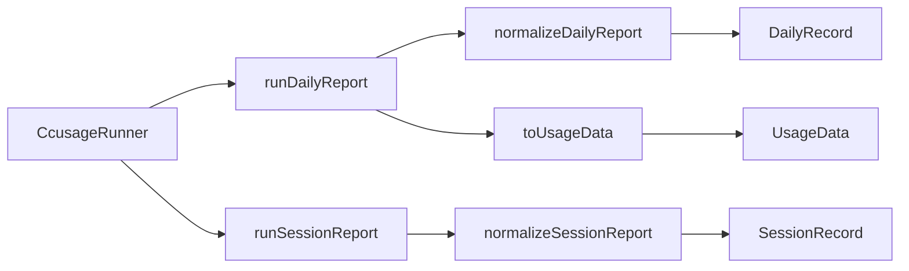

# Module: capture

## Purpose

The only data-ingestion module: invokes the bundled ccusage CLI (via a dependency-injected runner), parses its JSON, and normalizes it into the durable archive records the store persists and the `UsageData` the tray renders.

## Public Surface

| Export | Type | File |
|--------|------|------|
| `CcusageRunner` | `(args: string[]) => Promise<string>` | [capture.ts:31](../../src/capture.ts#L31) |
| `defaultCcusageRunner` | `CcusageRunner` | [capture.ts:33](../../src/capture.ts#L33) |
| `ccusageVersion()` | `() => string` | [capture.ts:43](../../src/capture.ts#L43) |
| `runDailyReport()` | `(runner, tz) => Promise<CcusageDailyReport>` | [capture.ts:52](../../src/capture.ts#L52) |
| `runSessionReport()` | `(runner, tz) => Promise<CcusageSessionReport>` | [capture.ts:60](../../src/capture.ts#L60) |
| `normalizeDailyReport()` | `(report, tz, capturedAt) => DailyRecord[]` | [capture.ts:85](../../src/capture.ts#L85) |
| `normalizeSessionReport()` | `(report, capturedAt) => SessionRecord[]` | [capture.ts:105](../../src/capture.ts#L105) |
| `toUsageData()` | `(report, today) => UsageData` | [capture.ts:124](../../src/capture.ts#L124) |

`normalizeModels()` is module-private. — [capture.ts:71](../../src/capture.ts#L71)

## Responsibilities

- Resolve the ccusage CLI entry via `createRequire(...).resolve("ccusage/src/cli.js")`. — [capture.ts:23-24](../../src/capture.ts#L23-L24)
- Spawn ccusage through the current runtime (`process.execPath`) with `ELECTRON_RUN_AS_NODE=1` and a 256 MiB stdout buffer — wrapped behind `CcusageRunner` so tests inject a fixture. — [capture.ts:33-40](../../src/capture.ts#L33-L40)
- Run the `daily` and `session` subcommands (timezone-pinned via `-z`) and parse their JSON. — [capture.ts:52-66](../../src/capture.ts#L52-L66)
- Normalize rows into `DailyRecord[]` / `SessionRecord[]`, recomputing per-model `totalTokens` and rolling up record totals. — [capture.ts:71-121](../../src/capture.ts#L71-L121)
- Derive the tray-facing `UsageData` (today + grand total) from the same daily report. — [capture.ts:124-130](../../src/capture.ts#L124-L130)
- Report the ccusage package version recorded in the archive manifest. — [capture.ts:43-50](../../src/capture.ts#L43-L50)

## Non-Goals

- No persistence, merge, or de-dup — that lives in [store](./store.md); capture only produces fresh records.
- No formatting (dollar strings, `toLocaleString`) — that lives in [tray](./tray.md).
- No scheduling / polling — the loop lives in [capture-service](./capture-service.md).
- No `UsageData.error` mapping — failures propagate; the service catches and surfaces them.

## How It Works

The runner is the seam: `defaultCcusageRunner` shells out to `<runtime> <ccusage cli> <args>`, while `runDailyReport`/`runSessionReport` own the argv (`--json --mode calculate -z <tz>`) and `JSON.parse`. The two `normalize*` functions are **pure**: they mirror ccusage's field names one-to-one (no renames — see [DOMAIN.md](../DOMAIN.md)), recompute each model line's `totalTokens` from its four components, and set record `totals` to `rollupTotals(models)` so the *totals = Σ models* invariant holds even if a future ccusage build rounds or omits a sum. `toUsageData` is a thin view over the same daily report (find today's row, read grand totals).

## Key Types

| Type | Purpose | File |
|------|---------|------|
| `CcusageDailyReport` / `CcusageSessionReport` | Parsed CLI output (consumed subset) | [types.ts#L62-L72](../../src/types.ts#L62-L72) |
| `CcusageRow` | One normalized daily/session row | [types.ts#L36-L51](../../src/types.ts#L36-L51) |
| `DailyRecord` / `SessionRecord` | Durable archive records | [types.ts#L100-L122](../../src/types.ts#L100-L122) |
| `ModelBreakdown` / `RecordTotals` | Per-model line + record rollup | [types.ts#L86-L94](../../src/types.ts#L86-L94) |
| `UsageData` | Mapped result for the tray | [types.ts#L13-L17](../../src/types.ts#L13-L17) |

## Invariants & Failure Modes

- **totals = Σ models**: record `totals` is always `rollupTotals(models)`, and each model's `totalTokens` is recomputed from its four token components — never trusted from the wire. — [capture.ts:78-79](../../src/capture.ts#L78-L79), [store.ts#rollupTotals](../../src/store.ts#L69)
- **Normalizers are pure & total**: no I/O, no throw on well-formed input; missing `metadata` degrades gracefully (empty agents / `capturedAt` fallback). — [capture.ts:95](../../src/capture.ts#L95), [capture.ts:114](../../src/capture.ts#L114)
- **Timezone is explicit**: bucketing is pinned via `-z <tz>` and stamped onto each `DailyRecord.timezone`, so dates don't drift with the host's TZ — unlike the old UTC-only `usage.ts`. — [capture.ts:56](../../src/capture.ts#L56), [capture.ts:93-95](../../src/capture.ts#L93-L95)
- **`runner` throws on spawn/parse failure** — this module does not swallow it; callers own recovery. — [capture.ts:34](../../src/capture.ts#L34), [capture.ts:57](../../src/capture.ts#L57)
- Backend-agnostic via `--mode calculate` (prices from local logs). — [capture.ts:21-22](../../src/capture.ts#L21-L22)
- **Launch gotcha**: `ELECTRON_RUN_AS_NODE` here is intentional and scoped to the child; an *inherited* one (e.g. IDE terminals) breaks Burnbar's own launch — see [adr/002](../adr/002-electron-run-as-node.md).

## Extension Points

- **Inject a runner** for tests or alternate transports — pass any `CcusageRunner` to `runDailyReport`/`runSessionReport`. — [capture.ts:31](../../src/capture.ts#L31)
- To consume more ccusage fields, extend `CcusageRow`/`ModelBreakdown` and the `normalize*` mapping. — [capture.ts:71-82](../../src/capture.ts#L71-L82)
- To change the subcommand/flags (timezone, mode), edit the argv in `runDailyReport`/`runSessionReport`. — [capture.ts:56](../../src/capture.ts#L56), [capture.ts:64](../../src/capture.ts#L64)

## Related Files

- [capture-service.md](./capture-service.md) — the loop that calls these functions on a schedule.
- [store.md](./store.md) — merges/persists the records (owns `rollupTotals`).
- [types.md](./types.md) — the contract types.
- See [adr/001-ccusage-cli-shell-out.md](../adr/001-ccusage-cli-shell-out.md), [adr/002-electron-run-as-node.md](../adr/002-electron-run-as-node.md), and [adr/006-durable-usage-archive.md](../adr/006-durable-usage-archive.md) for the rationale. This module absorbed the old `usage.ts`.
