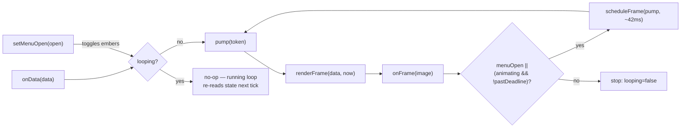

# Module: card-animator

## Purpose

Drives the menu card's frame-at-a-time rendering API ([menu-card-window](./menu-card-window.md)) on a timer, so the [tray](./tray.md) doesn't have to hand-roll polling loops for each of the card's animations ([ADR-013](../adr/013-menu-card-animation-framework.md)). Decoupled from *how* a frame is produced (both the render call and the ember toggle are injected functions) and from real wall-clock time (the clock and scheduler are injectable too), so the tricky part — supersession, the safety-cap deadline, the menu-open/close race — is unit-testable without a real hidden `BrowserWindow` or real timers.

## Public Surface

| Export | Type | File |
|--------|------|------|
| `CardAnimator` | class (`onData`, `setMenuOpen`, `dispose`) | [card-animator.ts](../../src/card-animator.ts) |
| `RenderCardFrame`, `SetEmbersActive`, `CardAnimatorOptions` | the injected-dependency shapes | [card-animator.ts](../../src/card-animator.ts) |

`new CardAnimator(renderFrame, setEmbersActive, options)` — `renderFrame`/`setEmbersActive` are typically `MenuCardRenderer.renderFrame`/`.setEmbersActive` bound closures; `options.onFrame` is called with every rendered frame (including `null` on failure); `options.now`/`scheduleFrame`/`cancelFrame` default to `Date.now`/`setTimeout`/`clearTimeout` and exist to be overridden in tests. `onData(data)` — new card figures arrived (the tray already checked its signature changed). `setMenuOpen(open)` — the tray context menu opened or closed. `dispose()` — cancels any pending timer.

## Responsibilities

- Run **one** self-scheduling loop (`setTimeout`, not `setInterval`, so a slow render can never cause overlapping frame requests) that calls `renderFrame(latestData, now())`, forwards the result to `onFrame`, and decides whether to schedule another tick. — [pump](../../src/card-animator.ts)
- Serve two independent triggers off that single loop: `onData` (**bounded** — keep polling while the browser reports `animating: true`, capped by `MAX_BOUNDED_RUN_MS` as a runaway-safety net) and `setMenuOpen(true)` (**ambient** — keep polling indefinitely, ember particles included, until the menu closes). Whichever reason currently applies keeps the loop alive; it stops only once neither does. — [pump](../../src/card-animator.ts)
- Toggle the ember loop via the injected `setEmbersActive` exactly on a `setMenuOpen` transition (not on every tick). — [setMenuOpen](../../src/card-animator.ts)
- Guard against starting two concurrent pump loops when two triggers fire in the same synchronous tick (e.g. `onData()` immediately followed by `setMenuOpen(true)`, both before the first render has resolved) via a `looping` flag set **synchronously** at loop-start — not just once a frame lands. — [ensureLoop](../../src/card-animator.ts)
- Supersede a stale in-flight run: a `dispose()` (or a fresh `ensureLoop`) bumps a `runToken`; a render that resolves after its token is stale is discarded without calling `onFrame`. — [pump](../../src/card-animator.ts)
- Cancel any pending timer and stop the loop on `dispose()`. — [dispose](../../src/card-animator.ts)

## Non-Goals

- **No drawing, no animation math** — it only calls the injected `renderFrame`/`setEmbersActive` and reacts to their results; the actual tween/particle timing lives in [`src/menu-card/animation.ts`](../../src/menu-card/animation.ts) and [`card.ts`](../../src/menu-card/card.ts).
- **No Electron dependency beyond the `NativeImage` type** — `renderFrame`/`setEmbersActive` are plain injected functions; nothing here calls `executeJavaScript` or touches a `BrowserWindow` directly (that's [menu-card-window.ts](./menu-card-window.md)).
- **No menu-building or icon-mutation** — the [tray](./tray.md)'s `onFrame` callback decides what to do with a rendered image (cache it, mutate a live `MenuItem.icon`, or trigger a one-time menu rebuild).
- **No data derivation or change detection** — the tray decides *whether* `onData` should be called at all (it already skips unchanged signatures before calling in).

## How It Works

`onData(data)` stores `latestData`, resets a bounded deadline (`now() + MAX_BOUNDED_RUN_MS`), and calls `ensureLoop()`. `setMenuOpen(open)` flips the `menuOpen` flag, fires the ember toggle, and — only when opening — also calls `ensureLoop()`. `ensureLoop()` is idempotent: if a loop is already `looping`, it no-ops (the running loop re-reads `latestData`/`menuOpen`/`boundedDeadlineMs` fresh on every tick, so a newer call's effects are already visible to it); otherwise it flips `looping` true and starts `pump` with a fresh `runToken`.

`pump(token)` bails immediately if superseded (`token !== runToken`) or if there's no data yet. Otherwise it captures `now()` and calls `renderFrame(latestData, now)`. When that resolves: if still current, it calls `onFrame(image)`, then computes `shouldContinue = menuOpen || (animating && !pastDeadline)` — the menu being open dominates the bounded deadline entirely (an ember loop that outlives the original bounded window is expected and correct), so on transition to open, that flag alone keeps the *existing* loop going without restarting it. If continuing, it schedules the next `pump(token)` after `FRAME_INTERVAL_MS` (~24fps); otherwise it clears `looping`/`timer` and stops. A thrown render is caught the same way (stop, don't rethrow) so a renderer bug can't wedge the tray.

## Key Types

| Type | Purpose | File |
|------|---------|------|
| `RenderCardFrame` | `(data, nowMs) => Promise<{ image, animating }>` — the injected render call | [card-animator.ts](../../src/card-animator.ts) |
| `SetEmbersActive` | `(active, nowMs) => Promise<void>` — the injected ember toggle | [card-animator.ts](../../src/card-animator.ts) |
| `MenuCardData` | the card figures passed to `onData` | [types.ts#MenuCardData](../../src/types.ts) |

## Invariants & Failure Modes

- **Exactly one loop at a time**: guarded by the `looping` flag (set synchronously, before any `await`) rather than the `timer` handle, specifically so two same-tick triggers can't race two concurrent pumps and drop a frame. — [test/card-animator.test.ts](../../test/card-animator.test.ts)
- **The bounded deadline never applies while the menu is open**: `shouldContinue`'s `menuOpen ||` short-circuits the deadline check entirely, so an ember loop that started under `onData`'s bounded run and is still going once the menu opens keeps running past `MAX_BOUNDED_RUN_MS` — that cap only protects the menu-closed case (e.g. a stuck `animating: true`) from spinning forever.
- **A stale render never calls `onFrame`**: `dispose()`/a fresh `ensureLoop` bump `runToken`; any in-flight `renderFrame` promise that resolves after its captured token is stale is silently dropped.
- **`dispose()` is safe to call any time**, including mid-render — it cancels the pending timer (if any) and stops the loop from continuing once the in-flight render resolves (via the token check).

## Extension Points

- New animation triggers (a fourth "reason to keep polling") slot into `shouldContinue` in `pump` alongside `menuOpen`/`animating`.
- The frame-rate cadence (`FRAME_INTERVAL_MS`) and the runaway-safety cap (`MAX_BOUNDED_RUN_MS`) are top-of-file constants.
- Swap the clock/scheduler (`now`/`scheduleFrame`/`cancelFrame`) via `CardAnimatorOptions` for tests, or to move off `setTimeout` (e.g. an RAF-driven variant) without touching the loop logic.

## Related Files

- [menu-card-window.ts](../../src/menu-card-window.ts) → [menu-card-window.md](./menu-card-window.md) — the `renderFrame`/`setEmbersActive` implementation this drives.
- [tray.ts](../../src/tray.ts) → [tray.md](./tray.md) — the sole consumer: constructs one `CardAnimator`, feeds it `onData`/`setMenuOpen`, and reacts to `onFrame`.
- [src/menu-card/animation.ts](../../src/menu-card/animation.ts), [src/menu-card/card.ts](../../src/menu-card/card.ts) → [menu-card.md](./menu-card.md) — what actually gets animated.
- [adr/013-menu-card-animation-framework.md](../adr/013-menu-card-animation-framework.md) — why this shape.
- [test/card-animator.test.ts](../../test/card-animator.test.ts) — the loop-lifecycle unit tests (injected fake clock/scheduler).
