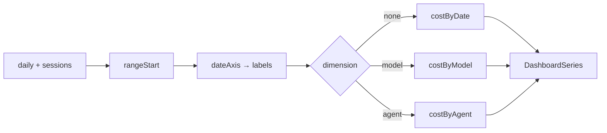

# Module: derive

## Purpose

Pure read-time projection: turns archive records ([`DailyRecord[]`](../../src/types.ts#L100-L108), [`SessionRecord[]`](../../src/types.ts#L114-L122)) into a chart-ready [`DashboardSeries`](../../src/types.ts#L149-L155) over a continuous, zero-filled daily axis. Data in → data out, no IO.

## Public Surface

| Export | Type | File |
|--------|------|------|
| `deriveSeries()` | `(daily, sessions, options) => DashboardSeries` | [derive.ts:108](../../src/derive.ts#L108) |

`options` is `{ range, dimension, timezone, today }`. The axis/window helpers (`shiftDate`, `rangeStart`, `dateAxis`, `sessionLocalDate`) and the three per-dimension builders (`costByDate`, `costByModel`, `costByAgent`) are module-private. — [derive.ts:21-106](../../src/derive.ts#L21-L106)

## Responsibilities

- Build the date window: fixed `RANGE_DAYS` for `30d`/`90d`, or anchor `all` to the earliest source date. — [derive.ts:16-38](../../src/derive.ts#L16-L38)
- Emit a **continuous** ascending `YYYY-MM-DD` axis from `start` to `today` (no gaps). — [derive.ts:40-46](../../src/derive.ts#L40-L46)
- Dispatch on `dimension`: `none` → single "Cost" line, `model` → one stacked dataset per model, `agent` → one per agent. — [derive.ts:126-133](../../src/derive.ts#L126-L133)
- Bucket each session to its **local last-activity day** for the by-agent view (the documented approximation). — [derive.ts:81-106](../../src/derive.ts#L81-L106)
- Zero-fill every axis index with no data, so stacked datasets stay index-aligned. — [derive.ts:59,76-77,104](../../src/derive.ts#L59)
- Sum `totalCost` across the visible datasets. — [derive.ts:135-138](../../src/derive.ts#L135-L138)

## Non-Goals

- No persistence or capture — it reads what [store](../../src/store.ts) already merged.
- No formatting, colors, or chart config — that is the renderer's job ([dashboard](../../src/dashboard.ts)).
- Not authoritative for by-agent daily totals — see the approximation below and [adr/007](../adr/007-keep-richest-merge.md).

## How It Works

Date math is done by **UTC shift on the `YYYY-MM-DD` string** (`shiftDate`), which is tz-agnostic and calendar-correct, so DST never skews the axis. — [derive.ts:21-29](../../src/derive.ts#L21-L29)

`deriveSeries` first picks the `sourceDates` that anchor an `all` window — session local days for the `agent` dimension, else daily `record.date` — then computes `start`, the axis `labels`, and an `inRange` set, and dispatches to the matching builder. — [derive.ts:108-133](../../src/derive.ts#L108-L133)

## Key Types

| Type | Purpose | File |
|------|---------|------|
| `DailyRecord` | Authoritative per-day source (cost-over-time, by-model) | [types.ts:100-108](../../src/types.ts#L100-L108) |
| `SessionRecord` | Per-session source (by-agent) | [types.ts:114-122](../../src/types.ts#L114-L122) |
| `SeriesRange` / `SeriesDimension` | Window + breakdown selectors | [types.ts:135-136](../../src/types.ts#L135-L136) |
| `SeriesDataset` | One stacked line: `{ label, data[] }` aligned to `labels` | [types.ts:143-147](../../src/types.ts#L143-L147) |
| `DashboardSeries` | The returned chart payload | [types.ts:149-155](../../src/types.ts#L149-L155) |

## Invariants & Failure Modes

- **Aligned datasets**: every `dataset.data` has exactly `labels.length` entries — gaps are `0`, never `undefined`. — [derive.ts:59,104](../../src/derive.ts#L59)
- **Continuous axis**: `labels` is strictly ascending with no missing days; `all` never starts after `today`. — [derive.ts:36-46](../../src/derive.ts#L36-L46)
- **Invalid timestamps are skipped**, not crashed: a session whose `lastActivity` fails `Date` parsing returns `null` from `sessionLocalDate` and is dropped from both `sourceDates` and the by-agent buckets. — [derive.ts:48-55,94](../../src/derive.ts#L48-L55)
- **By-agent approximation (load-bearing)**: a session is attributed *wholly* to its last-activity local day, so by-agent daily totals can drift slightly from the authoritative daily totals near day boundaries. This is intentional — by-model/cost-over-time stay authoritative. — [derive.ts:87-89](../../src/derive.ts#L87-L89), [adr/007](../adr/007-keep-richest-merge.md)
- Model and agent labels are **sorted** for stable stacking order. — [derive.ts:69-71,102](../../src/derive.ts#L69-L71)

## Extension Points

- **New breakdown dimension**: add a `SeriesDimension` value, a `costBy…` builder returning `SeriesDataset[]`, and a branch in `deriveSeries`. — [derive.ts:126-133](../../src/derive.ts#L126-L133)
- **New range**: add to `SeriesRange` + `RANGE_DAYS` (or special-case in `rangeStart`). — [derive.ts:16-38](../../src/derive.ts#L16-L38)
- **Token-based series** (vs. cost): builders read `record.totals.totalCost` / `session.totals.totalCost`; swap the field to plot tokens. — [derive.ts:58,99](../../src/derive.ts#L58)

## Related Files

- [types.ts](../../src/types.ts) — the source and series contracts ([types doc](./types.md)).
- [time.ts](../../src/time.ts) — `localDateString`, the tz day-bucketing primitive.
- [store.ts](../../src/store.ts) — produces the merged records this module reads.
- [usage-dashboard.md](../features/usage-dashboard.md) — the feature this powers; [usage-archive.md](../features/usage-archive.md) — the upstream archive.
- [adr/007-keep-richest-merge.md](../adr/007-keep-richest-merge.md) — the by-agent approximation rationale; [adr/006-durable-usage-archive.md](../adr/006-durable-usage-archive.md), [adr/008-dashboard-window-bundle.md](../adr/008-dashboard-window-bundle.md).
