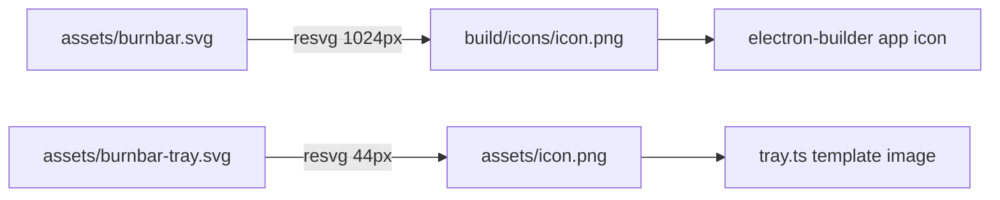

# Module: icon-pipeline

## Purpose

Regenerates Burnbar's PNG icons from committed SVG sources, so both the menu-bar tray mark and the packaged app icon derive from a single source of truth.

## Public Surface

| Artifact | Type | File |
|----------|------|------|
| `pnpm icon` | npm script → node | [package.json:30](../../package.json#L30) |
| icon generator | ESM script | [scripts/generate-icons.mjs](../../scripts/generate-icons.mjs) |

## Responsibilities

- Render [assets/burnbar.svg](../../assets/burnbar.svg) (full-color) → `build/icons/icon.png` at 1024px for packaging. — [scripts/generate-icons.mjs:31](../../scripts/generate-icons.mjs#L31)
- Render [assets/burnbar-tray.svg](../../assets/burnbar-tray.svg) (monochrome) → `assets/icon.png` at 44px for the tray. — [scripts/generate-icons.mjs:32](../../scripts/generate-icons.mjs#L32)

## Non-Goals

- Does not generate `.icns` / multi-resolution sets — electron-builder derives those from the 1024px PNG.
- Does not run automatically in `build`/`dist`; it is a manual, source-controlled step.

## How It Works

Uses `@resvg/resvg-js` (prebuilt npm binaries — no system `rsvg-convert`/Homebrew needed) to rasterize each SVG to PNG, fitting to a target width. Paths are resolved relative to the repo root via `import.meta.url`. — [scripts/generate-icons.mjs:14-32](../../scripts/generate-icons.mjs#L14-L32)

## Invariants & Failure Modes

- The **SVGs are the source of truth**; the PNGs are generated outputs (both are committed). — [scripts/generate-icons.mjs:3-12](../../scripts/generate-icons.mjs#L3-L12)
- `assets/icon.png` must stay a monochrome template (consumed via `setTemplateImage(true)`). — [tray.ts:19-21](../../src/tray.ts#L19-L21)
- Output dirs are created on demand (`mkdirSync recursive`). — [scripts/generate-icons.mjs:23](../../scripts/generate-icons.mjs#L23)

## Extension Points

- To change icon art, edit the SVGs and re-run `pnpm icon` — never hand-edit the PNGs.
- To add a size, add a `render(...)` call. — [scripts/generate-icons.mjs:31-32](../../scripts/generate-icons.mjs#L31-L32)

## Related Files

- [tray.ts](../../src/tray.ts) — consumes `assets/icon.png`.
- [packaging](./packaging.md) — consumes `build/icons/icon.png`.
- [adr/004-template-tray-icon.md](../adr/004-template-tray-icon.md) — why a template image.
