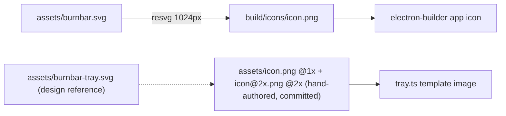

# Module: icon-pipeline

## Purpose

Regenerates the packaged **app icon** from its committed SVG source. The menu-bar **tray** PNGs are hand-authored and committed directly (optically tuned per size), so they are not part of this generation step — `assets/burnbar-tray.svg` is retained only as a design reference.

## Public Surface

| Artifact | Type | File |
|----------|------|------|
| `pnpm icon` | npm script → node | [package.json:30](../../package.json#L30) |
| icon generator | ESM script | [scripts/generate-icons.mjs](../../scripts/generate-icons.mjs) |

## Responsibilities

- Render [assets/burnbar.svg](../../assets/burnbar.svg) (full-color) → `build/icons/icon.png` at 1024px for packaging. — [scripts/generate-icons.mjs:31](../../scripts/generate-icons.mjs#L31)
- The tray mark is **not** generated: `assets/icon.png` (22px @1x) and `assets/icon@2x.png` (44px @2x) are committed hand-authored monochrome templates. [tray.ts](../../src/tray.ts) builds the tray image from the @2x asset at `scaleFactor: 2` (crisp, ~22pt on Retina) and adds the @1x as a representation for non-Retina displays.

## Non-Goals

- Does not generate `.icns` / multi-resolution sets — electron-builder derives those from the 1024px PNG.
- Does not run automatically in `build`/`dist`; it is a manual, source-controlled step.

## How It Works

Uses `@resvg/resvg-js` (prebuilt npm binaries — no system `rsvg-convert`/Homebrew needed) to rasterize each SVG to PNG, fitting to a target width. Paths are resolved relative to the repo root via `import.meta.url`. — [scripts/generate-icons.mjs:14-32](../../scripts/generate-icons.mjs#L14-L32)

## Invariants & Failure Modes

- For the **app icon**, `assets/burnbar.svg` is the source of truth; `build/icons/icon.png` is a generated, committed output. — [scripts/generate-icons.mjs:3-12](../../scripts/generate-icons.mjs#L3-L12)
- The **tray** PNGs (`assets/icon.png` @1x + `assets/icon@2x.png` @2x) are the source of truth themselves — hand-authored and committed, deliberately *not* generated (per-size optical tuning a single SVG render can't reproduce).
- `assets/icon.png` / `assets/icon@2x.png` must stay monochrome templates (consumed via `setTemplateImage(true)`). — [tray.ts](../../src/tray.ts)
- The **update badge** does not change this: the committed asset stays a template; [tray-icon.ts](../../src/tray-icon.ts) composites a *runtime, non-template* badged variant from it only while an update is pending (recolor by alpha + colored dot), so the source asset stays monochrome. — [tray-icon.md](./tray-icon.md), [ADR-011 amendment](../adr/011-auto-update-mechanism.md#amendment-attention-cues-2026-07)
- Output dirs are created on demand (`mkdirSync recursive`). — [scripts/generate-icons.mjs:23](../../scripts/generate-icons.mjs#L23)

## Extension Points

- To change the **app icon** art, edit `assets/burnbar.svg` and re-run `pnpm icon` — never hand-edit `build/icons/icon.png`.
- To change the **tray** art, replace the committed `assets/icon.png` (22px) and `assets/icon@2x.png` (44px) directly (keep them monochrome templates); update `assets/burnbar-tray.svg` to match as the reference.
- To add an app-icon size, add a `render(...)` call. — [scripts/generate-icons.mjs:31](../../scripts/generate-icons.mjs#L31)

## Related Files

- [tray.ts](../../src/tray.ts) — consumes `assets/icon.png`.
- [packaging](./packaging.md) — consumes `build/icons/icon.png`.
- [adr/004-template-tray-icon.md](../adr/004-template-tray-icon.md) — why a template image.
