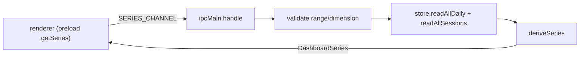

# Module: ipc

## Purpose

The main-process IPC surface for the dashboard: registers the single read-only `archive:get-series` handler that reads the archive store, derives a chart series, and returns it to the renderer through the preload bridge.

## Public Surface

| Export | Type | File |
|--------|------|------|
| `SERIES_CHANNEL` | the `"archive:get-series"` channel name | [ipc.ts:7](../../src/ipc.ts#L7) |
| `registerArchiveIpc()` | `(store: ArchiveStore, timezone: string) => void` | [ipc.ts:18](../../src/ipc.ts#L18) |

The `RANGES`/`DIMENSIONS` allow-sets are module-private validation guards. — [ipc.ts:9-10](../../src/ipc.ts#L9-L10)

## Responsibilities

- Register one `ipcMain.handle(SERIES_CHANNEL, …)` handler — the only IPC entry point. — [ipc.ts:19](../../src/ipc.ts#L19)
- Defensively coerce the raw request: default `range` to `"all"` and `dimension` to `"none"` unless the value is in the allow-set. — [ipc.ts:20-23](../../src/ipc.ts#L20-L23)
- Read the full archive (`readAllDaily` + `readAllSessions`) in parallel. — [ipc.ts:25](../../src/ipc.ts#L25)
- Resolve "today" in the pinned timezone and hand everything to `deriveSeries`. — [ipc.ts:26-27](../../src/ipc.ts#L26-L27)

## Non-Goals

- No writes — registration takes the store but only calls its read methods; capture/merge lives in [capture-service](./capture-service.md) / [store](./store.md).
- No series math — bucketing, zero-fill, and stacking are owned by [derive](./derive.md).
- No channel name leakage to the renderer — the preload re-exports the same constant; this module doesn't reach into the renderer.

## How It Works

`registerArchiveIpc` is called once at startup from [main](./main.md). Each renderer call (via the preload `getSeries`) arrives as an `unknown` payload; the handler validates it, reads the archive, and returns a `DashboardSeries`.

## Key Types

| Type | Purpose | File |
|------|---------|------|
| `SeriesRequest` | renderer input (`range`, `dimension`) | [types.ts#SeriesRequest](../../src/types.ts#L138-L141) |
| `SeriesRange` / `SeriesDimension` | the validated enums mirrored by the allow-sets | [types.ts:135-136](../../src/types.ts#L135-L136) |
| `DashboardSeries` | the handler's return contract | [types.ts#DashboardSeries](../../src/types.ts#L149-L155) |

## Invariants & Failure Modes

- **Allow-sets must mirror the type enums.** `RANGES`/`DIMENSIONS` are stringly-typed and drift silently from `SeriesRange`/`SeriesDimension` if either side changes — keep them in lockstep. — [ipc.ts:9-10](../../src/ipc.ts#L9-L10)
- **No input is trusted.** A missing, malformed, or hostile payload coerces to the `"all"`/`"none"` defaults rather than throwing, even though the only caller is our own renderer. — [ipc.ts:20-23](../../src/ipc.ts#L20-L23)
- **`timezone` is the day-bucket anchor.** "today" is computed via `localDateString(timezone)`; the same pinned tz must be threaded through capture so read-time and write-time days agree. — [ipc.ts:26](../../src/ipc.ts#L26)
- Store read errors (e.g. unreadable shards) reject the handler and surface as a rejected `invoke` in the renderer — there is no fallback series here.

## Extension Points

- New dashboard query → add a channel constant + `ipcMain.handle` here, expose it in the [preload](./preload.md) bridge, and add the method to `BurnbarBridge`. — [types.ts#BurnbarBridge](../../src/types.ts#L158-L160)
- New `range`/`dimension` value → extend the type enum **and** the matching allow-set.

## Related Files

- [window.md](./window.md), [preload.md](./preload.md) — the renderer-side host and bridge that invoke this channel.
- [derive.md](./derive.md), [store.md](./store.md), [time.md](./time.md) — the read-path collaborators.
- [main.md](./main.md) — wires `registerArchiveIpc(store, timezone)` at startup. — [main.ts:34](../../src/main.ts#L34)
- See [features/usage-dashboard.md](../features/usage-dashboard.md) and [adr/008-dashboard-window-bundle.md](../adr/008-dashboard-window-bundle.md).
