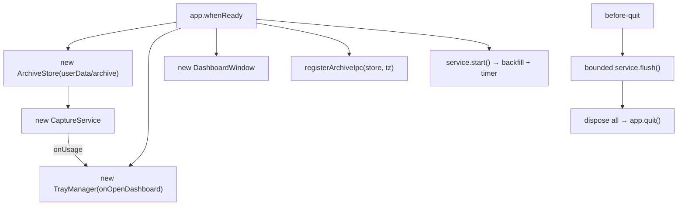

# Module: main

## Purpose

Electron main-process entry point. Wires the four collaborators — `ArchiveStore`, `CaptureService`, `TrayManager`, `DashboardWindow` (plus the archive IPC) — and enforces menu-bar-only behavior with a quit-time flush.

## Public Surface

No exports — it is the executable entry (`package.json#main` → `dist/main.js`). — [main.ts](../../src/main.ts)

## Responsibilities

- Hide the Dock on macOS (menu-bar-only). — [main.ts:18-20](../../src/main.ts#L18-L20)
- Pin the timezone and construct the `ArchiveStore` under `userData/archive`. — [main.ts:23-25](../../src/main.ts#L23-L25)
- Construct the `CaptureService`, `DashboardWindow`, and `TrayManager` (with an `onOpenDashboard` callback). — [main.ts:26-29](../../src/main.ts#L26-L29)
- Register the read-only archive IPC, initialize the tray, subscribe it to `service.onUsage`, and `start()` capture. — [main.ts:34-37](../../src/main.ts#L34-L37)
- On `before-quit`, defer once and run a bounded final flush so the last interval persists. — [main.ts:39-66](../../src/main.ts#L39-L66)

## Non-Goals

- No usage parsing, merging, or menu construction — delegated to [capture-service](./capture-service.md) / [store](./store.md) / [tray](./tray.md).
- No dashboard rendering — delegated to [window](./window.md) / [ipc](./ipc.md).

## How It Works

On `app.whenReady()` it builds the object graph and starts capture, which immediately backfills and pushes the first `UsageData` to the tray. The dashboard window is created lazily when the tray item is clicked.

`before-quit` uses a deferred-quit pattern: the first event calls `preventDefault()`, runs `service.flush()` raced against a 5 s timeout, then re-quits; the second pass tears everything down. This guarantees the last interval is captured without letting a hung ccusage block shutdown. — [main.ts:39-66](../../src/main.ts#L39-L66)

## Invariants & Failure Modes

- Exactly one of each collaborator for the app's lifetime; module-level handles are disposed on quit. — [main.ts:12-16](../../src/main.ts#L12-L16)
- `app.dock` is guarded before `.hide()` (undefined off-darwin). — [main.ts:18-20](../../src/main.ts#L18-L20)
- The quit flush is bounded by `QUIT_FLUSH_TIMEOUT_MS`; a hung ccusage cannot prevent shutdown. — [main.ts:11](../../src/main.ts#L11)
- On non-darwin, closing the dashboard quits the app (`window-all-closed`); on macOS it stays resident. — [main.ts:68-73](../../src/main.ts#L68-L73)

## Related Files

- [capture-service.ts](../../src/capture-service.ts), [tray.ts](../../src/tray.ts), [window.ts](../../src/window.ts), [ipc.ts](../../src/ipc.ts), [store.ts](../../src/store.ts) — the wired collaborators.
