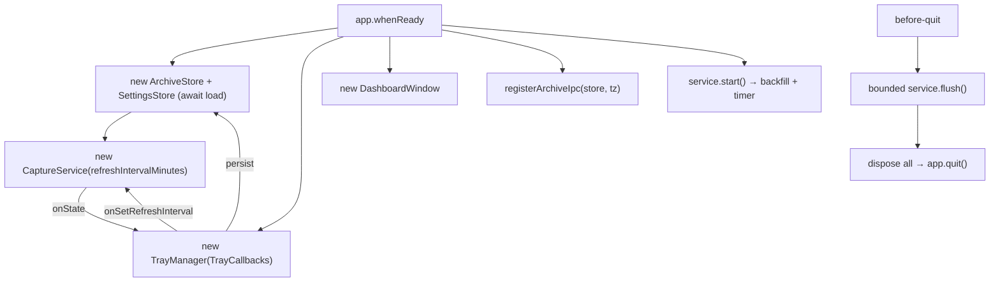

# Module: main

## Purpose

Electron main-process entry point. Builds the object graph — `ArchiveStore`, `SettingsStore`, `CaptureService`, `TrayManager`, `DashboardWindow` (plus the archive IPC) — wires the tray's actions to the service and settings, and enforces menu-bar-only behavior with a bounded quit-time flush.

## Public Surface

No exports — this is the executable entry (`package.json#main` → `dist/main.js`). Module-private state: the singleton `captureService`/`trayManager`/`dashboardWindow` handles and the `quitting` latch. — [main.ts:14-17](../../src/main.ts#L14-L17)

## Responsibilities

- Hide the Dock on macOS for menu-bar-only operation. — [main.ts:20-23](../../src/main.ts#L20-L23)
- Resolve the timezone and construct the `ArchiveStore` (`userData/archive`) and `SettingsStore` (`userData/settings.json`), then `await settings.load()`. — [main.ts:25-29](../../src/main.ts#L25-L29)
- Construct the `CaptureService`, seeding `refreshIntervalMinutes` from the loaded settings. — [main.ts:31-35](../../src/main.ts#L31-L35)
- Construct the `DashboardWindow` and `TrayManager`, wiring `TrayCallbacks`: `onOpenDashboard` → `dashboard.open()`, `onRefreshNow` → `service.refreshNow()`, `onSetRefreshInterval` → `service.setRefreshIntervalMinutes(m)` then persist via `settings.setRefreshIntervalMinutes(m)` (a write failure is logged, never an unhandled rejection). — [main.ts:36-48](../../src/main.ts#L36-L48)
- Register the read-only archive IPC, initialize the tray, subscribe it to state (`service.onState(state => tray.render(state))`), and `start()` capture. — [main.ts:54-57](../../src/main.ts#L54-L57)
- On `before-quit`, defer once and run a bounded final flush so the last interval persists, then tear down. — [main.ts:60-81](../../src/main.ts#L60-L81)

## Non-Goals

- No usage fetching, merging, or menu construction — delegated to [capture-service](./capture-service.md) / [store](./store.md) / [tray](./tray.md).
- No settings sanitization or atomic write — owned by [settings](./settings.md) (and `atomicWriteJson` from [store](./store.md)).
- No dashboard rendering or archive querying — delegated to [window](./window.md) / [ipc](./ipc.md).

## How It Works

On `app.whenReady()` it builds the object graph and starts capture, which immediately backfills and pushes the first `TrayState` to the tray via `onState`. The dashboard window is created lazily on the tray's "Open Usage Dashboard…" action. The live refresh interval has two owners kept in lockstep by `onSetRefreshInterval`: the `CaptureService` (the in-memory timer/menu) updates synchronously, and the `SettingsStore` persists asynchronously so the choice survives restart.

`before-quit` uses a deferred-quit pattern: the first event calls `preventDefault()`, runs `captureService.flush()` raced against `QUIT_FLUSH_TIMEOUT_MS`, then `app.quit()`; the second pass (re-entry with `quitting` set) disposes every collaborator. This guarantees the last interval is captured without letting a hung ccusage block shutdown. — [main.ts:60-81](../../src/main.ts#L60-L81)

## Key Types

| Type | Purpose | File |
|------|---------|------|
| `TrayCallbacks` | The three tray actions main wires | [tray.ts:21-25](../../src/tray.ts#L21-L25) |
| `TrayState` | What `onState` pushes to the tray | [types.ts#TrayState](../../src/types.ts#L175-L180) |
| `AppSettings` | Persisted prefs seeding the service | [types.ts#AppSettings](../../src/types.ts#L166-L168) |

## Invariants & Failure Modes

- Exactly one of each collaborator for the app's lifetime; the module-level handles are disposed on quit. — [main.ts:50-52](../../src/main.ts#L50-L52)
- `app.dock` is guarded before `.hide()` (undefined off-darwin). — [main.ts:21-23](../../src/main.ts#L21-L23)
- Settings load is awaited before the service is built, so the timer starts at the persisted cadence — never the default-then-correct flicker. — [main.ts:29-34](../../src/main.ts#L29-L34)
- The persist on `onSetRefreshInterval` is fire-and-forget with a `.catch`: the live timer/menu change is immediate and a disk failure degrades to "not remembered next launch", not a crash. — [main.ts:43-46](../../src/main.ts#L43-L46)
- The quit flush is bounded by `QUIT_FLUSH_TIMEOUT_MS` (5 s); a hung ccusage cannot prevent shutdown. — [main.ts:11-12](../../src/main.ts#L11-L12), [main.ts:73-76](../../src/main.ts#L73-L76)
- On non-darwin, closing the dashboard quits the app (`window-all-closed`); on macOS it stays resident in the tray. — [main.ts:83-88](../../src/main.ts#L83-L88)

## Extension Points

- New persisted preferences: extend [settings](./settings.md) + `AppSettings`, then thread the value through the `CaptureService` construction here.
- New tray actions: add a field to `TrayCallbacks` and wire it in the `TrayManager` constructor call. — [main.ts:37-48](../../src/main.ts#L37-L48)
- New main-process IPC: register alongside `registerArchiveIpc`. — [main.ts:54](../../src/main.ts#L54)

## Related Files

- [capture-service.ts](../../src/capture-service.ts), [settings.ts](../../src/settings.ts), [tray.ts](../../src/tray.ts), [window.ts](../../src/window.ts), [ipc.ts](../../src/ipc.ts), [store.ts](../../src/store.ts) — the wired collaborators.
- Sibling docs: [capture-service](./capture-service.md), [settings](./settings.md), [tray](./tray.md), [window](./window.md), [ipc](./ipc.md), [store](./store.md), [types](./types.md).
- [ARCHITECTURE.md](../ARCHITECTURE.md) for the overall graph; feature: [usage-refresh.md](../features/usage-refresh.md).
