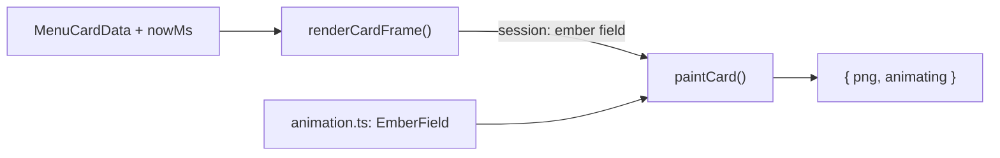

# Module: menu-card

## Purpose

The browser-context renderer that **draws** the tray's menu bitmaps, and (since [ADR-013](../adr/013-menu-card-animation-framework.md)) drifts ember particles over the stats card while the menu is open. (Two sibling animations — an odometer-style digit roll and a bar-chart grow-from-baseline reveal — were removed; see ADR-013's amendment.) It exposes two globals — `window.__burnbarRenderCardFrame(data, nowMs)` for one animated card frame and `window.__burnbarDrawIcon(name)` for the small menu-row glyphs — each paints an off-DOM `<canvas>` and returns a PNG data URL (the card frame also reports whether more frames are needed). Like [dashboard](./dashboard.md), it runs outside the main process and is bundled by esbuild; unlike the dashboard it has no UI, no DOM mutation beyond the throwaway canvas, and no IPC — driven entirely by [menu-card-window](./menu-card-window.md) and, for the animation math, by [`animation.ts`](../../src/menu-card/animation.ts).

## Public Surface

No module exports (`window` globals) — it is an esbuild bundle entry point. On load it assigns `window.__burnbarRenderCardFrame` (one animated card frame), `window.__burnbarSetEmbersActive` (start/stop the ember loop), and `window.__burnbarDrawIcon` (monochrome row glyphs: `"refresh"`, `"dashboard"`). — [card.ts](../../src/menu-card/card.ts)

It also has plain **named exports**, used directly (no `window`) by tests and by [Storybook](../storybook.md) (`stories/menu-card.stories.ts`), since the module runs in any real browser context, not just Electron's hidden window:

| Export | Purpose |
|--------|---------|
| `renderCardFrame(data, nowMs)` | The production entry point — the function `window.__burnbarRenderCardFrame` wraps. |
| `setEmbersActive(active, nowMs)` | The function `window.__burnbarSetEmbersActive` wraps. |
| `drawCard(data)` | A fully static, non-animated render (no rolls, no growth, no embers) — the "settled" reference look. |
| `resetCardSession()` | Forgets animation history; used by tests/Storybook so switching examples starts clean. |
| `nextCardSession(session)` | The pure state-transition (no canvas) `renderCardFrame` delegates to — carries the active `EmberField` forward. See [Invariants](#invariants--failure-modes). Directly unit-tested (`test/menu-card-session.test.ts`) without a browser. |

The `window.__burnbar*` assignments are guarded (`if (typeof window !== "undefined")`) so the module — and its pure exports like `nextCardSession` — stays importable from plain Node (Vitest) despite living in a browser-only bundle entry point.

Internal helpers: `paintCard` (the shared low-level canvas paint, given already-resolved animation state), `drawStat` (label + value), `drawBars` (the warm bar chart, drawn at full height), `drawEmbers`, `money`/`tokens` formatters, and the icon helpers `iconContext`/`drawRefreshIcon`/`drawDashboardIcon`/`drawIcon`.

Issues #52 (odometer digit roll) and #54 (bar-chart grow-from-baseline reveal) were removed: [ADR-013's amendment](../adr/013-menu-card-animation-framework.md#amendment-the-verification-item-resolved-false-2026-07) established that Electron never repaints a `MenuItem.icon` while the native menu is already open and idle, so neither animation could ever be seen. `drawStat`/`drawBars` now paint values/bars directly at their final state.

## Responsibilities

- Paint the stats card on a **transparent** background at `SCALE`× device pixels (logical 270×212): a 2×2 stat grid — **Today** $ / **30d cost** $ ; **30d tokens** / **Today tokens** — a warm-orange bar chart of the 30-day daily costs over a faint baseline, a "Top model: …" line, and the footnote "Estimated from local logs at API rates". — [paintCard](../../src/menu-card/card.ts)
- Own the card's **animation session** (module-scoped, since there's exactly one hidden `BrowserWindow` for the app's lifetime — see [ADR-009](../adr/009-menu-stats-card.md)): track the active `EmberField` while embers are on. — [renderCardFrame](../../src/menu-card/card.ts)
- **Ember particles** (issue #53): while active (`setEmbersActive(true, …)`), a handful of small glowing dots drift upward and fade over the bar-chart region, looping indefinitely on a deterministic, seeded pattern (see [animation.ts](../../src/menu-card/animation.ts)). — [drawEmbers](../../src/menu-card/card.ts)
- Format money as USD and tokens as compact (`1.1B`, `42M`); render `—` for `null` (no daily row yet). — [card.ts](../../src/menu-card/card.ts)
- Draw the menu-row glyphs (refresh ↻, dashboard bar-chart) solid-black on transparent at the standard 16-px menu-icon size; the main process flags them template images so macOS tints them. — [drawIcon](../../src/menu-card/card.ts)
- Return `canvas.toDataURL("image/png")` (plus `animating` for card frames) for the main process to decode. — [card.ts](../../src/menu-card/card.ts)

## Non-Goals

- **No Electron, no `NativeImage`, no `scaleFactor`, no `setTemplateImage`** — wrapping the PNG, the retina tagging, and the template flag belong to [menu-card-window](./menu-card-window.md).
- **No frame-timing/lifecycle decisions** — *when* to ask for another frame, the bounded-run safety cap, and the menu-open ember lifecycle all live in the main process's [`card-animator.ts`](../../src/card-animator.ts) / [tray.ts](./tray.md). This module only answers "what does the card look like at instant `nowMs`."
- **No data access** — it draws exactly the `MenuCardData` it's handed; derivation is the [capture-service](./capture-service.md)'s job and assembly is the [tray](./tray.md)'s.
- No theme **detection**: the card adapts its value-text color from the `dark` flag the tray passes in (`MenuCardData.dark`), it doesn't query the OS itself; the **icons** are alpha-only so macOS owns their tint. See [adr/009](../adr/009-menu-stats-card.md).
- Not unit-tested as a *renderer* (the DOM/canvas paint path, verified via the production `MenuCardRenderer` and via [Storybook](../storybook.md)) — but everything that doesn't touch `document`/canvas **is**: the animation math it depends on ([animation.ts](../../src/menu-card/animation.ts), `test/menu-card-animation.test.ts`) and its own session state-transition logic (`nextCardSession`, `test/menu-card-session.test.ts`).

## How It Works

`card.ts` is bundled by **esbuild** (`platform: "browser"`, ESM), *not* `tsc`, because it needs the DOM lib the Node16 main config omits; type-checking happens via `tsconfig.dashboard.json` (which includes `src/menu-card`). The bundle plus `index.html` are copied into `dist/menu-card/`. — [build-renderer.mjs](../../scripts/build-renderer.mjs)

`renderCardFrame(data, nowMs)` reads the last-rendered `session` (or `null` on first call) via `nextCardSession`, resolves the current `EmberField`'s particle instances at `nowMs` if embers are active, then calls `paintCard` with `data` and those instances. `paintCard` does the actual `<canvas>` work: scales the context by `SCALE` (so all layout is in logical px) on a transparent canvas, lays out the four stats via `drawStat` (a plain label + value `fillText`), draws the bars via `drawBars` (always at full height), draws embers via `drawEmbers` when instances are supplied, then the optional top-model line and footnote, and returns `{ png, animating }` — `animating` is `true` only while embers are on. `drawCard(data)` is the same `paintCard` call with `emberInstances: null` — a deliberately dumb, fully-static path (now identical to any non-ember frame). `drawIcon` does the equivalent at 16-px on a transparent canvas for the two row glyphs. `index.html` carries a strict **CSP** (`default-src 'none'; script-src 'self'`) and renders nothing visible.

The animation *timing* math (easing, tweens, the seeded ember particle field) is factored out into [`animation.ts`](../../src/menu-card/animation.ts) — deliberately DOM-free so it's plain, deterministic, unit-testable functions of an absolute timestamp; every tunable (particle count/life/opacity) lives in [`animation-config.ts`](../../src/menu-card/animation-config.ts). See [ADR-013](../adr/013-menu-card-animation-framework.md) for why. The `Tween`/easing exports in `animation.ts` are currently unused by `card.ts` (they drove the removed odometer/bar animations) but are kept as shared engine primitives for any future tween-based animation.

## Key Types

| Type | Purpose | File |
|------|---------|------|
| `MenuCardData` | the card's full input (`MenuCard` + today's numbers) | [types.ts#MenuCardData](../../src/types.ts) |
| `CardFrame` | one animation frame's output (`{ png, animating }`) | [types.ts#CardFrame](../../src/types.ts) |
| `Tween`, `EmberField`, `EmberInstance` | the DOM-free animation primitives this module draws with | [animation.ts](../../src/menu-card/animation.ts) |

## Invariants & Failure Modes

- **Global contract**: the page must define `window.__burnbarRenderCardFrame`, `window.__burnbarSetEmbersActive`, and `window.__burnbarDrawIcon`; the hidden window calls them by name. Renaming one breaks that render (the renderer then returns `null`/no-ops). — [card.ts](../../src/menu-card/card.ts), [menu-card-window](./menu-card-window.md)
- **Retina contract**: draws at `SCALE`× and the consumer tags the image `scaleFactor: SCALE`; the two constants must agree. — [card.ts](../../src/menu-card/card.ts)
- **Session is module-scoped, not per-call**: `renderCardFrame`/`setEmbersActive` remember the last paint via a module-level `session` variable — correct because production has exactly one hidden window instance, but it means only **one** live animated preview can run at a time (relevant to [Storybook](../storybook.md), which calls `resetCardSession()` per story). — [ADR-013](../adr/013-menu-card-animation-framework.md)
- **Transparent card + adaptive text**: the card has no background fill, so the bold value color follows `MenuCardData.dark` (light text on dark menus, dark text on light) to stay legible on the menu surface; labels, bars, and template-tinted icons read on both. See [adr/009](../adr/009-menu-stats-card.md). The **icons** are alpha-only on purpose (template tinting).
- **Graceful empties**: an all-zero spark draws just the baseline (no bars); a `null` top model omits that line; `null` today figures render `—`. — [drawBars](../../src/menu-card/card.ts), [paintCard](../../src/menu-card/card.ts)

## Extension Points

- Change the layout/typography/palette by editing the geometry + color constants and the `drawStat`/`drawBars`/`drawEmbers` helpers.
- Tune the ember particles' feel (particle count/life/opacity) in [`animation-config.ts`](../../src/menu-card/animation-config.ts) — no drawing-code changes needed.
- Add a new animation: extend [`animation.ts`](../../src/menu-card/animation.ts) with a new primitive if needed, thread its state through `session` in `renderCardFrame`, and paint it in `paintCard`. The main process's [`card-animator.ts`](../../src/card-animator.ts) already handles "keep polling while `animating`" generically — a new bounded animation needs no driver changes. Read [ADR-013's amendment](../adr/013-menu-card-animation-framework.md#amendment-the-verification-item-resolved-false-2026-07) first: any animation that needs multiple frames visible *while the native menu is already open* can't work in production — target either the always-visible `Tray.setImage()` icon or an animation bounded to before the menu opens.
- Add a stat: extend `MenuCardData` in [types](./types.md), feed it from [capture-service](./capture-service.md)'s `computeCard`, and draw it here.
- Add a menu-row icon: extend the `"refresh" | "dashboard"` union, add a `drawXIcon` branch in `drawIcon`, and render it via the tray's `loadIcons`. Keep it alpha-only (any fill color) so the template tint works.
- If the card's logical size changes, keep `SCALE`/`W`/`H` consistent with [menu-card-window](./menu-card-window.md)'s `scaleFactor`.
- Preview any of the above without Electron: [`stories/menu-card.stories.ts`](../../stories/menu-card.stories.ts) drives the real functions with a browser `requestAnimationFrame` loop — see [storybook.md](../storybook.md).

## Related Files

- [menu-card-window.ts](../../src/menu-card-window.ts) → [menu-card-window.md](./menu-card-window.md) — the hidden window that calls `__burnbarRenderCardFrame`/`__burnbarSetEmbersActive` and wraps the PNG.
- [animation.ts](../../src/menu-card/animation.ts), [animation-config.ts](../../src/menu-card/animation-config.ts) — the DOM-free timing/particle math and its tunables.
- [card-animator.ts](../../src/card-animator.ts) — the main-process frame-poll driver that decides *when* to call `renderCardFrame`/`setEmbersActive`.
- [tray.ts](../../src/tray.ts) → [tray.md](./tray.md) — assembles `MenuCardData`, owns the `CardAnimator`, and attaches the resulting image.
- [capture-service.ts](../../src/capture-service.ts) → [capture-service.md](./capture-service.md) — derives the `MenuCard` figures.
- [scripts/build-renderer.mjs](../../scripts/build-renderer.mjs) — bundles this alongside the dashboard renderer.
- [dashboard.md](./dashboard.md) — the sibling browser-context renderer (the visible window).
- [adr/009-menu-stats-card.md](../adr/009-menu-stats-card.md) — the card's original rationale. [adr/013-menu-card-animation-framework.md](../adr/013-menu-card-animation-framework.md) — the animation framework's rationale.
- [storybook.md](../storybook.md) — the live, Electron-free preview of the ember animation.
