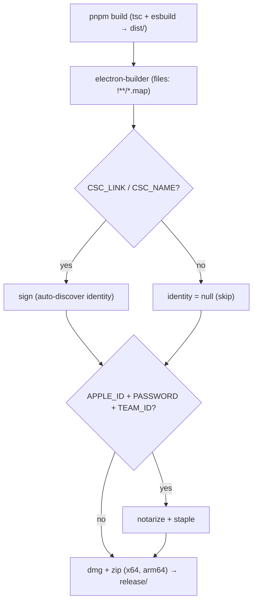

# Module: packaging

## Purpose

Turns the compiled app into distributable macOS artifacts (`.dmg` + `.zip`, x64 + arm64), with optional signing and notarization driven entirely by environment variables.

## Public Surface

| Artifact | Type | File |
|----------|------|------|
| electron-builder config | CJS module (`Configuration`) | [electron-builder.config.cjs](../../electron-builder.config.cjs) |
| hardened-runtime entitlements | plist | [build/entitlements.mac.plist](../../build/entitlements.mac.plist) |
| `dist` / `dist:mac` / `dist:mac:universal` | npm scripts | [package.json:31-33](../../package.json#L31-L33) |

## Responsibilities

- Define app identity: `appId` `com.tangentlin.burnbar`, `productName` `Burnbar`. — [electron-builder.config.cjs:24-25](../../electron-builder.config.cjs#L24-L25)
- Bundle `dist/` (incl. `dist/dashboard/**` and `dist/preload.mjs`), `assets/`, `node_modules/`, `package.json` into the app — **excluding `**/*.map`** so source maps never ship in the distributable. — [electron-builder.config.cjs:31](../../electron-builder.config.cjs#L31)
- Mark the app agent-only via `LSUIElement` (no Dock). — [electron-builder.config.cjs:41](../../electron-builder.config.cjs#L41)
- Build dmg + zip for both x64 and arm64. — [electron-builder.config.cjs:42-45](../../electron-builder.config.cjs#L42-L45)
- Conditionally sign/notarize from env presence. — [electron-builder.config.cjs:17-40](../../electron-builder.config.cjs#L17-L40)

## Non-Goals

- No auto-update / Sparkle channel.
- No Windows/Linux targets (config is `mac`-only). — [electron-builder.config.cjs:28-42](../../electron-builder.config.cjs#L28-L42)

## How It Works

`hasSigningCreds` is true if `CSC_LINK` or `CSC_NAME` is set; `hasNotaryCreds` if `APPLE_ID` + `APPLE_APP_SPECIFIC_PASSWORD` + `APPLE_TEAM_ID` are all set. `identity` is `undefined` (auto-discover) when signing creds exist, else `null` (explicitly skip). `notarize` mirrors `hasNotaryCreds`. With nothing set, artifacts are produced **unsigned** — fine locally, Gatekeeper-blocked elsewhere. — [electron-builder.config.cjs:17-40](../../electron-builder.config.cjs#L17-L40)

The hardened-runtime entitlements grant JIT / unsigned-executable-memory / library-validation-disable etc. — required for Electron under hardened runtime. — [build/entitlements.mac.plist](../../build/entitlements.mac.plist)

## Invariants & Failure Modes

- A credential-less build **never fails** for lack of signing — it just ships unsigned. — [electron-builder.config.cjs:14-15](../../electron-builder.config.cjs#L14-L15), [electron-builder.config.cjs:39-40](../../electron-builder.config.cjs#L39-L40)
- Output lands in `release/` (git-ignored). — [electron-builder.config.cjs:26](../../electron-builder.config.cjs#L26)
- The app icon comes from `build/icons/icon.png` (generated; see [icon-pipeline](./icon-pipeline.md)). — [electron-builder.config.cjs:34](../../electron-builder.config.cjs#L34)

## Extension Points

- Add a target OS by extending the config with `win`/`linux` blocks.
- Tune signing behavior via the env contract above — no code edits needed.

## Related Files

- [icon-pipeline](./icon-pipeline.md) — produces the packaging icon.
- [features/release-distribution.md](../features/release-distribution.md) — the operator-facing release flow.
- [adr/005-env-driven-signing-notarization.md](../adr/005-env-driven-signing-notarization.md) — rationale.
