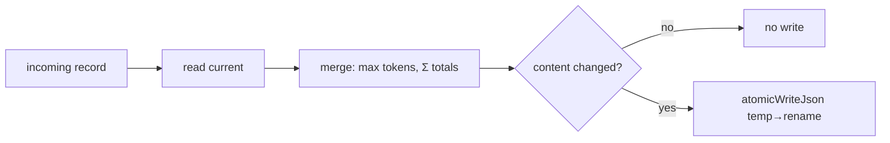

# Module: store

## Purpose

The durable archive's persistence core: pure "keep richest, never shrink" merge logic plus atomic temp-then-rename JSON IO, wrapped in `ArchiveStore` (read → merge → write daily records, monthly-sharded sessions, and the manifest). The highest-stakes module — it owns the anti-purge guarantee.

## Public Surface

| Export | Type | File |
|--------|------|------|
| `ARCHIVE_SCHEMA_VERSION` | `number` | [store.ts:13](../../src/store.ts#L13) |
| `mergeModelBreakdowns()` | `(existing, incoming) => ModelBreakdown[]` | [store.ts:53](../../src/store.ts#L53) |
| `rollupTotals()` | `(models) => RecordTotals` | [store.ts:69](../../src/store.ts#L69) |
| `mergeDailyRecord()` | `(existing?, incoming) => DailyRecord` | [store.ts:107](../../src/store.ts#L107) |
| `mergeSessionRecord()` | `(existing?, incoming) => SessionRecord` | [store.ts:125](../../src/store.ts#L125) |
| `dailyContentEqual()` | `(a, b) => boolean` | [store.ts:162](../../src/store.ts#L162) |
| `sessionContentEqual()` | `(a, b) => boolean` | [store.ts:174](../../src/store.ts#L174) |
| `atomicWriteJson()` | `(path, data, deps?) => Promise<void>` | [store.ts:203](../../src/store.ts#L203) |
| `AtomicWriteDeps` | injectable fs seam | [store.ts:189](../../src/store.ts#L189) |
| `ArchiveStore` | read/merge/write class | [store.ts:243](../../src/store.ts#L243) |

Module-private: `tokenTotal`/`mergeModelLine` (the per-line max rule), `earliest`/`latest`/`unionSorted`/`modelsEqual` (merge helpers), `readJson`/`listJsonFiles` (ENOENT→empty IO), and `sessionMonth` (UTC shard key). — [store.ts:24-50](../../src/store.ts#L24-L50), [store.ts:224-239](../../src/store.ts#L224-L239)

## Responsibilities

- Merge per-model lists by `max()` of every token field, with cost following the larger-total snapshot. — [mergeModelLine/mergeModelBreakdowns](../../src/store.ts#L33-L66)
- Derive record totals as the rollup of merged lines (`totals = Σ models`). — [rollupTotals](../../src/store.ts#L69)
- Merge daily/session records: union models, keep `firstCapturedAt`, advance `lastCapturedAt`. — [store.ts:107-141](../../src/store.ts#L107-L141)
- Provide a timestamp-free content equality (the dirty check) so unchanged re-captures don't rewrite files. — [store.ts:143-183](../../src/store.ts#L143-L183)
- Persist any payload via serialize → write temp → rename, cleaning up orphan temps on failure. — [atomicWriteJson](../../src/store.ts#L203)
- Read/merge/write daily records (`daily/<date>.json`), sessions (`sessions/<YYYY-MM>.json`), and `manifest.json`. — [store.ts:254-366](../../src/store.ts#L254-L366)
- Gate writes on schema compatibility (refuse to merge into a newer on-disk format). — [isSchemaCompatible](../../src/store.ts#L287)

## Non-Goals

- No ccusage spawning or normalization — that's [capture](./capture.md).
- No scheduling/orchestration of when to capture — that's the capture service.
- No read-time aggregation for the dashboard (series, ranges) — that's [derive](./derive.md).
- No migration logic yet — `isSchemaCompatible` only *detects* an incompatible manifest; the caller decides.

## How It Works

The pure layer is data-in/data-out so the anti-purge guarantee is unit-tested without touching disk. `ArchiveStore` is the stateful shell: each `merge*` reads the current record, folds the incoming snapshot through the pure merge, runs the content equality dirty check, and only then writes atomically.

Sessions load **every** shard into one map before writing so a session crossing a month boundary moves shards cleanly with no cross-file duplicate; only touched months are rewritten. — [mergeSessions](../../src/store.ts#L314)

## Key Types

| Type | Purpose | File |
|------|---------|------|
| `ModelBreakdown` | per-model token line + cost | [types.ts#ModelBreakdown](../../src/types.ts#L86-L89) |
| `RecordTotals` | record-level rollup | [types.ts#RecordTotals](../../src/types.ts#L92-L94) |
| `DailyRecord` | one local date, all agents | [types.ts#DailyRecord](../../src/types.ts#L100-L108) |
| `SessionRecord` | one agent session by `sessionId` | [types.ts#SessionRecord](../../src/types.ts#L114-L122) |
| `ArchiveManifest` | archive-wide metadata + `schemaVersion` | [types.ts#ArchiveManifest](../../src/types.ts#L125-L131) |

## Invariants & Failure Modes

- **Anti-purge (load-bearing)**: per-field `max()` means a later, smaller snapshot can never shrink a stored count; merge is monotonic, so backfill and incremental update are one idempotent path. — [mergeModelLine](../../src/store.ts#L33), [adr/007](../adr/007-keep-richest-merge.md)
- **Atomic write (load-bearing)**: the destination only ever holds complete content — serialization happens before any file opens, and a failed `rename` leaves the prior file intact and drops the orphan temp. — [atomicWriteJson](../../src/store.ts#L203-L222)
- `totals` are never read from the snapshot; always recomputed from merged models, so they can't drift from the lines. — [mergeDailyRecord/mergeSessionRecord](../../src/store.ts#L114-L141)
- Dirty check excludes capture timestamps, so a quiet 60s re-capture neither rewrites the file nor advances `lastCapturedAt`. — [store.ts:143-144](../../src/store.ts#L143-L144)
- Missing files read as `undefined`/`[]` (ENOENT swallowed); any other IO error throws. — [readJson](../../src/store.ts#L224-L234), [listJsonFiles](../../src/store.ts#L369-L379)
- **Cost-field skew** [accepted]: `max()` per field can combine fields from two snapshots; cost then follows the larger-total snapshot. Fields move together in practice and counts are never lost. — [adr/007](../adr/007-keep-richest-merge.md)
- Session shard key is the **UTC** month of `lastActivity` (`sessionMonth`), independent of the display timezone — storage-only. — [store.ts:236-239](../../src/store.ts#L236-L239)

## Extension Points

- Bump `ARCHIVE_SCHEMA_VERSION` and add migration on the `isSchemaCompatible` path when the on-disk shape changes. — [store.ts:11-13](../../src/store.ts#L11-L13), [store.ts:287](../../src/store.ts#L287)
- Inject `AtomicWriteDeps` to test the rename-failure path or to swap IO backends. — [store.ts:189-199](../../src/store.ts#L189-L199)
- New record kinds reuse `mergeModelBreakdowns` + `rollupTotals`; keep them pure so the guarantee stays unit-tested off-disk.

## Related Files

- [types.ts](../../src/types.ts) — the archive record contracts.
- Sibling docs: [capture](./capture.md), [derive](./derive.md), [types](./types.md).
- [adr/007-keep-richest-merge.md](../adr/007-keep-richest-merge.md) — the merge rule and its tradeoffs; builds on [adr/006-durable-usage-archive.md](../adr/006-durable-usage-archive.md).
- Feature: [usage-archive.md](../features/usage-archive.md).
