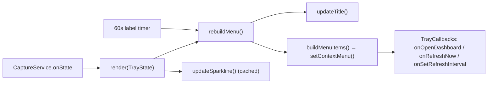

# Module: tray

## Purpose

The menu-bar surface — a display-only consumer of `TrayState`. It owns the template icon and macOS cost title, then renders the context menu: today/all-time usage rows, a clickable 30-day spend sparkline, an "Updated …" relative-time stamp, Refresh Now, an Auto-Refresh radio submenu, Open Dashboard, and Quit. It fetches nothing; the [CaptureService](./capture-service.md) pushes state via `render`.

## Public Surface

| Export | Type | File |
|--------|------|------|
| `TrayCallbacks` | `{ onOpenDashboard, onRefreshNow, onSetRefreshInterval }` | [tray.ts:21](../../src/tray.ts#L21) |
| `TrayManager` | class (`initialize`, `render`, `dispose`) | [tray.ts:33](../../src/tray.ts#L33) |

Module-private: `sameNumbers()` (the sparkline change check) — [tray.ts:215](../../src/tray.ts#L215). All menu construction (`buildMenuItems`, `buildAutoRefreshItem`, `addDailyUsageItems`, `addTotalUsageItems`, `updateTitle`, `updateSparkline`, `rebuildMenu`) are instance-private.

## Responsibilities

- Create the tray from a template icon resolved relative to the module (`fileURLToPath(import.meta.url)` for ESM `__dirname`), and clear the macOS title. — [tray.ts:47-63](../../src/tray.ts#L47-L63)
- Run a 60s UI-only timer that rebuilds the menu so "Updated X ago" stays honest between data refreshes — no ccusage call. — [tray.ts:19](../../src/tray.ts#L19), [tray.ts:72](../../src/tray.ts#L72)
- Apply pushed `TrayState`: re-render the sparkline if changed, then rebuild the menu. — [render](../../src/tray.ts#L76)
- Set the macOS title to today's cost (`$x.xx`); clear it on error or no daily row. — [updateTitle](../../src/tray.ts#L116)
- Build usage rows (today + all-time cost/tokens), formatting via `toFixed(2)` / `toLocaleString()`. — [tray.ts:188-212](../../src/tray.ts#L188-L212)
- Render a 30-day spend sparkline as a template `NativeImage`; clicking the row opens the dashboard. — [tray.ts:139-147](../../src/tray.ts#L139-L147)
- Show the "Updated …" relative-time row + Refresh Now, and the Auto-Refresh radio submenu (presets + a disabled "Custom" radio for a non-preset value). — [tray.ts:149-185](../../src/tray.ts#L149-L185)
- Wire menu clicks to the injected `TrayCallbacks`; Quit calls `app.quit()`. — [tray.ts:145-161](../../src/tray.ts#L145-L161)
- Tear down the timer and destroy the tray on dispose. — [dispose](../../src/tray.ts#L82)

## Non-Goals

- **No data fetching, no refresh scheduling** — the [CaptureService](./capture-service.md) owns the ccusage call and the auto-refresh timer; the tray's only timer is the UI label tick.
- No window lifecycle — opening the dashboard delegates to [window](./window.md) via `onOpenDashboard`.
- No settings persistence — `onSetRefreshInterval` fires back to `main`, which persists via [settings](./settings.md).
- No sparkline pixel encoding — that's [sparkline](./sparkline.md); the tray only caches and templates the resulting image.
- No relative-time / interval-label formatting — borrowed from [time](./time.md).

## How It Works

`main` constructs the tray with the three callbacks and subscribes the service's `onState` to `tray.render`. — [main.ts:37-56](../../src/main.ts#L37-L56)

`initialize()` loads the template icon, starts the 60s label timer, and builds the initial (empty) menu. Each `render(state)` stores the state, diffs the sparkline, and rebuilds. The sparkline image is cached: `updateSparkline` early-returns when `sameNumbers` says the cost array is unchanged, so the PNG is re-encoded only on real change; an all-zero range clears the image (no row). When present, the row is a clickable drill-down into the dashboard. — [tray.ts:76-106](../../src/tray.ts#L76-L106)

The Auto-Refresh submenu maps `REFRESH_PRESETS_MINUTES` to radio items (0 ⇒ "Manual (off)"); a current value outside the preset set is surfaced as a separate disabled, checked "Custom: …" radio so file-edited intervals stay visible. — [tray.ts:166-186](../../src/tray.ts#L166-L186)

## Key Types

| Type | Purpose | File |
|------|---------|------|
| `TrayState` | full input the tray renders (usage, lastUpdatedAt, sparkline, interval) | [types.ts#TrayState](../../src/types.ts#L175-L180) |
| `UsageData` | today + all-time stats rendered into title + rows | [types.ts#UsageData](../../src/types.ts#L13-L17) |
| `TrayCallbacks` | dashboard/refresh/interval hooks injected by `main` | [tray.ts:21-25](../../src/tray.ts#L21-L25) |

## Invariants & Failure Modes

- **Tray-null guard**: `rebuildMenu` and `updateTitle` no-op if `tray` is null (creation failed in `initialize`'s try/catch). — [tray.ts:50-61](../../src/tray.ts#L50-L61), [tray.ts:108-111](../../src/tray.ts#L108-L111)
- Title is set only on darwin; cleared on `usage.error` or missing daily row. — [updateTitle](../../src/tray.ts#L116)
- On a ccusage error the service pushes `usage.error`; the menu collapses the usage rows to a single "Error loading usage data" line (sparkline/refresh/quit still render). — [tray.ts:131-137](../../src/tray.ts#L131-L137)
- **Sparkline cache is load-bearing for cost**: re-encoding only when `sameNumbers` reports a change keeps the 60s label tick and unchanged re-captures from rebuilding the PNG. — [tray.ts:93-106](../../src/tray.ts#L93-L106)
- An all-zero (or empty) sparkline clears the image and omits the row entirely — no flat/empty chart. — [tray.ts:98-101](../../src/tray.ts#L98-L101)
- Sparkline `NativeImage` is marked a template so macOS tints it to the menu foreground (light/dark aware). — [tray.ts:104](../../src/tray.ts#L104), [sparkline](./sparkline.md)

## Extension Points

- To add a menu row, extend `buildMenuItems` (or `addDailyUsageItems` / `addTotalUsageItems`). — [tray.ts:127](../../src/tray.ts#L127)
- New refresh presets: edit `REFRESH_PRESETS_MINUTES`; the "Custom" fallback then narrows automatically. — [settings.ts:9](../../src/settings.ts#L9)
- Sparkline dimensions/scale are passed at the `sparklinePng` call; tune width/height/scale there. — [tray.ts:102](../../src/tray.ts#L102)
- The icon path assumes `assets/icon.png` sits one level up from `dist/`; keep that layout when changing packaging. — [tray.ts:48](../../src/tray.ts#L48)

## Related Files

- [capture-service.ts](../../src/capture-service.ts) — produces and pushes the `TrayState` (`onState`).
- [main.ts](../../src/main.ts) — wires the `TrayCallbacks` to the service, window, and settings.
- [window.ts](../../src/window.ts) — opened by the sparkline row and the dashboard menu item.
- [sparkline.ts](../../src/sparkline.ts) / [time.ts](../../src/time.ts) — the PNG encoder and the relative-time / interval-label formatters.
- [settings.ts](../../src/settings.ts) — `REFRESH_PRESETS_MINUTES` and interval persistence.
- [assets/icon.png](../../assets/icon.png) — the template icon (see [icon-pipeline](./icon-pipeline.md)).
- Sibling docs: [capture-service](./capture-service.md), [settings](./settings.md), [sparkline](./sparkline.md), [time](./time.md), [window](./window.md), [types](./types.md).
- Feature: [usage-menu.md](../features/usage-menu.md), [usage-refresh.md](../features/usage-refresh.md), [usage-dashboard.md](../features/usage-dashboard.md).
