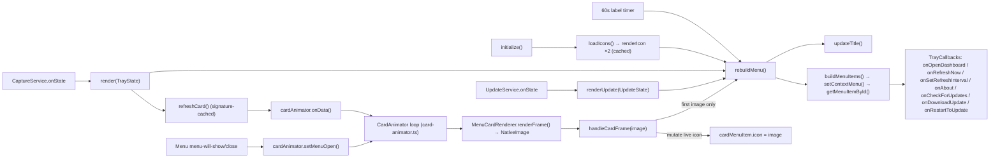

# Module: tray

## Purpose

The menu-bar surface — a display-only consumer of `TrayState` **and** `UpdateState`. It owns the template icon and macOS cost title, then renders the context menu: a rich, **animated** stats card bitmap (today + 30-day spend/tokens, a bar chart, top model — see [ADR-013](../adr/013-menu-card-animation-framework.md)) shown as a non-selectable banner, "Open Usage Dashboard…" directly beneath it, an "Updated …" relative-time stamp, Refresh Now, an Auto-Refresh radio submenu, About Burnbar / Open Log Folder / Copy Diagnostics, a single state-driven **update row**, and Quit. The Dashboard and Refresh rows carry template icons. When an update needs action it also swaps the menu-bar icon for a **badged** variant (blue dot = available, orange = downloaded), composited from the template glyph by the pure [tray-icon](./tray-icon.md) helper. It fetches nothing; the [CaptureService](./capture-service.md) pushes usage state via `render`, [UpdateService](./update-service.md) pushes update state via `renderUpdate`, and the card bitmap's frames are produced by the injected [MenuCardRenderer](./menu-card-window.md), scheduled by an owned [CardAnimator](./card-animator.md).

## Public Surface

| Export | Type | File |
|--------|------|------|
| `TrayCallbacks` | `{ onOpenDashboard, onRefreshNow, onSetRefreshInterval, onAbout, onOpenLogFolder, onCopyDiagnostics, onCheckForUpdates, onDownloadUpdate, onRestartToUpdate }` | [tray.ts:22](../../src/tray.ts#L22) |
| `TrayManager` | class (`initialize`, `render`, `renderUpdate`, `dispose`) — constructed with `(callbacks, cardRenderer)` | [tray.ts:49](../../src/tray.ts#L49) |

Module-private: `toCardData()` (merges the derived `MenuCard` with today's numbers into the renderer input); `buildUpdateItem()` (maps `UpdateState` to the single update menu row); `handleCardFrame()` (the `CardAnimator`'s `onFrame` sink). All menu construction (`buildMenuItems`, `buildAutoRefreshItem`, `buildUpdateItem`, `addFallbackUsageItems`, `updateTitle`, `refreshCard`, `loadIcons`, `rebuildMenu`) is instance-private.

## Responsibilities

- Create the tray from a template icon resolved relative to the module (`fileURLToPath(import.meta.url)` for ESM `__dirname`), and clear the macOS title. — [initialize](../../src/tray.ts#L54)
- Run a 60s UI-only timer that rebuilds the menu so "Updated X ago" stays honest between data refreshes — no ccusage call, and it reuses the cached card image. — [tray.ts:19](../../src/tray.ts#L19), [initialize](../../src/tray.ts#L62)
- On startup, render the two static menu-row glyphs once (Refresh ↻, Dashboard bar-chart) and cache them. — [loadIcons](../../src/tray.ts#L87)
- Reserve a uniform icon gutter: assign a transparent spacer image to every text row lacking a real glyph so all labels left-align and the real icons stand out. — [buildMenuItems](../../src/tray.ts#L157), [transparentIcon](../../src/tray.ts)
- Apply pushed `TrayState`: rebuild immediately, then kick off the card's re-render **only when its data changed**, via the owned `CardAnimator`. — [render](../../src/tray.ts#L98), [refreshCard](../../src/tray.ts#L122)
- Own a `CardAnimator` and feed it two triggers: `onData` on every changed `refreshCard` call, and `setMenuOpen` from the built `Menu`'s own `menu-will-show`/`menu-will-close` events (this is also the ember loop's whole lifecycle — see [ADR-013](../adr/013-menu-card-animation-framework.md)). Every frame it produces lands in `handleCardFrame`: cache it, and if the menu is open right now, mutate the live card `MenuItem.icon` directly (found via `Menu.getMenuItemById`) rather than rebuilding the whole menu. A **full** `rebuildMenu()` only fires once — the first time a card image ever lands — to swap the plain-text fallback rows for the real card row. — [rebuildMenu](../../src/tray.ts), [handleCardFrame](../../src/tray.ts), [card-animator.md](./card-animator.md)
- Set the macOS title to today's cost (`$x.xx`); clear it on error or no daily row. — [updateTitle](../../src/tray.ts#L139)
- Render the stats card as a **non-selectable** banner (`enabled: false`, no click), with "Open Usage Dashboard…" directly beneath it as the drill-down action. Fall back to plain "Today's Usage" text rows only when the card image is unavailable (first-render gap or a render failure). — [buildMenuItems](../../src/tray.ts#L157), [addFallbackUsageItems](../../src/tray.ts#L217)
- Stamp the menu appearance (`nativeTheme.shouldUseDarkColors`) into the card data so the transparent card's value text stays legible, and re-render the card on `nativeTheme` "updated". — [toCardData](../../src/tray.ts#L240), [handleThemeChange](../../src/tray.ts#L54)
- Show the "Updated …" relative-time row + Refresh Now (icon), the Auto-Refresh radio submenu (presets + a disabled "Custom" radio for a non-preset value), and **About Burnbar** labeled with the app version (`app.getVersion()`). — [buildMenuItems](../../src/tray.ts#L157), [buildAutoRefreshItem](../../src/tray.ts#L189)
- Render exactly one state-driven **update row** — label/behavior determined by `UpdateState.status` (`Check for Updates` / `Checking for Updates...` / `Download Update (vX.Y.Z)...` / `Downloading... NN%` / `Restart to Update`) — placed just above the final separator + Quit. There is no separate always-visible "Up to date" row. — [buildUpdateItem](../../src/tray.ts), [renderUpdate](../../src/tray.ts), [ADR-011](../adr/011-auto-update-mechanism.md)
- Swap the tray image to a **badged** variant when the update status warrants attention (`available` → blue, `downloaded` → orange), else restore the plain template icon. Variants are composited via [tray-icon](./tray-icon.md) from `templateIcon.toBitmap()`, memoized by `${badge}:${appearance}`, and re-derived on a light/dark switch; any failure falls back to the template icon. — [refreshTrayIcon](../../src/tray.ts), [handleThemeChange](../../src/tray.ts), [ADR-011 amendment](../adr/011-auto-update-mechanism.md#amendment-attention-cues-2026-07)
- Wire menu clicks to the injected `TrayCallbacks`; Quit calls `app.quit()`. — [buildMenuItems](../../src/tray.ts#L157)
- Tear down the timer, dispose the `CardAnimator` (cancels any pending animation frame), and destroy the tray on dispose (the card window itself is disposed by `main`). — [dispose](../../src/tray.ts#L110)

## Non-Goals

- **No data fetching, no refresh scheduling** — the [CaptureService](./capture-service.md) owns the ccusage call and the auto-refresh timer; the tray's only timer is the UI label tick.
- **No card drawing** — the bitmap is produced by [menu-card-window](./menu-card-window.md) (the hidden window) + [menu-card](./menu-card.md) (the canvas); the tray only caches the resulting `NativeImage` and attaches it.
- No window lifecycle — opening the dashboard and the About link delegate to `main` via the callbacks.
- No settings persistence — `onSetRefreshInterval` fires back to `main`, which persists via [settings](./settings.md).
- No relative-time / interval-label formatting — borrowed from [time](./time.md).

## How It Works

`main` constructs the tray with the full `TrayCallbacks` and the `MenuCardRenderer`, then subscribes `CaptureService.onState` to `tray.render` and `UpdateService.onState` to `tray.renderUpdate`. — [main.ts](../../src/main.ts)

`renderUpdate(state)` stores the `UpdateState`, rebuilds the menu, and calls `refreshTrayIcon()`. `buildUpdateItem` switches on `state.status` to pick the row's label and click handler; `idle`/`error` (and the initial/`update-not-available` state) collapse onto the same manual "Check for Updates" action. `refreshTrayIcon` maps the status to a badge via `badgeForStatus`: no badge restores the template icon, otherwise it composites (or reuses a cached) non-template variant for the current `nativeTheme` appearance and `setImage`s it. The card bitmap is untouched by the update path.

`initialize()` loads the template icon, starts the 60s label timer, builds the initial (cardless) menu, and kicks off `loadIcons` (render + cache the two row glyphs once; this also warms the hidden window). Each `render(state)` stores the state and rebuilds immediately (so the title and rows are fresh), then calls `refreshCard`. `refreshCard` builds the renderer input via `toCardData`, hashes it to a JSON signature, and calls `cardAnimator.onData(data)` **only** when the signature changed (so the 60s tick and unchanged re-captures never kick off an animation). The card is a **display-only** banner (`enabled: false`); the drill-down lives in the "Open Usage Dashboard…" row immediately beneath it. On a ccusage error the card is dropped and the menu collapses to a single "Error loading usage data" line.

Every frame `CardAnimator` produces (whether from a bounded data-change run or the ambient ember loop) lands in `handleCardFrame`: it always updates the cached `cardImage`, and — if `cardMenuItem` is set (the menu is currently built with a real card row) — mutates `cardMenuItem.icon` directly, live, with **no** menu rebuild. The *only* time `handleCardFrame` triggers a full `rebuildMenu()` is the transition from "no card image yet" to "first image landed" (swapping the plain-text fallback for the real row). `rebuildMenu()` itself, each time it runs, rebuilds the `Menu`, looks up the card row via `Menu.getMenuItemById(CARD_MENU_ITEM_ID)` to refresh `cardMenuItem`, and wires that `Menu`'s `menu-will-show`/`menu-will-close` events straight to `cardAnimator.setMenuOpen(true/false)` — that's the ember loop's entire open/close lifecycle. See [card-animator.md](./card-animator.md) and [ADR-013](../adr/013-menu-card-animation-framework.md).

The Auto-Refresh submenu maps `REFRESH_PRESETS_MINUTES` to radio items (0 ⇒ "Manual (off)"); a current value outside the preset set is surfaced as a separate disabled, checked "Custom: …" radio so file-edited intervals stay visible. — [buildAutoRefreshItem](../../src/tray.ts#L189)

## Key Types

| Type | Purpose | File |
|------|---------|------|
| `TrayState` | full input the tray renders (usage, lastUpdatedAt, `card`, interval) | [types.ts#TrayState](../../src/types.ts) |
| `MenuCard` / `MenuCardData` | derived 30-day figures + the renderer's combined input | [types.ts#MenuCard](../../src/types.ts) |
| `UsageData` | today + all-time stats; drives the title + the fallback row | [types.ts#UsageData](../../src/types.ts#L13) |
| `UpdateState` | electron-updater lifecycle snapshot; drives the single update row | [types.ts#UpdateState](../../src/types.ts) |
| `TrayCallbacks` | dashboard/refresh/interval/about/log/diagnostics/update hooks injected by `main` | [tray.ts:22](../../src/tray.ts#L22) |

## Invariants & Failure Modes

- **Tray-null guard**: `rebuildMenu` and `updateTitle` no-op if `tray` is null (creation failed in `initialize`'s try/catch). — [initialize](../../src/tray.ts#L62), [rebuildMenu](../../src/tray.ts#L138)
- Title is set only on darwin; cleared on `usage.error` or missing daily row. — [updateTitle](../../src/tray.ts#L139)
- **Card is non-interactive**: it's an `enabled: false` image banner — selection/hover highlighting is suppressed, and the dashboard drill-down lives in the row beneath it. — [buildMenuItems](../../src/tray.ts#L157)
- On a ccusage error the service pushes `usage.error`; the menu collapses the card to a single "Error loading usage data" line (Dashboard/Updated/Refresh/About/Quit still render), and the cached card image is cleared. — [render](../../src/tray.ts#L98), [buildMenuItems](../../src/tray.ts#L157)
- **Card cache is load-bearing for the label tick**: kicking off the animator only when the JSON signature changes keeps the 60s tick and unchanged re-captures from spawning an animation run. — [refreshCard](../../src/tray.ts#L122)
- **Card re-render triggers only on a real change, never on a rebuild**: `refreshCard` calls `cardAnimator.onData` only when the signature changed; a theme switch changes the signature too (it carries `dark`) and re-renders the card, so a theme-only switch recolors without replaying the ember loop. See [menu-card.md](./menu-card.md). (Issues #52/#54's digit-roll/bar-growth animations, which used to deliberately exclude `dark` from their own change-detection to avoid replaying on a theme switch, were removed — see [ADR-013's amendment](../adr/013-menu-card-animation-framework.md#amendment-the-verification-item-resolved-false-2026-07).)
- **Live icon mutation, not a rebuild, on every animation frame**: `handleCardFrame` sets `cardMenuItem.icon` directly; only the very first frame ever (fallback → real card) triggers `rebuildMenu()`. Rebuilding on every frame would mean tearing down/re-showing the context menu ~24 times a second while animating. — [handleCardFrame](../../src/tray.ts), [ADR-013](../adr/013-menu-card-animation-framework.md)
- **Icons are best-effort & cached**: rendered once at startup; if `renderIcon` returns `null` the rows simply show no icon. — [loadIcons](../../src/tray.ts#L87)
- **Badge is best-effort & non-template**: the badged variant is a runtime-composited non-template image (so light/dark is handled in code, not by macOS auto-tinting); a compose failure falls back to the plain template icon so the menu bar never goes blank. Only `available`/`downloaded` badge — every other status shows the template. — [refreshTrayIcon](../../src/tray.ts), [tray-icon](./tray-icon.md), [ADR-004](../adr/004-template-tray-icon.md)
- **Graceful degradation**: if the card renderer returns `null` (or before the first render lands), the menu shows plain-text "Today's Usage" rows instead of a blank item. — [addFallbackUsageItems](../../src/tray.ts#L217)
- **Exactly one update row, always present**: `buildUpdateItem` always returns a row (idle/error fold onto the manual "Check for Updates" action) — there is no state that removes the row or leaves the menu without an update entry. — [buildUpdateItem](../../src/tray.ts), [ADR-011](../adr/011-auto-update-mechanism.md)
- **The tray never calls `quitAndInstall()` itself**: `onRestartToUpdate` is a callback into `main.ts`, which is the sole caller of `UpdateService.quitAndInstall()` — the tray only renders the click target. — [buildUpdateItem](../../src/tray.ts), [main.ts](../../src/main.ts)

## Extension Points

- To add a menu row, extend `buildMenuItems`. — [buildMenuItems](../../src/tray.ts#L157)
- To change what the card shows, edit [menu-card](./menu-card.md) (the canvas) and the `MenuCard`/`MenuCardData` contracts in [types](./types.md); feed new figures from [capture-service](./capture-service.md)'s `computeCard`.
- To change how/when the card animates, edit [menu-card](./menu-card.md)/[animation-config.ts](../../src/menu-card/animation-config.ts) (the visuals) or [card-animator.md](./card-animator.md) (the polling cadence/lifecycle) — `tray.ts`'s wiring (construct once, feed `onData`/`setMenuOpen`) stays as-is for a new animation.
- To add a menu-row icon, add a glyph to `__burnbarDrawIcon` in [menu-card](./menu-card.md) and render it in `loadIcons`. — [loadIcons](../../src/tray.ts#L87)
- To change the update badge (colors, which states badge, geometry), edit [tray-icon](./tray-icon.md) — `BADGE_RGB`, `badgeForStatus`, and `composeBadgedIconBitmap`; the tray's `refreshTrayIcon` wiring stays as-is.
- New refresh presets: edit `REFRESH_PRESETS_MINUTES`; the "Custom" fallback then narrows automatically. — [settings.ts:9](../../src/settings.ts#L9)
- The icon path assumes `assets/icon.png` sits one level up from `dist/`; keep that layout when changing packaging. — [initialize](../../src/tray.ts#L63)

## Related Files

- [capture-service.ts](../../src/capture-service.ts) — produces and pushes the `TrayState` (`onState`), including the derived `MenuCard`.
- [update-service.ts](../../src/update-service.ts) → [update-service.md](./update-service.md) — produces and pushes the `UpdateState` (`onState`) the update row + badge render.
- [tray-icon.ts](../../src/tray-icon.ts) → [tray-icon.md](./tray-icon.md) — the pure badge compositor `refreshTrayIcon` calls.
- [update-notifier.ts](../../src/update-notifier.ts) → [update-notifier.md](./update-notifier.md) — the companion notifier for the same `UpdateState` transitions.
- [menu-card-window.ts](../../src/menu-card-window.ts) → [menu-card-window.md](./menu-card-window.md) — the injected `MenuCardRenderer` that rasterizes each card frame.
- [card-animator.ts](../../src/card-animator.ts) → [card-animator.md](./card-animator.md) — the frame-poll loop the tray owns and feeds.
- [menu-card/](../../src/menu-card/) → [menu-card.md](./menu-card.md) — the browser-context canvas that draws and animates the card.
- [main.ts](../../src/main.ts) — wires the `TrayCallbacks` (incl. `onAbout` → [`AboutWindow`](./about-window.md), `onCheckForUpdates`/`onDownloadUpdate`/`onRestartToUpdate` → `UpdateService`) and the `MenuCardRenderer` to the service, window, and settings.
- [window.ts](../../src/window.ts) — opened by the card row and the dashboard menu item.
- [about-window.ts](../../src/about-window.ts) — opened by the About Burnbar row.
- [time.ts](../../src/time.ts) — the relative-time / interval-label formatters.
- [settings.ts](../../src/settings.ts) — `REFRESH_PRESETS_MINUTES` and interval persistence.
- Sibling docs: [capture-service](./capture-service.md), [update-service](./update-service.md), [settings](./settings.md), [menu-card-window](./menu-card-window.md), [card-animator](./card-animator.md), [menu-card](./menu-card.md), [time](./time.md), [window](./window.md), [about-window](./about-window.md), [types](./types.md).
- Feature: [usage-menu.md](../features/usage-menu.md), [usage-refresh.md](../features/usage-refresh.md), [usage-dashboard.md](../features/usage-dashboard.md), [about.md](../features/about.md), [auto-update.md](../features/auto-update.md).
- ADR: [adr/013-menu-card-animation-framework.md](../adr/013-menu-card-animation-framework.md).
