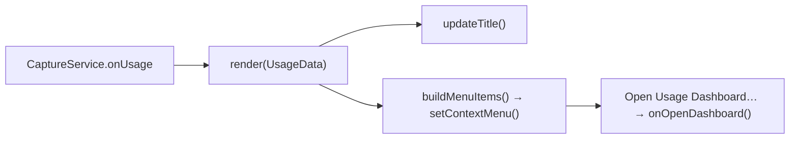

# Module: tray

## Purpose

Owns the menu-bar presence — the template icon, the live cost title, and the context menu (today + all-time usage, "Open Usage Dashboard…", Quit). **Display-only**: it renders the `UsageData` the [CaptureService](./capture-service.md) pushes; it no longer fetches data or runs a timer.

## Public Surface

| Export | Type | File |
|--------|------|------|
| `TrayCallbacks` | `{ onOpenDashboard }` | [tray.ts:8](../../src/tray.ts#L8) |
| `TrayManager` | class (`initialize`, `render`, `dispose`) | [tray.ts:17](../../src/tray.ts#L17) |

## Responsibilities

- Create the tray from a template icon resolved relative to the module. — [tray.ts:23-49](../../src/tray.ts#L23-L49)
- Render pushed `UsageData`: set the title to today's cost (macOS) and rebuild the context menu. — [tray.ts#render](../../src/tray.ts#L51)
- Offer "Open Usage Dashboard…", invoking the injected `onOpenDashboard` callback. — [tray.ts](../../src/tray.ts)
- Destroy the tray on dispose. — [tray.ts:60](../../src/tray.ts#L60)

## Non-Goals

- **No data fetching, no refresh timer** — the `CaptureService` owns the ccusage call and pushes updates via `onUsage`. — [capture-service.md](./capture-service.md)
- No window lifecycle — opening the dashboard is delegated to [window](./window.md) via the callback.
- No persistence/state beyond the live `Tray` handle and the latest usage.

## How It Works

`main` constructs the tray with an `onOpenDashboard` callback and subscribes the service's `onUsage` to `tray.render`. `initialize()` loads the template icon (`fileURLToPath(import.meta.url)` for ESM `__dirname`) and renders the initial (empty) usage; every later `render(usage)` updates the title and rebuilds the menu from a fresh template. — [tray.ts:23-58](../../src/tray.ts#L23-L58), [main.ts](../../src/main.ts)

## Key Types

| Type | Purpose | File |
|------|---------|------|
| `UsageData` | input rendered into title + menu | [types.ts#UsageData](../../src/types.ts#L13-L19) |
| `TrayCallbacks` | dashboard-open hook injected by `main` | [tray.ts:8-10](../../src/tray.ts#L8-L10) |

## Invariants & Failure Modes

- Every method no-ops if `tray` is null (creation failed). — [tray.ts:52-54](../../src/tray.ts#L52-L54)
- Title is set only on darwin; cleared on error or no-daily — unchanged from before. — [tray.ts#updateTitle](../../src/tray.ts)
- On a ccusage error the service pushes `UsageData.error`; the menu shows the error row and the title clears. — [capture-service.md](./capture-service.md)

## Extension Points

- To add a menu row, extend `addDailyUsageItems` / `addTotalUsageItems` or `buildMenuItems`. — [tray.ts](../../src/tray.ts)
- The icon path assumes `assets/icon.png` sits one level up from `dist/`; keep that layout when changing packaging. — [tray.ts:24](../../src/tray.ts#L24)

## Related Files

- [capture-service.ts](../../src/capture-service.ts) — produces and pushes the `UsageData`.
- [window.ts](../../src/window.ts) — opened by the dashboard menu item.
- [assets/icon.png](../../assets/icon.png) — the template icon (see [icon-pipeline](./icon-pipeline.md)).
