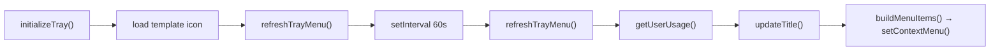

# Module: tray

## Purpose

Owns the entire menu-bar presence: the icon, the live cost title, the context menu, and the 60-second refresh loop.

## Public Surface

| Export | Type | File |
|--------|------|------|
| `TrayManager` | class | [tray.ts:9](../../src/tray.ts#L9) |

`TrayManager` public methods: `initializeTray()`, `refreshTrayMenu()`, `dispose()`. — [tray.ts:13-65](../../src/tray.ts#L13-L65)

## Responsibilities

- Create the tray from a template icon resolved relative to the module. — [tray.ts:13-31](../../src/tray.ts#L13-L31)
- Set the menu-bar title to today's cost (macOS only). — [tray.ts:67-79](../../src/tray.ts#L67-L79)
- Build the context menu: Today's Usage, All-Time Usage, Quit. — [tray.ts:81-104](../../src/tray.ts#L81-L104)
- Refresh on a 60s interval and on demand. — [tray.ts:42-44](../../src/tray.ts#L42-L44), [tray.ts:54-65](../../src/tray.ts#L54-L65)
- Clean up the timer on dispose. — [tray.ts:47-52](../../src/tray.ts#L47-L52)

## Non-Goals

- No data fetching — it consumes `UsageData` from [usage](./usage.md).
- No persistence/state beyond the live `tray` and `refreshTimer` handles.

## How It Works

`initializeTray()` resolves the icon via `fileURLToPath(import.meta.url)` (ESM `__dirname` replacement), marks it a template image, creates the `Tray`, then does an initial `refreshTrayMenu()` and starts a `setInterval`. Each refresh calls `getUserUsage()`, updates the title, and rebuilds the menu from a fresh template. — [tray.ts:13-65](../../src/tray.ts#L13-L65)

## Key Types

| Type | Purpose | File |
|------|---------|------|
| `UsageData` | Input rendered into title + menu | [types.ts#UsageData](../../src/types.ts#L6-L10) |

## Invariants & Failure Modes

- Every method no-ops if `tray` is null (creation failed). — [tray.ts:55-57](../../src/tray.ts#L55-L57), [tray.ts:68](../../src/tray.ts#L68)
- Title is set only on darwin; cleared on error or no-daily. — [tray.ts:67-79](../../src/tray.ts#L67-L79)
- `REFRESH_INTERVAL_MS` is the single tunable for refresh cadence. — [tray.ts:7](../../src/tray.ts#L7)

## Extension Points

- To add a menu row, extend `addDailyUsageItems` / `addTotalUsageItems` or `buildMenuItems`. — [tray.ts:81-150](../../src/tray.ts#L81-L150)
- To change cadence, edit `REFRESH_INTERVAL_MS`. — [tray.ts:7](../../src/tray.ts#L7)
- The icon path assumes `assets/icon.png` sits one level up from `dist/`; keep that layout when changing packaging. — [tray.ts:14-16](../../src/tray.ts#L14-L16)

## Related Files

- [usage.ts](../../src/usage.ts) — produces the `UsageData` rendered here.
- [assets/icon.png](../../assets/icon.png) — the template icon (generated; see [icon-pipeline](./icon-pipeline.md)).
