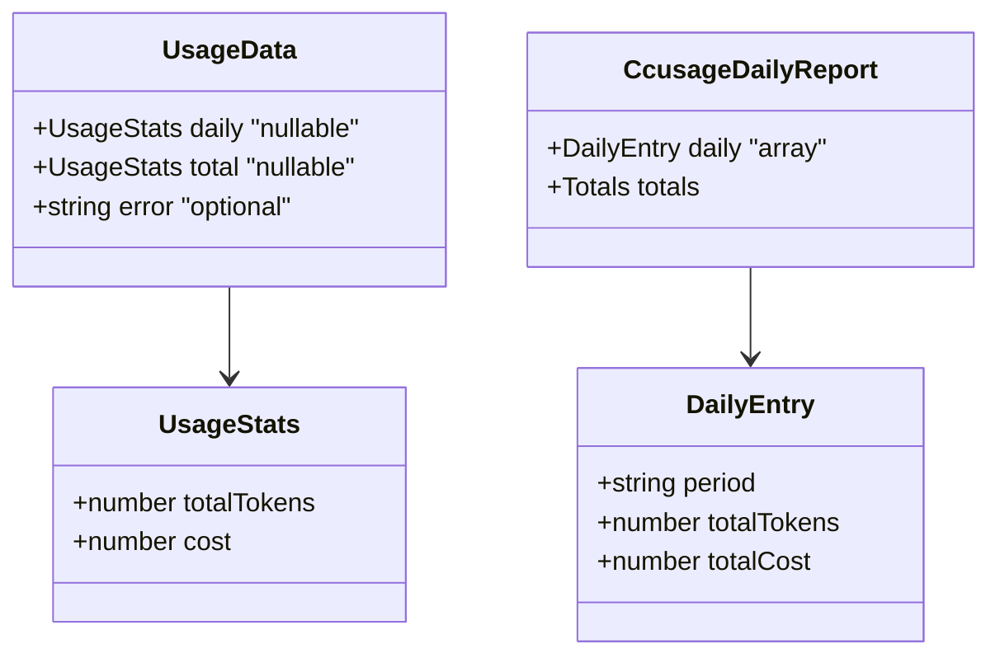

# Module: types

## Purpose

Shared type contracts between the data layer ([usage](./usage.md)) and the UI ([tray](./tray.md)).

## Public Surface

| Export | Type | File |
|--------|------|------|
| `UsageStats` | one period's `{ totalTokens, cost }` | [types.ts:1-4](../../src/types.ts#L1-L4) |
| `UsageData` | `{ daily, total, error? }` rendered by the tray | [types.ts:6-10](../../src/types.ts#L6-L10) |
| `CcusageDailyReport` | consumed subset of `ccusage daily --json` | [types.ts:17-27](../../src/types.ts#L17-L27) |

## Responsibilities

- Define the internal display model (`UsageStats`, `UsageData`).
- Define the **external contract** Burnbar assumes from ccusage (`CcusageDailyReport`) — only the fields actually read.

## Non-Goals

- Not the full ccusage schema — only the subset consumed is typed. — [types.ts:12-16](../../src/types.ts#L12-L16)
- No runtime validation; `JSON.parse` is trusted and asserted via `as`. — [usage.ts:26](../../src/usage.ts#L26)

## Key Types

## Invariants & Failure Modes

- `daily`/`total` are `UsageStats | null` (intentionally not optional) so the UI branches on value, not presence. — [types.ts:7-8](../../src/types.ts#L7-L8)
- `error` is the only optional field and signals the failure path. — [types.ts:9](../../src/types.ts#L9)
- Note the **rename**: ccusage's `totalCost` becomes Burnbar's `cost` during mapping. — [usage.ts:39-44](../../src/usage.ts#L39-L44)

## Documentation Update Rule

Changing any of these types must update this file's table, [DOMAIN.md](../DOMAIN.md) glossary/ER, and the consuming module docs.

## Related Files

- [usage.ts](../../src/usage.ts), [tray.ts](../../src/tray.ts) — the producers/consumers.
