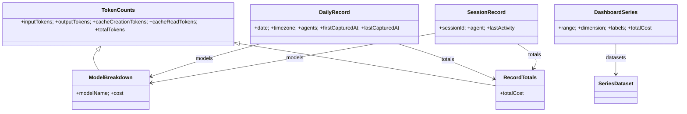

# Module: types

## Purpose

The shared type contracts across the app: the small tray-display DTOs, the ccusage raw-output subset Burnbar parses, the durable archive records, and the dashboard series. Archive records deliberately mirror ccusage's field names so the normalizer stays a thin mapping.

## Public Surface

| Export | Purpose | File |
|--------|---------|------|
| `UsageStats`, `UsageData` | tray display model (`{totalTokens, cost}`; `daily`/`total` nullable, `error?`) | [types.ts:8-19](../../src/types.ts#L8-L19) |
| `CcusageModelBreakdown`, `CcusageRow`, `CcusageReportTotals` | parsed ccusage row shapes (shared by `daily` + `session`) | [types.ts:22-61](../../src/types.ts#L22-L61) |
| `CcusageDailyReport`, `CcusageSessionReport` | top-level report envelopes | [types.ts:63-74](../../src/types.ts#L63-L74) |
| `TokenCounts`, `ModelBreakdown`, `RecordTotals` | archive token/model primitives | [types.ts:77-94](../../src/types.ts#L77-L94) |
| `DailyRecord`, `SessionRecord`, `ArchiveManifest` | durable archive records | [types.ts:100-132](../../src/types.ts#L100-L132) |
| `SeriesRange`, `SeriesDimension`, `SeriesRequest`, `SeriesDataset`, `DashboardSeries` | dashboard query + chart series | [types.ts:135-156](../../src/types.ts#L135-L156) |
| `BurnbarBridge` | the `window.burnbar` surface the preload exposes | [types.ts:158-160](../../src/types.ts#L158-L160) |

## Responsibilities

- Define the tray display model (`UsageStats`, `UsageData`). — [types.ts:8-19](../../src/types.ts#L8-L19)
- Define the **external contract** assumed from ccusage (`CcusageRow` et al.) — only the fields actually read. — [types.ts:22-74](../../src/types.ts#L22-L74)
- Define the **durable archive** shapes (`DailyRecord`, `SessionRecord`, `ArchiveManifest`). — [types.ts:77-132](../../src/types.ts#L77-L132)
- Define the **dashboard contract** between IPC/derive and the renderer (`SeriesRequest` → `DashboardSeries`, `BurnbarBridge`). — [types.ts:135-160](../../src/types.ts#L135-L160)

## Non-Goals

- Not the full ccusage schema — only the consumed subset is typed. — [types.ts:22-35](../../src/types.ts#L22-L35)
- No runtime validation; `JSON.parse` output is asserted via `as` at the capture boundary. — [capture.ts](../../src/capture.ts)
- No behavior — pure type declarations.

## Key Types

## Invariants & Failure Modes

- `ModelBreakdown` and `RecordTotals` both extend `TokenCounts`; `totalTokens` is the sum of the four component counts. — [types.ts:77-94](../../src/types.ts#L77-L94)
- `UsageData.daily`/`total` are `UsageStats | null` (not optional) so the UI branches on value; `error` is the only optional field. — [types.ts:13-19](../../src/types.ts#L13-L19)
- The **rename**: ccusage's `totalCost` becomes `cost` only in `UsageStats`/`ModelBreakdown`; record-level totals keep `totalCost`. — [types.ts:8-11](../../src/types.ts#L8-L11), [types.ts:92-94](../../src/types.ts#L92-L94)
- `ArchiveManifest.schemaVersion` gates migrations; bump it when any record shape changes. — [types.ts:125-132](../../src/types.ts#L125-L132)

## Documentation Update Rule

Changing any of these types must update this file's table, [DOMAIN.md](../DOMAIN.md) glossary/ER, and the consuming module docs ([capture](./capture.md), [store](./store.md), [derive](./derive.md), [tray](./tray.md)).

## Related Files

- Producers/consumers: [capture.ts](../../src/capture.ts), [store.ts](../../src/store.ts), [derive.ts](../../src/derive.ts), [tray.ts](../../src/tray.ts).
