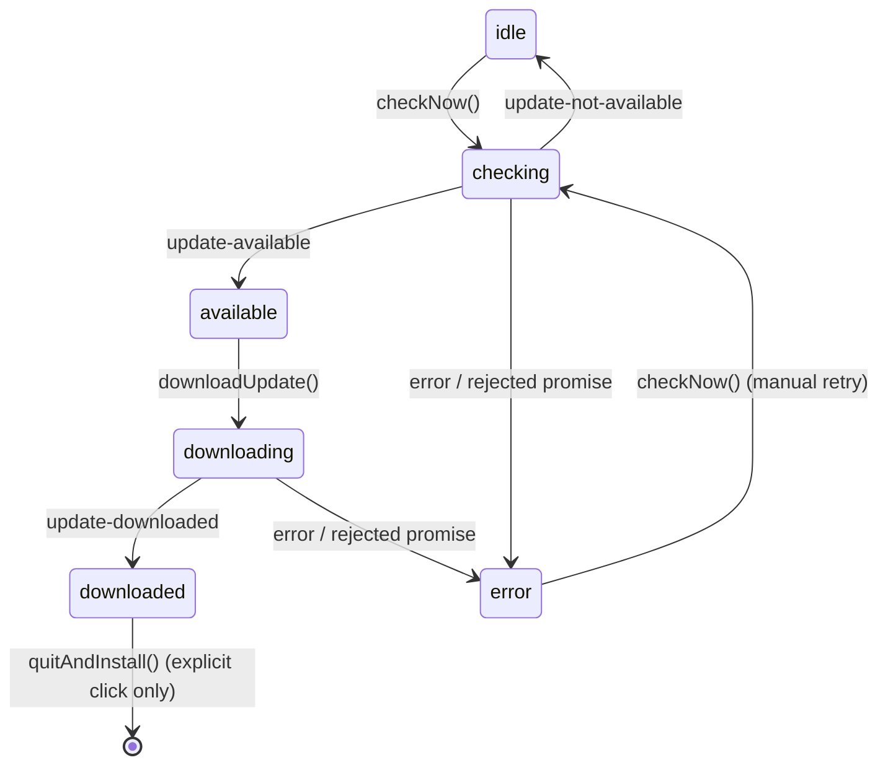

# Module: update-service

## Purpose

Owns the electron-updater lifecycle: checking GitHub Releases for a newer signed build on a fixed background cadence, downloading only on explicit request, and installing only on an explicit "Restart to Update" click. Pushes a serializable `UpdateState` to its one listener (the tray) after every transition — mirrors [capture-service](./capture-service.md)'s DI/push-state shape. See [ADR-011](../adr/011-auto-update-mechanism.md) for the design rationale and the tray-only UX sketch.

## Public Surface

| Export | Type | File |
|--------|------|------|
| `UpdateService` | class | [update-service.ts:59](../../src/update-service.ts#L59) |
| `UpdateServiceOptions` | injectable deps (updater/interval/logger/isPackaged seams) | [update-service.ts:38](../../src/update-service.ts#L38) |
| `UpdaterLike` | narrow DI interface over electron-updater's `autoUpdater` surface, including `off` for listener cleanup | [update-service.ts:24](../../src/update-service.ts#L24) |

Instance API — lifecycle: `start()`, `dispose()`; reads: `getState()`; wiring: `onState(listener)`; commands: `checkNow()`, `downloadUpdate()`, `quitAndInstall()`. Module-private: `addListener`/`scheduleTimer`/`reportFailure`/`setState` plus the `defaultUpdater()` factory and the `UPDATE_CHECK_INTERVAL_MINUTES` / `IDLE_STATE` constants. — [update-service.ts:14-16](../../src/update-service.ts#L14-L16), [update-service.ts:166-192](../../src/update-service.ts#L166-L192)

## Responsibilities

- Force `autoDownload = false` on construction, regardless of the injected updater's own default — nothing downloads without an explicit `downloadUpdate()` call. — [update-service.ts:81](../../src/update-service.ts#L81)
- Subscribe to the injected updater's `checking-for-update` / `update-available` / `update-not-available` / `download-progress` / `update-downloaded` / `error` events (via `addListener`, which also records each pair for `dispose()`) and translate each into one `UpdateState` transition. — [update-service.ts:83-104](../../src/update-service.ts#L83-L104)
- Own a fixed-interval background timer, **independent of** the user-configurable usage-refresh interval in [settings](./settings.md) (that one supports `0` = manual/off; update checks must never be silently disabled by it). — [update-service.ts:14](../../src/update-service.ts#L14), [scheduleTimer](../../src/update-service.ts#L177)
- Skip calling the real updater when the app isn't packaged, so `pnpm dev`/`pnpm start` don't spam checks against a build with no update feed. — [checkNow](../../src/update-service.ts#L128)
- Gate `downloadUpdate()` to the `"available"` state and `quitAndInstall()` to the `"downloaded"` state — both are defensive no-ops otherwise. — [downloadUpdate](../../src/update-service.ts#L142), [quitAndInstall](../../src/update-service.ts#L159)
- Funnel every failure — a rejected `checkForUpdates()`/`downloadUpdate()` promise **and** the updater's own `error` event — through one `reportFailure` that logs (`BurnbarLogger`, `error` level) and moves to an `"error"` state; nothing ever throws out of the service. — [reportFailure](../../src/update-service.ts#L186)

## Non-Goals

- No tray rendering — the single state-driven menu row is [tray](./tray.md)'s `buildUpdateItem`.
- No wiring of *which* callback fires `quitAndInstall()` — the "only from the explicit click" guarantee is enforced by [main.ts](./main.md), which wires the tray's Restart-to-Update row to this service and nothing else; the service's own state gate is a second line of defense, not the primary one.
- No feed hosting or signing — that's the [packaging](./packaging.md) publish config (`electron-builder.config.cjs`) and [ADR-011](../adr/011-auto-update-mechanism.md).
- No settings/persistence — the check cadence is a fixed constant, not a stored preference.

## How It Works

The real `autoUpdater` singleton (`electron-updater`'s default export) is the production `UpdaterLike`; tests inject a `vi.fn()`-based fake that captures registered listeners so they can be invoked directly to simulate electron-updater firing an event (see [test/update-service.test.ts](../../test/update-service.test.ts)).

`start()` calls `checkNow()` once immediately, then schedules the fixed-interval repeat via `scheduleTimer()`. `checkNow()` is also the manual "Check for Updates" tray action — same code path either way. Each updater event maps to exactly one `UpdateState`:

| Event | New status | Notes |
|-------|-----------|-------|
| `checking-for-update` | `checking` | version/percent cleared |
| `update-available` | `available` | version set from the event payload |
| `update-not-available` | `idle` | back to the manual-trigger row |
| `download-progress` | `downloading` | percent set; version preserved from `available` |
| `update-downloaded` | `downloaded` | version preserved/refreshed |
| `error` | `error` | message captured; version preserved |

## Key Types

| Type | Purpose | File |
|------|---------|------|
| `UpdateState` | Serializable snapshot the tray renders (`status`, `version`, `percent`, `error`) | [types.ts#UpdateState](../../src/types.ts) |
| `UpdateStatus` | `"idle" \| "checking" \| "available" \| "downloading" \| "downloaded" \| "error"` | [types.ts#UpdateStatus](../../src/types.ts) |
| `UpdaterLike` | Injected subset of electron-updater's `autoUpdater` surface, including `on`/`off` for listener lifecycle | [update-service.ts:24](../../src/update-service.ts#L24) |

## Invariants & Failure Modes

- **`autoDownload` is always false (load-bearing)**: set unconditionally in the constructor, overriding whatever the injected updater defaulted to. — [update-service.ts:81](../../src/update-service.ts#L81)
- **`quitAndInstall()` never fires without a completed download (load-bearing)**: the service refuses unless `state.status === "downloaded"`; combined with main.ts wiring only the tray's explicit click to this method, there is no path from "downloaded" to "installed" that skips the user's click. — [quitAndInstall](../../src/update-service.ts#L159)
- **A failed check/download never throws or crashes the tray**: both the promise-rejection paths and the updater's `error` event converge on `reportFailure`, which only logs + sets state. — [reportFailure](../../src/update-service.ts#L186)
- **Dev builds never call the real updater**: `checkNow()` short-circuits on `!isPackaged()` before touching the injected updater at all (electron-updater's own `checkForUpdates()` also no-ops unpackaged, but this avoids its per-call info log). — [checkNow](../../src/update-service.ts#L128)
- **The check cadence is fixed, not derived from `settings.ts`**: `UPDATE_CHECK_INTERVAL_MINUTES` (240 = 4h) is a standalone constant; nothing in `settings.ts`'s manual/`0` mode can suppress it. — [update-service.ts:14](../../src/update-service.ts#L14)
- **`downloadUpdate()` is a no-op outside `"available"`**: guards against a stale/duplicate tray click firing a second download. — [downloadUpdate](../../src/update-service.ts#L142)
- **`dispose()` clears the timer and unregisters every listener the constructor attached (load-bearing)**: safe to call multiple times; no further checks fire after, and constructing a new `UpdateService` against the same shared/real updater instance (e.g. electron-updater's `autoUpdater` singleton) never accumulates duplicate listeners. — [dispose](../../src/update-service.ts#L166)

## Extension Points

- **Test seams**: inject `updater`, `intervalMinutes`, `logger`, and `isPackaged` via `UpdateServiceOptions` to drive the lifecycle deterministically without a real electron-updater instance, network, or `app.isPackaged`. — [update-service.ts:38-44](../../src/update-service.ts#L38-L44)
- **Cadence**: change `UPDATE_CHECK_INTERVAL_MINUTES` to retune the background check frequency; it is intentionally not user-configurable (no new setting) per [ADR-011](../adr/011-auto-update-mechanism.md).
- **New updater events**: add a listener in the constructor alongside the existing ones, translating into a new or existing `UpdateStatus`.

## Related Files

- [tray.ts](../../src/tray.ts) — renders `UpdateState` into the single state-driven menu row (`buildUpdateItem`, `renderUpdate`).
- [main.ts](../../src/main.ts) — constructs the service, wires tray callbacks to it, disposes it on quit (both before-quit branches).
- [electron-builder.config.cjs](../../electron-builder.config.cjs) — the `publish` block that produces the `latest-mac.yml` feed this service's `checkForUpdates()` reads.
- [adr/011-auto-update-mechanism.md](../adr/011-auto-update-mechanism.md) — why electron-updater + GitHub provider, tray-only UX, and the never-auto-restart guarantee.
- Feature: [auto-update.md](../features/auto-update.md).
